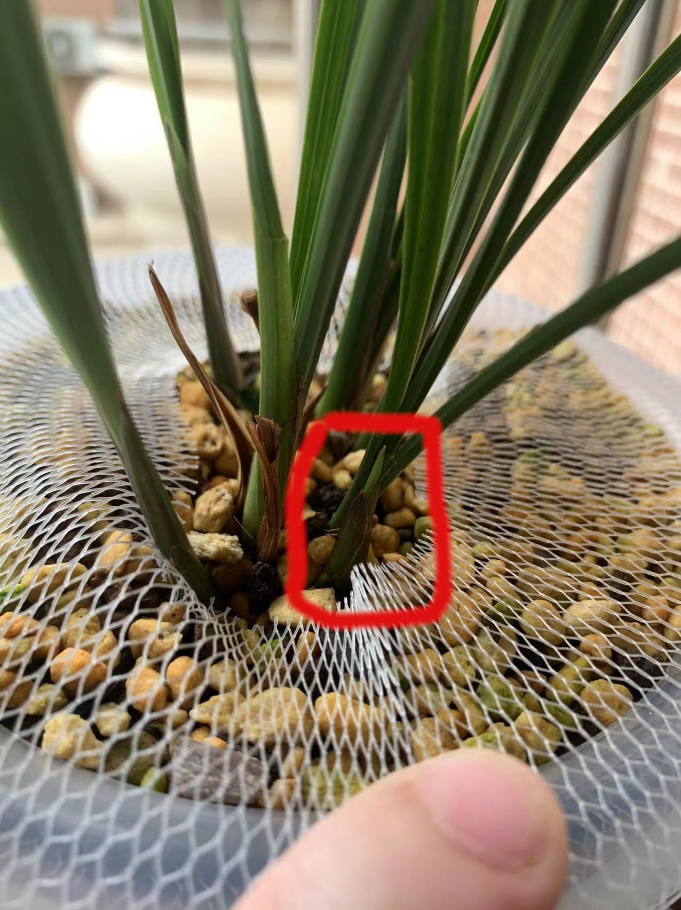

# 国兰

国兰专指中国境内产出的特定几类地生兰.具体来说按花期排序就是

1. 春兰
2. 莲瓣兰
3. 春剑
4. 豆瓣兰
5. 送春
6. 蕙兰
7. 建兰
8. 秋榜
9. 秋芝
10. 寒兰
11. 墨兰

## 国兰的结构

国兰都是地生兰,总体来讲适宜生长在南方温暖湿润的地区,多为丛生.植株高大的可以达到1米高,矮小的则可以只有不到20cm高.叶型飘逸,花有柔和的香味.

国兰整体上可以分为兰,蕙两种结构.这种分类方式参考自国画中的画兰花的分类,国画以写意见长,往往可以一眼看出特征.

+ 兰,通常专指春兰,春兰的特点就是一杆一般就一花,偶尔双花.

    

    

+ 蕙,一般指蕙兰,这边衍生为和蕙兰一样一杆多花的国兰.

    
    

可以看出,国兰的大致结构都一样,都是根到芦头到叶子和花,主要区别就在花杆上,春兰一杆单花(有时开双花),其他兰花则一杆多花.

### 根

国兰是肉质地生根,无根毛,颜色乳白或淡黄,粗细如筷子,一般无主根与支根之分.不同种类的国兰根的长短及形态各异,有的分杈有的不分杈,有的直生有的弯曲.

兰根从外到内由根被组织,皮层组织和中心柱三层组成.根被由海绵体状细胞组成,主要功能是吸水,储水,还有保护皮层组织的作用.

+ 最外层是根被组织,它导源于表皮组织.根被组织的细胞为长筒形,多角,由中心向外,辐射状排列.根被细胞成熟时细胞发生加厚的条纹,根被组织的功能是保护皮层,吸收水分,减少和保护皮层内部水分的散失

+ 兰根的中层为皮层组织,俗称根肉,细胞比较发达,约有20层多角形的细胞.厚度约为根被组织的3倍,占根的大部分.最外面紧靠根被组织的一层是外皮层由单层细胞组成,辐射状排列,整齐,体积大于一般的根被细胞;其内为皮层,皮层细胞有的含有针状结晶体,有的含有共生的根菌.

+ 兰根的内层为中心柱,中心柱最外层与皮层相接的为内皮层,内皮细胞上凯氏带很发达.紧贴内皮层的为一层维管束鞘.内皮层与维管束鞘都有两种不同构造的细胞.在韧皮部外周的为厚壁细胞;在木质部外周的则为薄壁细胞.厚壁细胞主要是加强根的强度,薄壁细胞是输导组织,用来运输水分和养分.兰根有多数的维管束,其木质部和韧皮部是分开的呈辐射状排列.在木质部和韧皮部周围有纤维组织,成为管柱;中心则为薄膜细胞的髓部.

兰根干渴后会萎蔫,一旦遇水又会迅速吸水膨涨.

兰菌是真菌.当它们进入兰根的皮层后便在皮层中形成菌丝团并吸收根周围根瘤细菌分解出的腐殖质,把它们变成养分贮存在体内.

健康的兰根一般是白色,生长中的兰根根尖的膨大部分颜色是白嫩半透明的,被称为水晶头,从一定程度上来说水晶头越多代表植株越有活力.同样的,兰根也会老化,其表现就是会变黄变黑,当一条兰根不再生长后往往根尖就会变黑.当根所在的芦头老化时根也会萎缩,表现为皮层组织萎缩,根会只剩中心柱和表皮形成空根.

当然造成空根的原因不光只有自然老化,养护中过分缺水和盆土过湿都有可能造成空根.另一种不健康的根是烂根,通常都是水大积水造成的.

国兰的根在自然环境下并不完全向下生长,而是喜欢贴着土面横着生长.一般来说地面上能有多大冠幅,地下就可以有多大冠幅.

现代兰苑养国兰一般使用深盆控根从而节省空间.因此一般买回来的兰根是向下生长的看起来像面条一样.

通常来说根决定了一从兰花壮不壮.因此就有了养兰先养根这个说法.

### 芦头

国兰各个品种的芦头形状大小各有不同,但无论哪个品种芦头都是最重要的器官.芦头是生长的起点,无论是生根,长叶芽,还是长花芽都是从芦头上开始的.芦头本身是国兰存储能量的地方,壮的植株通常芦头都大.只要芦头还在它就还有机会长根发芽开花.

国兰芦头一般是圆形或者椭圆形,通常讲墨兰建兰芦头比较大,春蕙则小些而且更加圆,莲瓣更小,但也不尽然.

叶子会一轮一轮的长在芦头上,叶根之间的空隙则会长出根,花芽,叶芽.芦头上长根长叶芽长花芽的点一般叫生长点,长出花芽叶芽的则被称为芽点,每个芦头一般最多可以出6个芽点,芽点一般在芦头的上半部分,有一些叶芽会从芦头下半部分长出来,这种一般被称作海底芽.

芦头是由叶芽底部生长得来的,叶芽的长到一定程度上面会开口长出叶子开始自主光合作用;下面会走第一条根从而开始自助获得水分和养分.日积月累芦头也会逐渐膨大.这个过程被称为"结头".通常当芦头不再膨大时说明这一苗兰花成熟了.当一苗兰花生命的最后阶段时芦头也会干瘪掉.

### 叶子

国兰的芦头之上会一轮一轮的长有叶子.

国兰的叶子也分为两类

1. 鞘叶,又叫叶鞘,叶裤,脚壳,脚鞘,甲壳等,是在兰叶或兰芽的最外层比较短小呈鞘状的叶子,对兰叶和兰芽起到保护作用,一般两年后会逐渐枯掉.
2. 常态叶,一般兰叶专指常态叶.在兰芽阶段会被藏在芽中,当叶芽的鞘叶开口后会从芽中长出来,呈带状或线型,一些品种的兰叶会有叶柄环,一些没有.叶片边缘有些品种有粗细不一的锯齿.叶脉平行,大多颜色为暗绿色,也有油绿色和墨绿色,叶片梢部圆钝或尖锐.通常刚长出来的时候叶色会比较嫩,一些品种因为叶绿素分布不均叶面上还会有深有浅.当长到一定长度后叶子将不再生长.兰叶非常娇贵,太干太湿都容易焦尖黑尖,这种变化是不可逆的,没有焦尖黑尖的兰叶被称为全封尖,很少有人能保持兰叶全封尖当一苗兰花快要走到生命的尽头时叶子会从外圈到内圈从叶尖到叶柄快速变黄变褐然后变脆,最后一阵风一吹叶子就从叶柄断掉

#### 叶芽

能长出叶子芦头的芽就是叶芽.叶芽是兰花分株繁殖的基础,叶芽类似妈妈肚子里的宝宝,它本身还不是一株兰苗,但可以长成一株兰苗.

叶芽会经历如下阶段的成长最终长成兰苗:

+ 芽点阶段,兰花从母体芦头上长出芽点并逐渐长大直到破土而出.
+ 出土阶段,兰芽破土而出逐渐升高但没有长叶子的阶段的阶段
   
+ 长根阶段,国兰一般在芽出土后会有一段时间不再生长看上去像僵苗了一样,这实际是芽在长根.
+ 开叶阶段,芽从完全闭合到鞘叶打开露出常态叶,这一阶段的芽一般叫做开口芽
   
+ 结头阶段,芽的底部开始膨大,结头结束后就可以认为这一苗已经长成

### 花

国兰主要还是赏花,但赏花多指的是欣赏花朵盛开的状态,而开花本身是一个过程.这个过程从芽点开始到含苞待放,再到盛开,最终结果或者枯萎凋谢.

由于兰蕙开花的形态不同,因此在含苞待放阶段会略有不同,下面介绍兰花在开花过程中的各个阶段

#### 花芽

芽点分化为花芽后开花过程正式开始,通常花芽比叶芽饱满圆润.

#### 抽杆

花芽成熟后会抽出花杆(也叫花梗,或花茎,或花葶或花箭或花夷)并逐渐长高,花蕾从苞壳中逐渐透出

抽杆这个过程有向光性,如果随便变换花盆朝向容易抽出歪七扭八的花杆,一个常见的解决方法有2:

1. 高频的变换花盆朝向,这个操作难度有点大,不推荐
2. 拿直筒状的不透光罩子套住花杆,让光线只能从顶部透入.

不少品种即便花已经盛开了还会继续抽杆比如翠一品.

#### 花苞

这个阶段兰蕙有所不同

+ 兰:
    1. 出苞片,花包露出花杆上的苞片
        
    2. 转茎,又称转宕,转身等.兰花花苞横出生长,长成花心朝外的过程,转茎一般也有向光性,因此一般会将花盆朝光的一面转到要欣赏的方向.
        
    3. 开凤眼,兰花花蕾绽放初期外三瓣的中萼片与两侧萼片的尖端是相互搭盖的状态时,当花蕾发育膨大时,主侧萼被发育了的捧瓣与唇瓣挤压隆起,主侧萼间上露唇瓣与捧瓣的一部分,下露舌根.使这个膨胀的花蕾基部形似鸡眼状,而被称为"凤眼".开凤眼即为花苞出现凤眼这一过程.凤眼开了一般再过2,3天花就完全打开了
        

+ 蕙:
    1. 小排铃,蕙开始抽箭后花苞片逐渐绽开,里面各朵幼小花铃呈竖直状,紧贴花梗的这种形态.小排铃算是抽杆后期的一个阶段
        
        古人称蕙花的幼蕾为花铃,因为在花未开时花蕾犹如一个个小铃铛因而得名.古人描述蕙花的花朵着生在花梗上的形状和排次称为排铃

    2. 转茎,又称转宕,转身等.花梗(茎)上每朵花铃的花柄横出生长,花心朝外.转茎是与大排铃基本同时开始的一个阶段,一般也有向光性,因此一般会将花盆朝光的一面转到要欣赏的方向.
        

    3. 大排铃,蕙抽箭结束后花朵会从底向顶次第开放,原来紧贴花梗的幼铃花柄(子房)离梗横出,作水平排列称为大排铃,此时即将绽蕊舒瓣渐次盛开.大排铃时尤其是夏天开花的建兰有时会出现花柄与花杆黏连的情况,这会带歪拔干的方向.产生原因可能是高温,这种情况如果早发现可以拿美工刀沿着花柄和花杆的分界线人工切割分离.
        

    4. 开凤眼,指兰花花蕾绽放初期外三瓣的中萼片与两侧萼片的尖端是相互搭盖的状态时,当花蕾发育膨大时,主侧萼被发育了的捧瓣与唇瓣挤压隆起,主侧萼间上露唇瓣与捧瓣的一部分,下露舌根.使这个膨胀的花蕾基部形似鸡眼状,而被称为"凤眼".开凤眼即为花苞出现凤眼这一过程.凤眼开了一般再过2,3天花就完全打开了
        

#### 盛开

外瓣完全打开就算盛开了,兰花的结构如下图

上图中还有如下概念没有标注:

+ 外三瓣:主萼瓣和侧萼瓣组成的整体称为外三瓣.
+ 中宫:捧瓣和唇瓣以及蕊柱组成的整体称为中宫.

#### 凋谢

当兰花在一段时间内没有授粉成功,花瓣会快速枯黄,最终从花柄和花杆连接处断开,花就算完全凋谢了

一般来说凋谢的兰花不用着急剪掉花杆,等他自然萎缩干枯后再剪不迟.

#### 结果

兰科植物在自然界中以擅长利用虫媒授粉而闻名.国兰作为兰科植物同样精于吸引虫媒.除了重瓣花(奇花)和抱杆花这类花朵结构有变异的品种外兰花都可以结果.当吸引到虫子传播成功授粉后兰花的花朵会和凋谢开始时一样花瓣快速枯黄,子房会开始变粗膨大,

在接下来的几个月中子房会持续发育膨大结成果子,这个果子被称作兰荪

当兰荪成熟后它的外壳蕙裂开露出种子,兰花的种子程粉状,一阵风吹过就会有大量的兰花种子被带走,兰花也就完成了它有性繁殖的任务.

值得注意的是所有兰科植物的种子都没有种胚,也就是说都没有保存可以发芽的能量,因此都不能自行发芽.有说法兰花种子的萌发需要兰菌参与,但我并没有找到兰菌具体是哪种菌,因此姑妄言之姑妄听之.

现代我们已经可以通过无菌操作让兰花种子在配置好的基质中萌发了,这也就意味着新品兰花的选育可以不再依赖山上的自然资源.也因为这个兰花失去了所谓的稀缺性彻底回归绿植地位.

## 国兰的价值

国兰最主要的价值还是在欣赏价值上.由于有着悠久的栽培欣赏历史,自然也赋予了它文化价值.东亚文化圈基本相通,在建国初期兰花成为中日建交的纽带,因此也有一定的外交价值.而国兰根部可以入药,因此也有一定的药用价值.