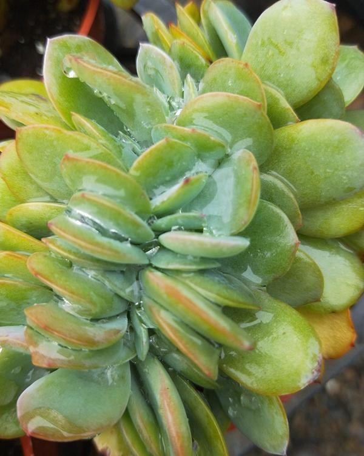

# 缀化

缀化指植物的叶部顶端的生长锥异常分生,加倍,而形成许多小的生长点,而这些生长点横向发展连成一条线,最终长成扁平的扇形或鸡冠形带状体.在缀化生长中,局部顶端优势丧失,每一个生长尖端都试图发育成新组织,导致"多节"或"块状,混乱"的生长.这种变异多出现在多肉植物和一些蕨类中,比如缀化仙人球,缀化瘤蕨

## 形成原因

所有的植物都是通过增加嫩枝和根尖的细胞数量来增加长度的,这些活跃的细胞分裂区域称为顶端分生组织,这种生长称为初级生长.一些植物,尤其是单子叶植物,在叶基部有分生组织导致叶片伸长.在木本植物中有额外的分生组织称为侧分生组织,产生次生生长.最重要的侧分生组织是维管形成层,它产生木材和树皮缀化.生长只涉及初级生长.

在每种植物中顶端分生组织和中间分生组织的细胞分裂会经过环境和自身调节从而形成独特的茎和叶形状.例如在抑制分枝的情况下,顶端的快速生长会导致茎长而细,而生长缓慢则会导致茎"更肥".偶尔会发生一种称为生长突变的现象,它"扰乱"了初级分生组织中受调控和协调的细胞分裂.这些突变的原因往往是

1. 植物体损伤,很多时候商家会使用化学药物,急冻或者辐射等方式造成植物体损伤从而诱发锦化
2. 细菌或病毒性疾病,往往来自自然界
3. 遗传变异

## 维护

缀化本质上是一种病态的表现,相较于正常植物抗性更差些.

缀化植物本身这种突变一般都不稳定,有一定概率退化(康复).维护缀化植株需要降低光照相对阴养并加强通风.

## 繁殖

多数缀化植物带缀这个变异是不稳定的,因此如果要保持锦通常都是通过[无性繁殖](https://blog.hszofficial.site/BalconyPlantLook-upTable/%E6%A4%8D%E7%89%A9%E7%B9%81%E6%AE%96%E6%96%B9%E5%BC%8F#%E6%97%A0%E6%80%A7%E7%94%9F%E6%AE%96).
