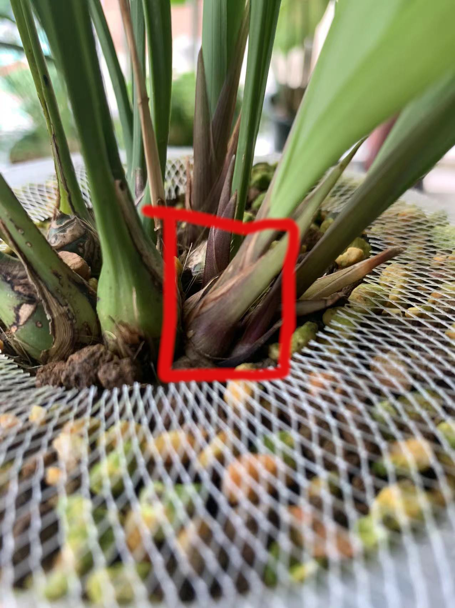
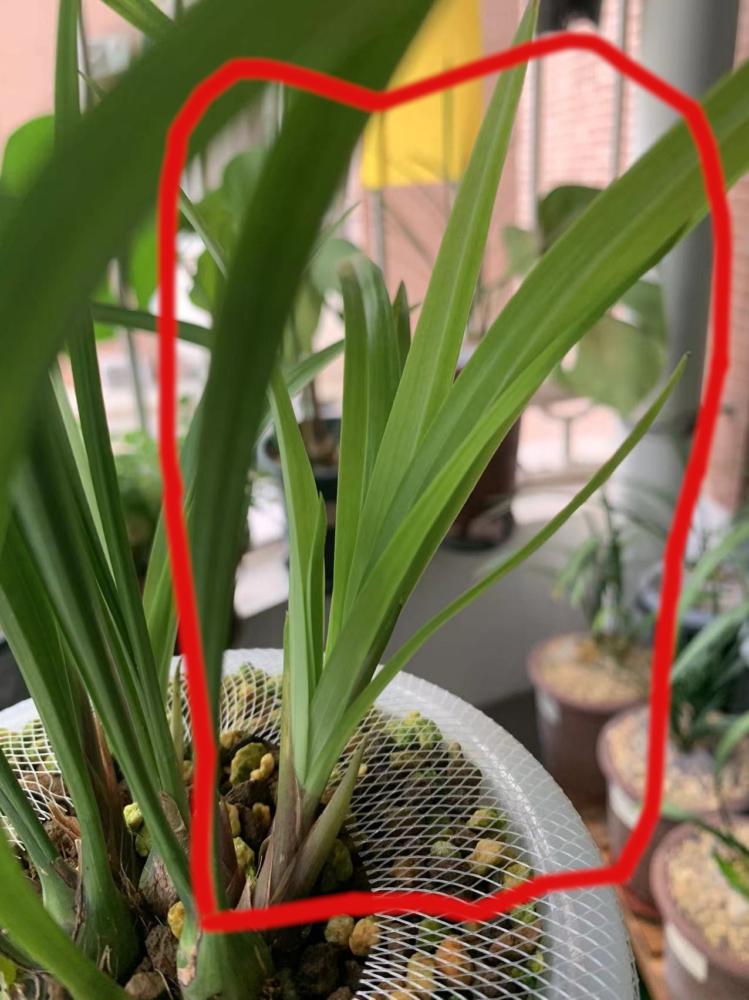
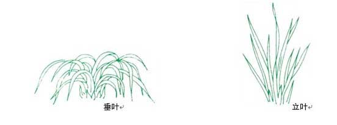
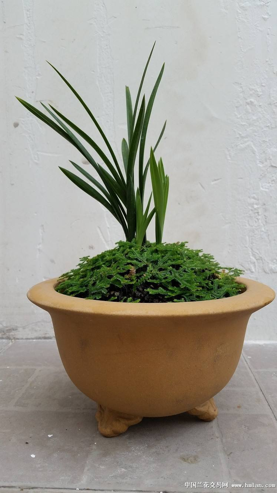

# 国兰

国兰指中国境内原生的特定几种形态习性相近的常绿地生兰,狭义来说种类包括春兰,蕙兰,建兰,墨兰,寒兰.近些年也已经将

莲瓣,秋芝,秋榜,春剑,送春纳入其范畴.

## 生长习性及评价标准

国兰生长习性标准分为如下几个方面:

+ 整体描述
+ 发芽习性
+ 长根习性
+ 展叶习性
+ 芦头特性
+ 开花习性

### 整体描述

国兰都是地生兰,总体来讲适宜生长在南方温暖湿润的地区,多为丛生.植株高大的可以达到1米高,矮小的则可以只有不到20cm高.叶型飘逸,花有柔和的香味.

国兰栽培一般不会做有性繁殖,都是分苗得到的新的植株.国兰单苗的生命周期可以分为:

+ 芽期,即从母本植株中分化为叶芽开始到结头开叶结束的时期
+ 新苗期,叶芽结头开叶后到最后一片常态叶长出来
+ 成苗期,最后一片常态叶长出来到出现叶片变黄,芦头长黑斑等老化现象
+ 老苗期,出现出现叶片变黄,芦头长黑斑等老化现象开始到开始退常态叶
     
+ 老头期,开始退常态叶到根也退光只剩芦头
    

介绍品种整体习性,主要包括:

1. 植物耐寒区适应性,按由难到易包含范围:
    + 未知
    + 无法种植,即无论如何都养不活
    + 大师,即需要相当有经验才能养不死,且即便养不死也难以养出状态
    + 困难,即需略有经验才能养不死,且需要相当有经验才能养出状态
    + 普通,即正常养护即可养活,略有经验即可达到非常好的状态
    + 简单,即正常养护即可养活并可以达到非常好的状态
    + 开挂,即正常养护即便有失误也可养活,正常养护就可以达到非常好的状态

    其形式为:

    | 植物耐寒区 | 适应性 |
    | ---------- | ------ |
    | 10区       | 简单   |
    | 11区       | 简单   |
    | 7区        | 普通   |

    该描述后面的描述都需要分区介绍

2. 一年周期内按农历的生长阶段,分为:
    + 花期,开花的时间段
    + 叶芽期,出叶芽的时间段
    + 花芽期,出花芽的时间段
    + 旺盛生长期,兰花长得最快的时间段
    + 春化期,部分国兰需要的一段低温孕育花芽的时期

    其形式以普通春兰为例:

    | 生长阶段   | 正月 | 二月 | 三月 | 四月 | 五月 | 六月 | 七月 | 八月 | 九月 | 十月 | 十一月 | 腊月 |
    | ---------- | ---- | ---- | ---- | ---- | ---- | ---- | ---- | ---- | ---- | ---- | ------ | ---- |
    | 花期       | T    | T    | ---  | ---  | ---  | ---  | ---  | ---  | ---  | ---  | ---    | T    |
    | 叶芽期     | ---  | T    | T    | T    | ---  | ---  | ---  | T    | T    | T    | ---    | ---  |
    | 花芽期     | ---  | ---  | ---  | T    | T    | T    | ---  | ---  | ---  | ---  | ---    | ---  |
    | 旺盛生长期 | ---  | ---  | T    | T    | ---  | ---  | ---  | T  | T  | ---  | ---    | ---  |
    | 春化期     | ---  | ---  | ---  | ---  | ---  | ---  | ---  | ---  | ---  | T    | T      | T    |

### 发芽习性

国兰一般丛生,在描述丛生结构的时候一般以几代苗来区分.

较新的前两苗称为前垄,剩下的称为后垄.发苗通常是前垄发,老苗后垄发苗概率不高.

芽会经历如下阶段的成长

+ 出土阶段,兰花芽点生长到破土而出但没有长叶子的阶段的阶段
   
+ 长根阶段,国兰一般在芽出土后会有一段时间不再长芽看上去像僵苗了一样,这实际是芽在长根.
+ 开叶阶段,芽从完全闭合到鞘叶打开露出常态叶
   
+ 结头阶段,芽芦头位置开始膨大到长成一个芦头的阶段
   
+ 展叶阶段,从开叶开始到最后一片常态叶长成
   

主要包括如下评估标准.

+ 芽色,兰花的芽点一般都是嫩白色,长成芽后一般会变成嫩绿色,深绿色,粉红色,嫩红色,深红色,紫色,黑色,有些叶尖还有颜色变化
+ 发芽条件,描述成熟健壮植株的发芽条件,分为:
    + 季节型,只要到固定季节就发芽
    + 条件型,只要满足固定条件就会发芽
    + 条件季节型,既要到固定季节又要满足固定条件

+ 单苗成熟周期,单苗从冒芽到长成成苗的生长时间

+ 不同位置出芽的丰芽程度.
    苗根据出芽位置分为如下

    + 新苗,即新苗期的苗
    + 弱苗,即成苗期但常态叶数量低于品种常态叶最大值
    + 壮苗,即成苗期但常态叶数量等于品种常态叶最大值
    + 老苗,即老苗期的苗
    + 老头,即老头期的苗
    + 花芽,即从凋谢的花芽上长出芽

    根据丛生情况可以分为:
    + 单苗
    + 两苗
    + 小丛,即3苗至10苗
        + 小丛前垄
        + 小丛后垄
    + 大丛,即20苗以上
        + 大丛前垄
        + 大丛后垄

    丰芽程度分为:
    + 丰芽,即1年3苗以上
    + 出芽,即1年1苗到2苗
    + 少芽,即1年最多1苗
    + 极少芽
    + 不出芽
  
    项目| 新苗|弱苗|壮苗|老苗|老头|花芽
    ---|---|---|---|---|---|---
    大丛前垄|不出芽|少芽|出芽|出芽|---|极少芽
    大丛后垄|不出芽|少芽|少芽|少芽|不出芽|极少芽
    小丛前垄|不出芽|少芽|出芽|出芽|---|极少芽
    小丛后垄|不出芽|少芽|少芽|少芽|不出芽|极少芽
    两苗|不出芽|少芽|出芽|少芽|少芽|极少芽
    独苗|不出芽|少芽|出芽|少芽|少芽|极少芽

## 长根习性

国兰是肉质地生根,无根毛,颜色乳白或淡黄,粗细如筷子,一般无主根与支根之分.不同种类的国兰根的长短及形态各异,有的分杈有的不分杈,有的直生有的弯曲.

兰根从外到内由根被组织,皮层组织和中心柱三层组成.根被由海绵体状细胞组成,主要功能是吸水,储水,还有保护皮层组织的作用.

+ 最外层是根被组织,它导源于表皮组织.根被组织的细胞为长筒形,多角,由中心向外,辐射状排列.根被细胞成熟时细胞发生加厚的条纹,根被组织的功能是保护皮层,吸收水分,减少和保护皮层内部水分的散失

+ 兰根的中层为皮层组织,俗称根肉,细胞比较发达,约有20层多角形的细胞.厚度约为根被组织的3倍,占根的大部分.最外面紧靠根被组织的一层是外皮层由单层细胞组成,辐射状排列,整齐,体积大于一般的根被细胞;其内为皮层,皮层细胞有的含有针状结晶体,有的含有共生的根菌.

+ 兰根的内层为中心柱,中心柱最外层与皮层相接的为内皮层,内皮细胞上凯氏带很发达.紧贴内皮层的为一层维管束鞘.内皮层与维管束鞘都有两种不同构造的细胞.在韧皮部外周的为厚壁细胞;在木质部外周的则为薄壁细胞.厚壁细胞主要是加强根的强度,薄壁细胞是输导组织,用来运输水分和养分.兰根有多数的维管束,其木质部和韧皮部是分开的呈辐射状排列.在木质部和韧皮部周围有纤维组织,成为管柱;中心则为薄膜细胞的髓部.

兰根干渴后会萎蔫,一旦遇水又会迅速吸水膨涨.

兰菌是真菌.当它们进入兰根的皮层后便在皮层中形成菌丝团并吸收根周围根瘤细菌分解出的腐殖质,把它们变成养分贮存在体内.

生长中的兰根根尖的膨大部分颜色是白嫩半透明的,被称为水晶头.从一定程度上来说水晶头越多代表植株越有活力.

国兰的根在自然环境下并不完全向下生长,而是喜欢贴着土面横着生长.一般来说地面上能有多大冠幅,地下就可以有多大冠幅.

现代兰苑养国兰一般使用深盆控根从而节省空间.因此一般买回来的兰根是向下生长的看起来像面条一样.

我们评估国兰张根的习性从如下几个角度

+ 发根条件,描述植株发根的条件
    + 季节型,只要到固定季节就发芽
    + 条件型,只要满足固定条件就会发芽
    + 条件季节型,既要到固定季节又要满足固定条件

+ 易根性,是否爱长根,主观感受,按0至10评分

## 展叶习性

国兰的的地上部分在非花期就是叶子.兰花的叶片一般都是由假鳞茎上生出,叶形呈带状或线型,而且都没有明显的叶柄.叶片边缘有些品种有粗细不一的锯齿.叶脉平行,大多颜色为暗绿色,也有油绿色和墨绿色,叶片梢部圆钝或尖锐.

国兰的展叶习性我们从如下几个角度:

+ 叶长范围,描述成苗最常见叶长状态,分为:
    + 小叶材(20cm上下),
    + 中小叶材(25cm上下),
    + 叶材中等(30cm上下),
    + 叶材中高(超过40cm,不到60cm),
    + 叶材高大(超过60cm)
+ 叶宽范围,描述成苗最常见叶宽状态,分为:
    + 细叶,1cm以下
    + 普通宽度,1~1.5cm
    + 宽叶,1.5cm以上
+ 叶色,指成苗叶片颜色,一般有翠绿,油绿,暗绿,墨绿4种颜色
+ 叶质,指兰叶质感,有软有硬,有薄有厚,有肉质有革质
+ 叶尖,描述兰花叶片叶尖的形状,下图是最常见的22种叶尖形状
    
+ 叶面,描述叶面特征,一般有平整叶,V形叶,蛤蟆皮(叶面有凹凸状斑点),行龙叶(中骨,即兰叶中间最粗大的一条主叶脉,两侧有纵向凹陷),扭卷叶(叶面延中骨扭曲)
+ 叶姿,描述叶片的整体形态,分为:
    
    
    + 立叶(企剑)
        + 直立叶:叶脉硬朗,叶质较厚,叶直立.立叶草往往叶面细,典型的如环球荷鼎.
            
        + 半立叶:叶从假鳞茎出土后向斜上方向生长.如龙字.
            
    + 软垂叶(软剑)
        + 半垂叶(弓型叶),叶片从假鳞茎斜着生长,到中间慢慢弯下.比如建兰国魂
            
        + 垂叶,叶呈镰刀型,叶尖下垂至假鳞茎.如大富贵等
            
    + 卷叶,叶子柔软打卷,比较少见
        

## 芦头特性

国兰芦头一般是圆形或者椭圆形,通常讲墨兰建兰芦头比较大,春蕙则小些,而且更加圆,但也不尽然.

国兰的芦头习性我们从如下几个角度:

+ 大小,即常见直径
+ 形状,即芦头是圆的还是椭圆的

## 开花习性

国兰除了春兰外都是一杆多花,只有春兰一般都是一杆一花,偶尔一杆两花.其花结构如下

上图中还有如下概念没有标注:

+ 外三瓣:主萼瓣和侧萼瓣组成的整体称为外三瓣.
+ 中宫:捧瓣和唇瓣以及蕊柱组成的整体称为中宫
+ 花铃:古人称蕙兰的幼蕾为花铃,因为在花未开时花蕾犹如一个个小铃铛因而得名.现在衍生为除春兰外国兰(即一杆多花的国兰)的幼蕾
+ 排铃:即兰花花序的特称.古人描述蕙兰的花朵着生在花梗上的形状和排次.现在衍生为除春兰外国兰((即一杆多花的国兰))花朵着生在花梗上的形状和排次.

国兰的花都有香味
国兰开花是从分化花芽开始的,一般花芽和叶芽颜色相同,但形状更加圆润.春兰和其他国兰从出花芽到开花过程不\同,会经历如下状态:

+ 春兰
    1. 抽杆(抽箭),花芽成熟后会抽出花杆(也叫花梗,或花茎,或花葶或花箭或花夷)并逐渐长高,花蕾从苞壳中逐渐透出.需要注意春兰的花杆即便开花了也会继续拔高
        
    2. 出苞片(春兰),花包露出花杆上的苞片
        

    3. 转茎,又称转宕,转身等.原指蕙兰大排铃时花梗(茎)上每朵花铃的花柄横出生长,长成花心朝外的过程.此处衍生其含义为春兰花苞横出生长,长成花心朝外的过程
        
    4. 开凤眼:兰花花蕾绽放初期外三瓣的中萼片与两侧萼片的尖端是相互搭盖的状态时,当花蕾发育膨大时,主侧萼被发育了的捧瓣与唇瓣挤压隆起,主侧萼间上露唇瓣与捧瓣的一部分,下露舌根.使这个膨胀的花蕾基部形似鸡眼状,而被称为“凤眼”.开凤眼即为花苞出现凤眼这一过程
        

    5. 盛开,花苞到完全打开状态的
        
    6. 凋谢,花枯萎到掉落的状态
        

+ 其他国兰

    1. 抽杆(抽箭),花芽成熟后会抽出花杆(也叫花梗,或花茎,或花葶或花箭或花夷)并逐渐长高,花蕾从苞壳中逐渐透出
        
    2. 小排铃(除春兰),原指蕙兰开始抽箭后花苞片逐渐绽开,里面各朵幼小花铃呈竖直状,紧贴花梗的这种形态.小排铃算是抽杆后期的一个阶段
        
    3. 转茎,又称转宕,转身等.对于春兰指的是 原指蕙兰大排铃时花梗(茎)上每朵花铃的花柄横出生长,花心朝外.转茎算是大排铃前期的一个阶段
        
    4. 大排铃(除春兰),蕙兰抽箭结束后花朵次第开放,原来紧贴花梗的幼铃花柄离梗横出,作水平排列称为大排铃,此时即将绽蕊舒瓣渐次盛开.
        
    5. 凤眼:指兰花花蕾绽放初期外三瓣的中萼片与两侧萼片的尖端是相互搭盖的状态时,当花蕾发育膨大时,主侧萼被发育了的捧瓣与唇瓣挤压隆起,主侧萼间上露唇瓣与捧瓣的一部分,下露舌根.使这个膨胀的花蕾基部形似鸡眼状,而被称为“凤眼”.
        
    6. 盛开,花苞到完全打开状态的
        
    7. 凋谢,花枯萎到掉落的状态
        

国兰的开花习性我们从如下几个角度:

+ 开花条件,描述成熟健壮植株的开花条件,分为:
    + 季节型,只要到固定季节就开花
    + 条件型,只要满足固定条件就会开花
    + 条件季节型,既要到固定季节又要满足固定条件
+ 苞叶颜色
+ 花杆颜色
+ 单花坐花阶段时长,单花从冒花芽到凋谢经历的状态变化阶段和持续时长
+ 花守,单花从盛开至枯萎期间能保持有欣赏价值不下降的能力,10分满分
+ 

+ 开花位置,描述植株在什么位置开花,大致有:
    + 老开花
    + 新枝开花
    + 新老枝都开花
+ 易花性,是否容易来花
    + 弱苗来花
    + 壮苗来花(说明壮苗标准)
    + 多苗来花(说明最少苗数)
+ 丰花性,是否容易群开
    + 分叉性
        + 一杆一花
        + 一杆多花(一般多少花)
        + 一杆多枝,一枝多花(一般分叉多少枝,一枝多少花)
    + 续花性,花期内一批花谢后多久可以有下一批
        + 不续花
        + 长间隔,指一批花谢后要等超过半月才会有下一批
        + 中间隔,指一批花谢后要等超过1周到不到半个月才会有下一批
        + 短间隔,指一批花谢后要等不超过一周可以有下一批花
        + 连续坐蕾,指一批花谢后下一批的花苞已经准备好,且在3天内可以开花
        + 连续开花,指一批花谢后下一批花已经打开

