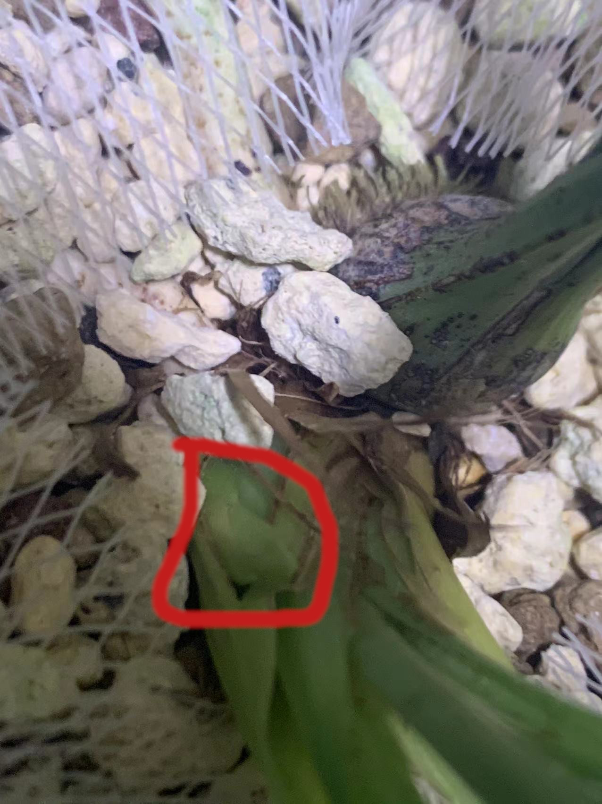

# 丹霞鱼枕素

+ 别名: 丹霞鱼魫素
+ 品种: 建兰
+ 产区: 四川峨眉
+ 来源类型: 自然选育下山
+ 价格区间: 50元/苗
+ 草型: 中等叶材
+ 优点:
    + 花品优秀
    + 叶材飘逸
    + 易出架
+ 缺点:
    + 小贵

<!--  -->

## 来源

丹霞鱼枕素下山自广东韶关市仁化县的丹霞山.丹霞山下山过大量优质兰花品种,本品在其中并不算突出,因此名声一般,传播也比较少.目前只知道中交仁化兰园偶尔会有放出.

鱼魫素是南宋<金漳兰谱>中介绍的一路白素,据说花瓣放入水中形如鱼骨,现在早已不可考.本品只是取其花型花色类似鱼枕附会而得名,实际是5年前下山的新花.

## 评价

+ 推荐等级: 4
+ 推荐人群: 素花爱好者,喜欢较大叶材且出架的爱好者

丹霞鱼枕素其实不算多优秀,而且也不是白素只是绿素偏淡,主要的卖点是叶材不小依然易出架.

## 欣赏价值

丹霞鱼枕素的欣赏价值还是可以的,花叶协调,叶材中等,花大,半立叶看起来比较有精神,颇具野性.

### 花性

<!--  -->

关键字: 绿素

+ 开花条件(仅猜测):条件型,经观察应该是需要有效积温,最低温度在27度以上超过至少60天
+ 下花条件: 未知,猜测季节型
+ 续花性: 未知
+ 单花坐花阶段时长: 约16天
+ 花寿: 约10天
+ 花守: 7分,
+ 稳定性: 7分,只有大小会不同,瓣型基本一致
+ 叶中花出现频率:未见
+ 消苞条件:
    1. 虫害
    2. 连续阴雨降温
+ 消苞率: 10%
+ 不同位置的丰花程度:

    | 母体位置 | 母体健壮程度 | 独苗 | 两苗 | 小丛前垄 | 小丛后垄 | 中丛前垄 | 中丛后垄 | 大丛前垄 | 大丛后垄 |
    | -------- | ------------ | ---- | ---- | -------- | -------- | -------- | -------- | -------- | -------- |
    | 新苗     | 弱苗         | ---  | ---  | ---      | ---      | ---      | ---      | ---      | ---      |
    | 新苗     | 中苗         | ---  | ---  | ---      | ---      | ---      | ---      | ---      | ---      |
    | 新苗     | 壮苗         | ---  | ---  | ---      | ---      | ---      | ---      | ---      | ---      |
    | 成苗     | 弱苗         | ---  | ---  | ---      | ---      | ---      | 不出花   | ---      | ---      |
    | 成苗     | 中苗         | ---  | ---  | ---      | ---      | 出花(4)  | 不出花   | ---      | ---      |
    | 成苗     | 壮苗         | ---  | ---  | ---      | ---      | ---      | 不出花   | ---      | ---      |
    | 老苗     | 弱苗         | ---  | ---  | ---      | ---      | 不出花   | 不出花   | ---      | ---      |
    | 老苗     | 中苗         | ---  | ---  | ---      | ---      | 不出花   | 不出花   | ---      | ---      |
    | 老苗     | 壮苗         | ---  | ---  | ---      | ---      | 不出花   | 不出花   | ---      | ---      |
    | 老头     | 弱苗         | ---  | ---  | ---      | ---      | ---      | 不出花   | ---      | ---      |
    | 老头     | 中苗         | ---  | ---  | ---      | ---      | ---      | 不出花   | ---      | ---      |
    | 老头     | 壮苗         | ---  | ---  | ---      | ---      | ---      | 不出花   | ---      | ---      |

+ 香味:
    + 甜: 2
    + 暖: 3
    + 扩散性: 1
    + 浓度: 2
    + 质感: 清澈,纯正,单薄,湿润
    + 侵略性: 1

+ 出架率:
    其评估表格如下:

    | 状态   | 频率 |
    | ------ | ---- |
    | 地板花 | 未见 |
    | 平架   | 常见 |
    | 出架   | 偶尔 |
    | 大出架 | 未见 |

+ 花序舒朗程度: 7
+ 花径: 5.0cm~4.6cm
+ 瓣形: 柳叶瓣
+ 花色: 绿素
+ 花芽颜色: 绿色

+ 苞叶颜色: 绿色
+ 花杆颜色: 绿色

### 叶性

+ 叶长范围: 中叶材
+ 叶宽范围: 普通宽度
+ 叶色: 油绿
+ 叶质: 较软
+ 叶尖: 长尖尾
+ 叶面: 平整叶
+ 叶姿: 半立叶

### 芽性

+ 芽色: 绿色
+ 发芽条件: 季节型,固定春秋两季
+ 单苗成熟周期: 约4个月
+ 不同位置出芽的丰芽程度:

    | 母体位置 | 母体健壮程度 | 独苗 | 两苗 | 小丛前垄 | 小丛后垄 | 中丛前垄 | 中丛后垄 | 大丛前垄 | 大丛后垄 |
    | -------- | ------------ | ---- | ---- | -------- | -------- | -------- | -------- | -------- | -------- |
    | 新苗     | 弱苗         | ---  | ---  | ---      | ---      | ---      | ---      | ---      | ---      |
    | 新苗     | 中苗         | ---  | ---  | ---      | ---      | ---      | ---      | ---      | ---      |
    | 新苗     | 壮苗         | ---  | ---  | ---      | 出芽     | ---      | ---      | ---      | ---      |
    | 成苗     | 弱苗         | ---  | ---  | ---      | ---      | ---      | 不出芽   | ---      | ---      |
    | 成苗     | 中苗         | ---  | ---  | ---      | ---      | 出芽     | 不出芽   | ---      | ---      |
    | 成苗     | 壮苗         | ---  | ---  | ---      | ---      | ---      | 不出芽   | ---      | ---      |
    | 老苗     | 弱苗         | ---  | ---  | ---      | ---      | ---      | 不出芽   | ---      | ---      |
    | 老苗     | 中苗         | ---  | ---  | ---      | ---      | ---      | 不出芽   | ---      | ---      |
    | 老苗     | 壮苗         | ---  | ---  | ---      | ---      | ---      | 不出芽   | ---      | ---      |
    | 老头     | 弱苗         | ---  | ---  | ---      | ---      | ---      | 不出芽   | ---      | ---      |
    | 老头     | 中苗         | ---  | ---  | ---      | ---      | ---      | 不出芽   | ---      | ---      |
    | 老头     | 壮苗         | ---  | ---  | ---      | ---      | ---      | 不出芽   | ---      | ---      |
    | 花芽     | ---          | ---  | ---  | ---      | ---      | ---      | ---      | ---      | ---      |

### 芦头

+ 大小: 偏大,一般直径在1.2cm以上
+ 形状: 椭圆

## 养护

丹霞鱼枕素养护算没有难度的,而且个人感觉比较耐虫害

养护上建议不要太大盆,用细高盆突出清秀灵动感

### 适合栽培场景

+ 庭院: 5/10,适合栽在庭院中背阴初,最好还是盆栽
+ 露台(开放阳台): 7/10,比较高大,在不影响晒衣服的情况下还是适合的
+ 封闭阳台: 4/10,比较高大,在不影响晒衣服的情况下还是适合的
+ 窗台: 2/10,比较高大,窗台可能放不下

### 种植难度

| 植物耐寒区 | 适应性 |
| ---------- | ------ |
| 10区       | 开挂   |

### 抗性

青山玉泉比较容易被虫子啃食嫩叶和花芽,需要注意防护

| 抗性项目 | 得分 |
| -------- | ---- |
| 耐虫度   | 7    |
| 耐病度   | 4    |
| 耐涝度   | 3    |
| 耐旱度   | 7    |
| 耐瘠薄度 | 10   |
| 耐肥度   | 3    |
| 耐寒度   | 3    |
| 耐热度   | 8    |
| 耐晒度   | 6    |

### 环境要求

+ 适应温度范围(摄氏度): `5~40`
+ 适应最大温差(摄氏度): `10`
+ 适应湿度范围: `35% ~ 100%`
+ 介质肥力要求: `无肥植料`或者`贫瘠植料`
+ 介质通透性要求: `疏水透气`
+ 光照要求

    | 评估项目       | 花期       | 发芽期         | 生长期 |
    | -------------- | ---------- | -------------- | ------ |
    | 时令范围       | 立夏至立冬 | 立冬至次年立夏 | 全年   |
    | 最低光照需要   | 低光       | 低光           | 低光   |
    | 最高光照耐受度 | 高光       | 高光           | 中高光 |
    | 最优光照强度   | 中光       | 中光           | 中光   |
    | 最优光照时长   | 全日照     | 全日照         | 全日照 |

### 生长周期

+ 10区

    | 生长阶段 | 花期 | 花芽期 | 叶芽期 | 旺盛生长期 |
    | -------- | ---- | ------ | ------ | ---------- |
    | 正月     | ---  | ---    | ---    | ---        |
    | 二月     | ---  | ---    | T      | T          |
    | 三月     | ---  | ---    | T      | T          |
    | 四月     | T    | T      | T      | T          |
    | 五月     | T    | T      | ---    | ---        |
    | 六月     | T    | T      | ---    | ---        |
    | 七月     | T    | T      | ---    | ---        |
    | 八月     | T    | T      | ---    | ---        |
    | 九月     | T    | T      | T      | T          |
    | 十月     | ---  | ---    | T      | T          |
    | 十一月   | ---  | ---    | T      | T          |
    | 腊月     | ---  | ---    | ---    | ---        |