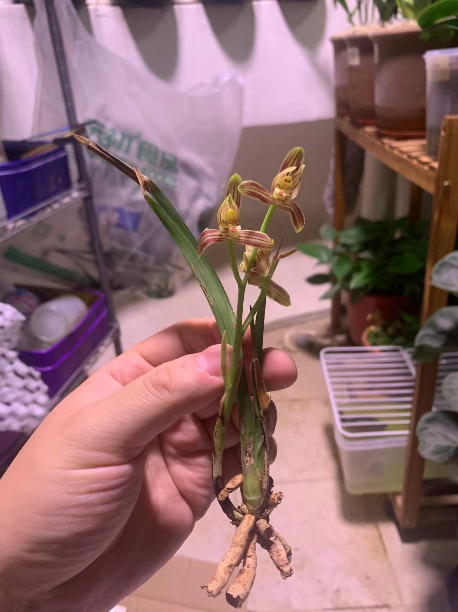
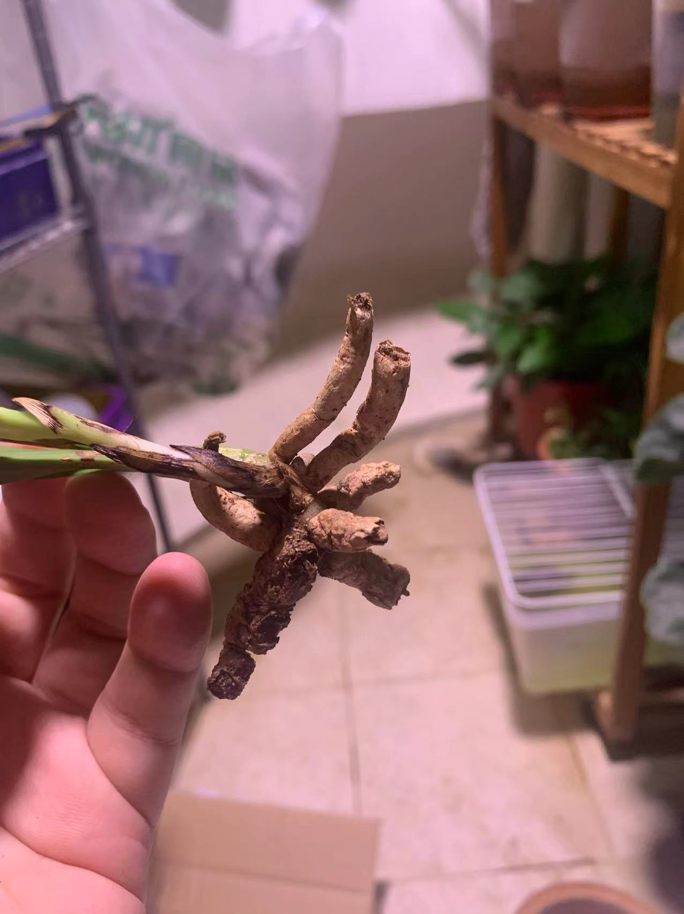
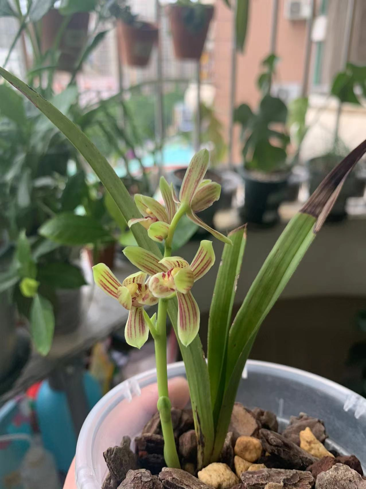

# 珍珠矮

珍珠矮(学名:Cymbidium nanulum Y. S. Wu et S. C. Chen),属于地生兰,地生植物.

## 科学分类

| 类目   | 所属                   |
| ------ | ---------------------- |
| 界     | 植物界(Plantae)        |
| 演化支 | 维管植物(Tracheophyta) |
| 演化支 | 被子植物(Angiosperms)  |
| 演化支 | 单子叶植物(Monocots)   |
| 目     | 天门冬目(Asparagales)  |
| 科     | 兰科(Orchidaceae)      |
| 属     | 蕙兰属(Cymbidium)      |
| 种     | 珍珠矮(C. nanulum)    |

## 保护级别(野生)

+ 列入<华盛顿公约>(CITES)——附录Ⅱ
+ 列入<世界自然保护联盟濒危物种红色名录>(IUCN)2004年 ver 3.1——濒危
+ 2021年底列入中国<国家重点保护野生植物名录>——二级

**注意野生珍珠矮是国家二级保护植物,请不要山采,不要购买野生珍珠矮(下山兰).目前珍珠矮并没有大范围培育园艺品种,因此市面上售卖的多为野生植株,购买有法律风险,请注意甄别.**

## 原生环境

原生珍珠矮生长在荫蔽度50%～65%的疏林中,土壤属微酸性的红黄壤,含少量黄砂,土质粘重,腐殖质极少.该地属亚热带季节气侯干热河谷类型,年均雨量不足1000毫米,90%降水集中5～10月(雨季).其余半年的旱季,降水量仅占全年的10%.冬春温暖干燥,夏秋炎热多雨,常温为28～35摄氏度,极温可达40度,冬季极少霜雾.

## 品种特点

珍珠矮通常独立成株,很少有大片连株的个体.每一株地下有一条粗壮型似姜块的不规则的近肉质的根状茎(龙根)直径达1厘米以上.根从龙根上长出,相当粗,而且分段,每段之间由中心柱连接.
珍珠矮的核心在于龙根,叶芽和花芽都是在龙根上长出来的,龙根也是会生长的,一些长得好的成株会有一个非常大非常重的龙根

珍珠矮植株矮小,叶长常在10cm至25cm,最长不过30cm,假鳞茎(芦头)不明显,一般一苗2至3片叶子.珍珠矮虽然是常绿植物不会季节性落叶,但比较容易退草,往往在一苗退草过程中会长出一苗新芽.

珍珠矮非常易花.花葶从龙根上发出直立,一般平架,总状花序疏生3-4朵花,花直径2.5-3.2厘米,花朵形态结构接近建兰.花朵有香,通常花瓣形如圆头短棍,平肩,略有收根放脚,外三瓣底色黄绿色或淡紫色,萼片和捧瓣都有5条红色脉纹.珍珠矮的花期基本和建兰重叠,花葶花朵形态结构也和建兰类似,因此早期被认为是建兰亚种.

<!-- 珍珠矮的有性繁殖能力很强,极易单株结果,兰荪中的种子也相对比较容易自然成活,这一点和传统国兰很不一样. -->

## 适合栽培场景

+ 地栽: 2/10,过于矮小起不到景观作用
+ 庭院: 2/10,过于矮小起不到景观作用
+ 露台(开放阳台): 8/10,天然通风优秀自带遮雨,根据朝向适当遮阳即可
+ 封闭阳台: 6/10,可以养但要注意开窗通风
+ 窗台: 6/10,可以养但要注意开窗通风
+ 室内: 1/10,没有阳光不行

## 种植难度

| 植物耐寒区 | 适应性 |
| ---------- | ------ |
| 11区       | 开挂   |
| 10区       | 开挂   |
| 9区        | 开挂   |
| 8区        | 简单   |
| 7区        | 普通   |
| 6区(暖气)  | 普通   |
| 5区 (暖气) | 普通   |
| 4区 (暖气) | 普通   |
| 3区 (暖气) | 普通   |
| 2区 (暖气) | 普通   |
| 1区 (暖气) | 普通   |

## 抗性

| 抗性项目 | 得分 |
| -------- | ---- |
| 耐虫度   | 6    |
| 耐病度   | 4    |
| 耐涝度   | 2    |
| 耐旱度   | 8    |
| 耐瘠薄度 | 10   |
| 耐肥度   | 2    |
| 耐寒度   | 3    |
| 耐热度   | 8    |
| 耐晒度   | 8    |

## 环境要求

+ 适应温度范围(摄氏度): `5~40`
+ 适应最大温差(摄氏度): `10`
+ 适应湿度范围: `35% ~ 100%`
+ 介质肥力要求: `无肥植料`或者`贫瘠植料`
+ 介质通透性要求: `疏水透气`
+ 光照要求

    | 评估项目       | 花期       | 发芽期         | 生长期 |
    | -------------- | ---------- | -------------- | ------ |
    | 时令范围       | 立夏至立冬 | 立冬至次年立夏 | 全年   |
    | 最低光照需要   | 低光       | 低光           | 低光   |
    | 最高光照耐受度 | 高光       | 高光           | 高光 |
    | 最优光照强度   | 中光       | 中光           | 中光   |
    | 最优光照时长   | 全日照     | 全日照         | 全日照 |

## 引种窗口期

比较合适的栽培时间应该是温度高于20摄氏度低于30摄氏度的时间段,也就是春秋两季.

## 栽培方式

针对珍珠矮的特性,其栽培方式.主要有:

1. 颗粒土种植,传统方式
2. 颗粒半水培

### 颗粒土种植

珍珠矮在最开始都是当建兰种的,因此颗粒土种植也是可行的.

优点是:

1. 技术成熟

缺点是:

1. 浇水频率较高

相较于常规兰盆,种珍珠矮更适合用浅盆种植,因为珍珠矮的根普遍短粗分节,并没有一般国兰那样向下扎根的能力,而是更喜欢长龙根.因此使用那种高度不超过20cm的宽口的钟形盆就可以了.

#### 物料准备

我个人的栽培环境和物料如下:

+ 开放阳台养殖
+ 使用的盆具有3种:
    + 土制红陶瓦盆: 口径17cm,高度18cm,底部带孔
+ 使用一次性龙虾桶作为红陶瓦盆和紫砂盆的泡盆容器
+ 使用颗粒植料作为介质: 植金石,赤玉土,奥科特树皮,大块泥炭土,蛇木碎,麦饭石或硅藻土碎
+ 4mm,6mm,9mm的筛子用于筛出粗细颗粒
+ 使用花多多1号,花多多2号,磷酸二氢钾作为叶面肥
+ 使用奥绿a2作为缓释肥
+ 茶叶包
+ 使用日本住友喷剂(小红瓶)作为杀虫杀菌药
+ 使用多菌灵作为杀菌和预防喷剂
+ 使用小白药小粉药作为药品
+ 黄板用于捉小飞黑

#### 上盆

1. 植料清洗干净并晾干至拿起来不会黏在手上但有可以摸出来是潮的的状态
2. 修剪植株,把干枯的叶子,叶夹,瘪掉根都剪干净,注意剪刀需要事先消毒
3. 上盆,我的配方分为4层
    1. 沥水层,使用9mm以上的大颗粒的植金石1:赤玉土1:大块树皮:1,大致铺2cm~3cm左右
    2. 中间层,使用6mm至9mm的植金石6:赤玉土6:奥科特树皮5:大块泥炭土2:蛇木碎1,铺到离芦头下端1cm左右
    3. 催芽层,在芦头周围一圈约1cm宽的位置使用3mm至6mm的纯赤玉土埋过芦头的位置,外围使用中间层植料填出一个以植株为圆心的鼓包
    4. 铺面层,使用3mm至6mm的植金石1:赤玉土1:麦饭石或硅藻土1混合铺面至埋过芦头约1cm.注意珍珠矮很可能根比芦头高,至少要埋过根
4. 放在阴凉通风没有直射光的位置放3至5天

#### 日常维护

+ 浇水
    1. 每个月一次使用大水浇透植料,浇到出泡泡,其他时候将内盆取出,套上960ml的一次性塑料甜品汤碗泡盆补水,注意每次泡盆需要将盆洗干净晾干避免交叉感染
    2. 观察内盆,盆壁没有水汽或者水汽很少了,盆上部细铺面部分全部干透,中间层也开始干了就浇水或者泡盆
    3. 梅雨季节持续阴天下雨,则至少10天浇一次水

+ 施肥(不严格)
    1. 非花期每周使用花多多1号喷施叶面肥
    2. 花期未开花时每周使用花多多2号和磷酸二氢钾交替喷施叶面肥
    3. 开花时不施叶面施肥
    4. 冬天白天温度低于10度,夏天晚上温度高于35度不施叶面肥
    5. 施叶面肥要在晚上,要叶片两面都喷上喷湿
    6. 施叶面肥的后一天晚上叶面喷水,同样叶片两面喷湿
    7. 每年春分秋分用茶叶包包上5颗奥绿a2后放在盆面
+ 预防病虫害(严格)
    1. 每年春分秋分,夏至冬至,使用茶叶包包上小白药小粉药各三分之一勺放在盆面
    2. 除冬天外每个月找个晚上用多菌灵溶液喷叶一次,同样叶片两面喷湿
    3. 喷多菌灵溶液后一天晚上叶面喷水,同样叶片两面喷湿
    4. 附近放黄板
+ 治疗病虫害
    1. 发现病虫害后消毒剪刀剪去病虫害的叶片,然后使用小红瓶喷湿剩下的植株,一天隔一天的喷,连喷3次

### 颗粒半水培

#### 物料准备

我个人的栽培环境和物料如下:

+ 开放阳台养殖
+ 使用套盆作为容器: 套盆部分使用960ml的一次性塑料甜品汤碗+口径11cm的塑料控根网盆
+ 使用颗粒植料作为介质: 就是普通的国兰颗粒植料,我的配方是植金石1:赤玉土1:奥科特树皮1,全部使用的是9mm以上的大颗粒
+ 使用花多多1号,花多多2号,磷酸二氢钾作为叶面肥
+ 使用奥绿a2作为缓释肥
+ 茶叶包
+ 使用日本住友喷剂(小红瓶)作为杀虫杀菌药
+ 使用多菌灵作为杀菌和预防喷剂
+ 使用小白药小粉药作为药品
+ 黄板用于捉小飞黑

### 上盆

1. 植料清洗干净并晾干至拿起来不会黏在手上但有可以摸出来是潮的的状态
2. 修剪植株,把干枯的叶子,瘪掉根都剪干净,注意剪刀需要事先消毒
3. 在塑料控根网盆中填入植料垫底,然后放入植株,最后填上剩余植料即可,一般埋末芦头1cm左右即可.注意拍捏盆壁使植料更好的填充空间,同时也需要适当保留一些空隙以透气
4. 放在阴凉通风没有直射光的位置放3至5天
5. 一次透水,并将外盆的水位控制在贴着内盆的底部(可以略微没过)

### 日常维护

+ 换水浇水
    1. 水中长藻太丑了可以换水顺便浇透植料
    2. 表层植料全干超过1个月可以换水顺便浇透植料
    3. 内盆中没有水汽了可以换水顺便浇透植料
    4. 冬季白天温度低于10度后不浇水改为喷湿叶片和表土
+ 施肥(不严格)
    1. 非花期每周使用花多多1号喷施叶面肥
    2. 花期未开花时每周使用花多多2号和磷酸二氢钾交替喷施叶面肥
    3. 开花时不施叶面施肥
    4. 冬天白天温度低于10度,夏天晚上温度高于35度不施叶面肥
    5. 施叶面肥要在晚上,要叶片两面都喷上喷湿
    6. 施叶面肥的后一天晚上叶面喷水,同样叶片两面喷湿
    7. 每年春分秋分用茶叶包包上5颗奥绿a2后放在盆面
+ 预防病虫害(严格)
    1. 每年春分秋分,夏至冬至,使用茶叶包包上小白药小粉药各三分之一勺放在盆面
    2. 除冬天外每个月找个晚上用多菌灵溶液喷叶一次,同样叶片两面喷湿
    3. 喷多菌灵溶液后一天晚上叶面喷水,同样叶片两面喷湿
+ 治疗病虫害
    1. 发现病虫害后消毒剪刀剪去病虫害的叶片,然后使用小红瓶喷湿剩下的植株,一天隔一天的喷,连喷3次

## 特殊时期维护重点

1. 梅雨季
    回南天(春分前后一个月),岭南的龙舟水(端午前后一个月)和长三角的黄梅天(农历6月初)是梅雨季节,雨水充沛,高湿度,温度适中.这两个时间节点分别是这两地兰花生长最旺盛的阶段,也是最容易得虫害病害的时候.这段时间需要好好施肥放药,篇湿养护.

2. 三伏天
    夏至后国内开始入伏,温度升,阳光开始变毒.兰花会在高温时进入短暂的休眠状态,吸收能力下降,几乎停止生长,可以拉50%的遮阳网防止晒伤也降低小环境温度.一般我会以40摄氏度为基准,低于40度正常养护,高于则偏干养护(浇水周期延长50%至100%).注意入伏后浇水施肥都应该在晚上天凉了以后

3. 入冬后(非岭南地区)
    当气温低于5摄氏度后珍珠矮会被冻伤,因此在秋末入冬后应该将其放入室内或者搭个简易温棚保温.

## 主要欣赏价值

珍珠矮的花小巧精神,花香味特点也接近建兰,主要是的价值在赏花闻香.由于非常丰花,所以闻香的时间比较长.加上一般植株不大,单株使用口径11cm的小浅盆就够,所以很适合作为窗前书桌上的摆件.

## 生长习性

+ 常态叶长度范围: 10cm~25cm
+ 常态叶宽度范围: 1cm~1.5cm
+ 花期:
    + 江南: 芒种~霜降
    + 岭南: 立夏~寒露
+ 花寿:
    + 10天左右

+ 生长周期
    + 10区

    | 生长阶段   | 正月 | 二月 | 三月 | 四月 | 五月 | 六月 | 七月 | 八月 | 九月 | 十月 | 十一月 | 腊月 |
    | ---------- | ---- | ---- | ---- | ---- | ---- | ---- | ---- | ---- | ---- | ---- | ------ | ---- |
    | 花期       | ---  | T  | T  | T    | T    | T    | T    | T    | T    | ---  | ---    | ---  |
    | 叶芽期     | ---  | ---   | T    | T    | ---  | ---  | ---  | T    | T    | T    | T      | ---  |
    | 花芽期     | ---  | ---  | T | T    | T    | T    | T    | T    | T    | ---  | ---    | ---  |
    | 旺盛生长期 | ---  | T    | T    | T    | ---  | ---  | ---  | T    | T    | T    | ---    | ---  |
