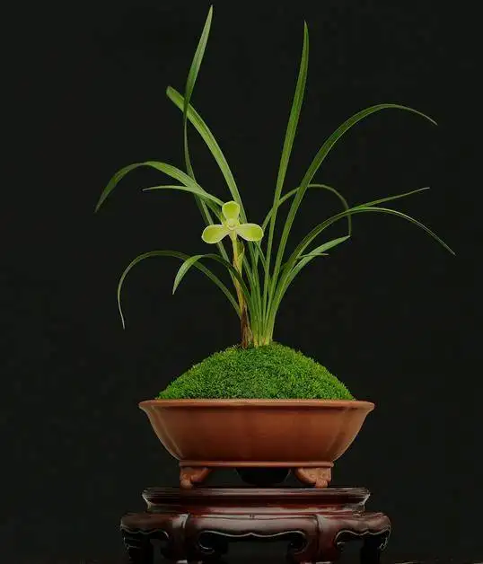

# 国兰

国兰指中国境内原生的特定几种形态习性相近的多年生常绿地生兰,狭义来说种类包括春兰,蕙兰,建兰,墨兰,寒兰.近些年也已经将

莲瓣,秋芝,秋榜,春剑,送春纳入其范畴.

注意国兰范畴中的所有品种都是国家二级保护植物,请不要山采,不要购买野生国兰(下山兰),如果喜欢请购买正规渠道的园艺种.

## 国兰鉴赏的历史沿袭

中国人培育国兰的历史从有典可寻算起已经超过800年,按时间线可以整理出我国国兰鉴赏栽培各个时期的特点

1. 唐宋时期,建兰培育鉴赏在文人士大夫等知识分子阶层开始流行.最早的国兰专著是唐宋时期闽人赵时庚的<金漳兰谱>(1233年)和闽人王贵学的<王氏兰谱>,这两本书系统地记有50多个建兰名种,并较全面地介绍了栽培和管理方法,被后人誉称为"建兰双堂".唐宋时期已经出现了写建兰的诗作,比如李白的<自金陵朔流过白璧山玩月达天门,寄句容王主簿>(从'秋月'一词判断寄君青兰花为建兰).
2. 南宋元明及清早期,建兰的鉴赏和栽培标准已经成熟,元明时期有孔静斋的<至正直记>,鹿亭翁的<兰易>和簟溪子的<兰易十二翼>,它们更为系统地记载和详细描述了建兰各个品种花品的外貌特征,叙写了具体的栽培方法.随着政治经济中心由中原转移到江浙,春兰也逐渐进入了文人的视野,这一时期已经可以看到画春兰的画作了,比如南宋赵孟坚的<墨兰图>(单杆单花明显是春兰).此时建兰被称为秋兰
3. 清康熙初年,江浙文人开始关注本地品种的春兰蕙兰,同时养兰已经形成产业.该时期的<第一香笔记>中就有相关记述.
4. 清乾隆初年,在江苏的徽人鲍绮云根据时人对"佳种"的讲究,率先用文字形式将兰蕙花品形态特征的审美理论和要求写在自己所撰的<艺兰杂记>一书里(本书已遗失).形成了最早的国兰鉴赏标准--瓣型学说的雏形.同时建兰的栽培被逐渐减少,春蕙正式进入历史主流.墨兰也开始被江浙商人注意到开始广泛栽培
5. 民国时期,对兰花的培育观赏开始进一步的系统化理论化,民国8年面世的江苏江宁人杨复明的<兰言四种>,民国9年时在上海问世的清芬室主人的<艺兰秘诀>.接续有民国12年时发行的仁和(杭州)吴恩元的<兰蕙小史>。这些书所搜集的兰蕙品种有150个之多,并全都按"瓣型学说"的要求对各花进行具体的形象描述.到民国18年时有于照的<都门艺兰记>,稍后还有湖州郑同梅的<莳兰实验>一书.
6. 新中国改革开放后,人民群众生活好了,有了更多的精神追求,同时许多遗失海外和台湾香港的国兰品种重新回到祖国,同时又有杂交组培技术带来了量大质优的新品种,国兰作为观赏植物重新被大众关注.同时由于国兰市场的发展,更多的品种开始填充进了国兰的范畴,寒兰,春剑,莲瓣兰,秋榜,送春,秋芝这些兰种也从区域范围流行开始走进全国市场.

## 当代国兰历史和发展趋势

当代国兰历史此处特指新中国建立后的的国兰历史.

兰花作为一种带有一定奢侈品定位的文化消费品其历史变迁自然自然也符合文化消费品的一般特征.即

1. 受经济水平,国民文化水平和国力水平变化影响
2. 受技术变革尤其是传媒技术和领域相关技术的变革影响

国兰栽培已有近千年历史,兰文化也早已辐射到了其他儒家文化圈的地区比如日韩,更不要提自诩中华正统的港台地区了.新中国本质是建立在旧中国之上的,虽然物质资源可谓一穷二白,但精神资源是有完整传承的;新中国用50年走过了别的发达国家100年200年的发展历程,堪称风云激荡.在这风云激荡的时代中,国兰的发展历程自然也跟着上下沉浮.因此当代国兰的历史变迁还有如下独有特征:

1. 剧烈,来得快去的也快
2. 热点分散.几乎每次的热点都不相同
3. 具有路径依赖,国兰在理论上基本还是沿用和发展传统的瓣型理论
4. 具有外部依赖性,受到周边亚文化尤其当时经济强势的日本台湾香港的极大影响.

当代国兰历史到目前为止又可以分为如下几个时期:

1. 建国初期

    建国初期由于有"兰王"沈渊如的集中保护,国内主要的文人兰(主要是春蕙)都保护的不错.由于朱德元帅是个兰花爱好者,总体来说这个阶段和建国前差不多依然是文人名人玩为主,基本是小圈子的娱乐.主要流行的也是江浙春兰蕙兰.当然也有"朱德素"这样的建兰名品被发掘出来流传后世

2. 文革时期

    沈渊如的藏品捐赠给了国家,后遭到大量贱卖遗失,国内的文人兰受到了极大打击,许多名品就此流失.国家的浩劫体现在各个领域.

3. 改革开放后

    随着改革开放,大量流传如日韩台湾香港的兰花返销国内,组培技术,杂交技术开始也借由日韩台商引入国内.兰花也在这一过程中也逐渐从文玩奢侈品转变成了投资标的,又由投资标的正在逐渐回归本质成为正常的绿植走进千家万户.这一趋势不出意外不会改变,但细讲又可以拆分成如下几个阶段:

    + 90年代初,第一波兰市,基本可以理解为日韩台湾成熟的兰花市场对国内不成熟兰花市场的降维打击.这一时期主要是炒作的有如下几类:
        + 国内失传流失海外的老种名品春蕙(传统瓣型花).具体操作大致是台商从日韩进货后返销内地,这些花多是组培的,很多并没有硬化好就投入市场,这类兰花现在被称为返销草
        + 线艺墨兰,主要推手是台商和闽粤两地商贩.
        + 建兰瓣型花,主要推手应该是四川商贩
        这一时期奠定了改革开放后新中国兰市的基本格调--围绕"兰文化"做文章.也为后续兰市的发展奠定了基础,毕竟文革对文人兰的影响太大了.这一时期春蕙依然是主流,但墨兰因为闽粤台的自然禀赋问题而真正进入国兰视野,成为绝对的明星.

    + 90年代末到00年代初,第二波兰市,基本可以理解为第一波兰市的延续,但台商已经从配角变成了主角.这个时期主要炒作的有如下几个类型:
        + 奇花,各种牡丹各种麒麟啥的,主要是墨兰建兰
        + 蝶花,各种蕊蝶各种三星蝶各种外蝶,主要是春兰建兰
        + 水晶艺,主要是墨兰
        这一时期主要是台商正式登上舞台,他们在南方设厂专门培育兰花,可以看到后续许多的事件都会看到他们的身影.但到了第二波兰市末期墨兰就已经没有后劲了,基本上之后也起不来了.

    + 20年代初到2007,第三波兰市也可以被称作兰花热,基本可以理解为台商利用现代的农业技术和金融技术手段对毫无见识的国内兰圈进行降维打击的结果.这个时期主要炒作的有如下几个类型:
        + 素心花,各种新的素心花基本是这个时候出来的,主要是春兰建兰
        + 各种边缘的细叶兰,比如莲瓣,春剑,香豆瓣,都是这个时期被炒成的主流
        + 跨种杂交兰伪装成国兰.
        这个时期应该是国内兰花热最疯狂的时期,各种天价兰花带着俗气的名字出现在大众面前,比如一株260万的大唐盛世,更是标价1100万的天逸荷等等.结合这个时期基本也是国内传销最猖獗的时期(也是台湾人带来的),这种现象回想起来也就不奇怪了.
        2007年随着央视一篇关于天价兰花的报道,第二波兰花热迅速降温,兰市陷入了持续7年的低迷期

    + 2014年至2019,第四波兰市,这个时期基本和国内智能手机以及4g网络开始铺开同步,由于智能手机自带高品质照相摄像功能,客观上让每个人都可以成为摄影师,极大的便利了卖家宣传.这个时期主要炒作花色,主要有如下几个类型:
        + 红花,水红花,粉红花,紫红花,主要是西南春兰和建兰
        + 红素红舌花,也主要是春兰建兰
        + 复色花,主要是建兰,比如白彩粉彩
        + 彩素(红壳素),主要是春兰建兰
        在2019年底国家重新修订了法案,国内所有除了兔耳兰外的野生兰科植物都成了国家二级保护植物,售卖下山兰成了非法行为,基本标志着第四波兰市的结束.虽然在这之前所谓下山兰也不过是杂交育种的幌子,但这个幌子没了市场还是需要适应一段时间的,时至今日(2022年)第四波兰市基本上只剩下余波,热门品种的售价也早已不再坚挺

    可以看出兰花在改革开放后在欣赏角度上经历了追求老种->追求新奇->追求视觉三个阶段.而流入资金明显也从暴发户心态转向过日子心态.就目前的情况看兰花的将来会重新回到文玩这个领域,只是很难再有什么孤品,更加接近名贵绿植的定位(参考ins风植物中的各种锦化绿植).
