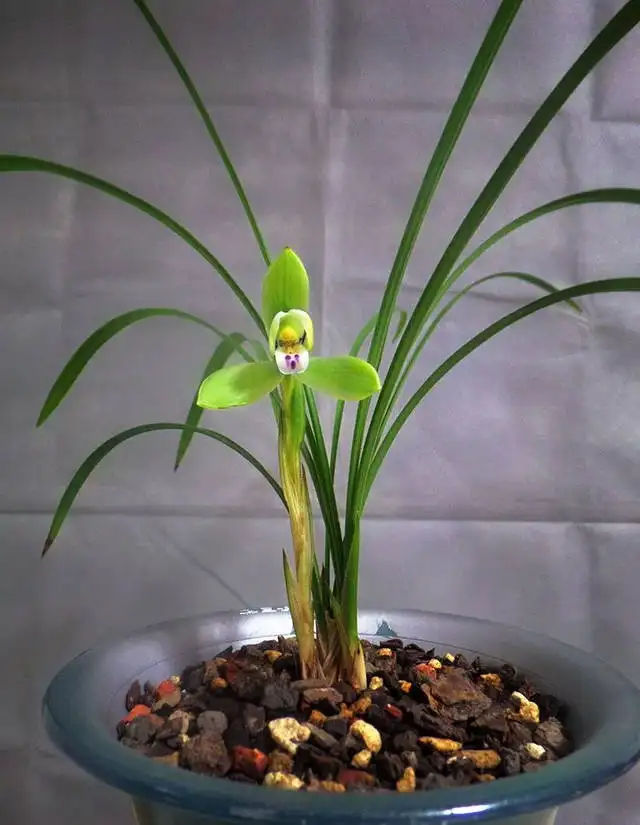
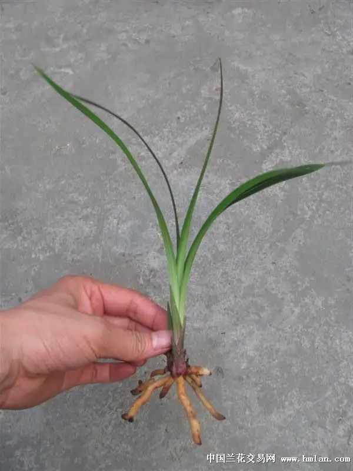
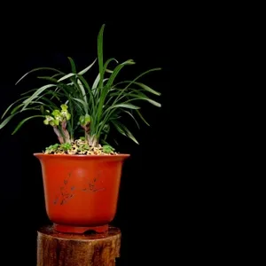

# 国兰赏叶

赏叶是国兰一个重要的价值所在.通常来国兰赏叶是赏的两个方面:

+ 叶型
+ 叶艺
  
通常来说春兰蕙兰寒兰主要赏叶型,建兰墨兰主要赏叶艺.

## 国兰的叶型

国兰的叶型指的是叶子的姿态.优秀叶型的品种要么挺拔刚健,要么清秀飘逸,要么雍容富贵.叶型欣赏主要从如下几个方面进行:

+ 叶长范围,描述成苗最常见叶长状态,分为:
    + 小叶材(20cm上下),
    + 中小叶材(25cm上下),
    + 叶材中等(30cm上下),
    + 叶材中高(超过40cm,不到60cm),
    + 叶材高大(超过60cm)
+ 叶宽范围,描述成苗最常见叶宽状态,分为:
    + 细叶,1cm以下
    + 普通宽度,1~1.5cm
    + 宽叶,1.5cm以上
+ 叶色,指成苗叶片颜色,一般有翠绿,油绿,暗绿,墨绿4种颜色
+ 叶质,指兰叶质感,有软有硬,有薄有厚,有肉质有革质
+ 叶尖,描述兰花叶片叶尖的形状,下图是最常见的22种叶尖形状
    
+ 叶面,描述叶面特征,一般有平整叶,V形叶,蛤蟆皮(叶面有凹凸状斑点),行龙叶(中骨,即兰叶中间最粗大的一条主叶脉,两侧有纵向凹陷),扭卷叶(叶面延中骨扭曲)
+ 叶姿,描述叶片的整体形态,分为:
    
    
    + 立叶(企剑)
        + 直立叶:叶脉硬朗,叶质较厚,叶直立.立叶草往往叶面细,典型的如环球荷鼎.
            
        + 半立叶:叶从假鳞茎出土后向斜上方向生长.如龙字.
            
    + 软垂叶(软剑)
        + 半垂叶(弓型叶),叶片从假鳞茎斜着生长,到中间慢慢弯下.比如建兰国魂
            
        + 垂叶,叶呈镰刀型,叶尖下垂至假鳞茎.如大富贵等
            
    + 卷叶,叶子柔软打卷,比较少见
        

## 国兰叶艺

国兰叶艺指的是叶子出现异于寻常状态的现象.通常包括锦化,缀化,蝶化3个部分

观叶一般是看叶子的变化,即特殊个体与普通个体的差别,最常见的是看锦化,比如现在大热的白锦龟背竹各种,比较成熟的欣赏标准是兰花的叶艺标准
+ 锦化范围
    + 无锦化(无艺)
    + 全叶边缘均匀锦化(覆轮艺,金边,银边)
    + 叶尖边缘锦化(爪艺)
    + 在叶尖范围内出现锦化(扫尾艺)
    + 叶尖由边缘向内锦化,范围最大可以超过叶面一半(鹤艺)
    + 叶面线状(缟艺)
    + 叶面斑状(斑艺)
    + 叶面除了边缘外都有锦化,和覆轮艺相反(中透艺)
    + 叶面以主筋为界一半有锦一半没有(阴阳锦)

+ 缀化

+ 蝶化