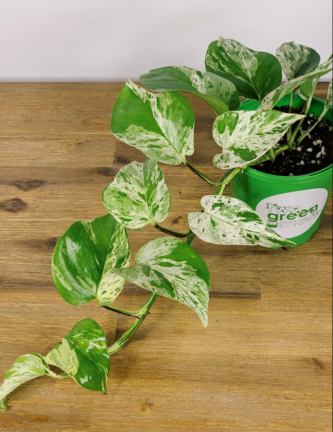
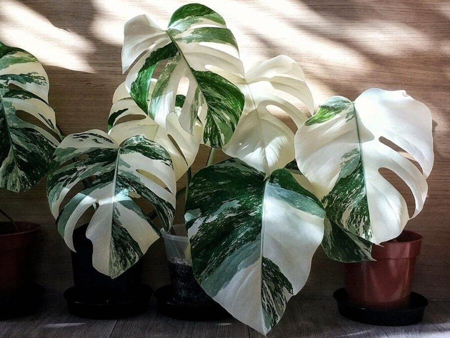

# 锦化

锦化(Variegation)又称锦斑变异,它是指植物的茎,叶等部位发生颜色上的改变,如原本植物主体颜色为绿色,而后发生锦斑变异现象从叶片中心或者边缘生长出白色或黄色的斑纹.比如我们常见的大理石女王绿萝,白锦叶龟背竹.

锦化是一种不稳定的变异,叶片由于变异部分或全部的缺乏叶绿素,形成黄色或白色的条纹或斑点组织.这些色素掩盖了叶绿素色素,产生了更暗的颜色(紫色,红色等).

## 形成原因

所有的植物都是通过增加嫩枝和根尖的细胞数量来增加长度的,这些活跃的细胞分裂区域称为顶端分生组织,这种生长称为初级生长.一些植物,尤其是单子叶植物,在叶基部有分生组织导致叶片伸长.在木本植物中有额外的分生组织称为侧分生组织,产生次生生长.最重要的侧分生组织是维管形成层,它产生木材和树皮缀化.生长只涉及初级生长.

在每种植物中顶端分生组织和中间分生组织的细胞分裂会经过环境和自身调节从而形成独特的茎和叶形状.例如在抑制分枝的情况下,顶端的快速生长会导致茎长而细,而生长缓慢则会导致茎"更肥".偶尔会发生一种称为生长突变的现象,它"扰乱"了初级分生组织中受调控和协调的细胞分裂.这些突变的原因往往是

1. 植物体损伤,很多时候商家会使用化学药物或者辐射等方式造成植物体损伤从而诱发锦化
2. 细菌或病毒性疾病,往往来自自然界
3. 遗传变异

## 后果

锦化本质上是一种病态的表现,由于缺乏叶绿素所以往往变得抗性降低.

## 维护

锦化植物本身这种突变一般都不稳定,有一定概率退化(康复).要维持锦化需要降低光照相对阴养,否则由于光照充足会促进叶绿素生成,更加容易退锦
