# 国兰的生长习性及评价标准

国兰生长习性标准分为如下几个方面:

+ 整体描述
+ 发芽习性
+ 长根习性
+ 展叶习性
+ 芦头特性
+ 开花习性

## 整体描述

国兰都是地生兰,总体来讲适宜生长在南方温暖湿润的地区,多为丛生.植株高大的可以达到1米高,矮小的则可以只有不到20cm高.叶型飘逸,花有柔和的香味.

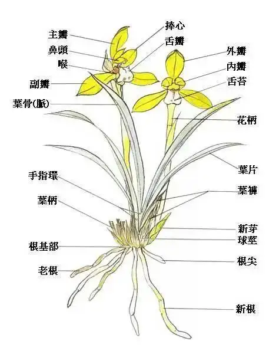

国兰栽培一般不会做有性繁殖,都是分苗得到的新的植株.国兰单苗的生命周期可以分为:

+ 芽期,即从母本植株中分化为叶芽开始到开叶结束的时期
+ 新苗期,叶芽开叶后到最后一片常态叶长出来,这个期间新苗的芦头会逐渐膨大(结头),叶片也会逐渐展开.
+ 成苗期,最后一片常态叶长出来到出现叶片变黄,芦头长黑斑等老化现象
+ 老苗期,出现出现叶片变黄,芦头长黑斑等老化现象开始到开始退常态叶
     
+ 老头期,开始退常态叶到根也退光只剩芦头
    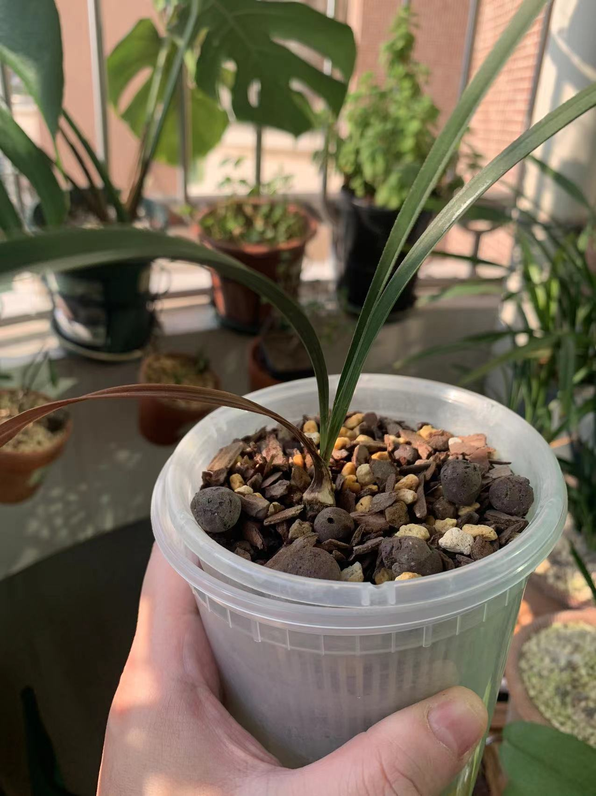

介绍品种整体习性,主要包括:

1. 植物耐寒区适应性,按由难到易包含范围:
    + 未知
    + 无法种植,即无论如何都养不活
    + 大师,即需要相当有经验才能养不死,且即便养不死也难以养出状态
    + 困难,即需略有经验才能养不死,且需要相当有经验才能养出状态
    + 普通,即正常养护即可养活,略有经验即可达到非常好的状态
    + 简单,即正常养护即可养活并可以达到非常好的状态
    + 开挂,即正常养护即便有失误也可养活,正常养护就可以达到非常好的状态

    其形式为:

    | 植物耐寒区 | 适应性 |
    | ---------- | ------ |
    | 11区       | 简单   |
    | 10区       | 简单   |
    | 9区        | 简单   |
    | 8区        | 简单   |
    | 7区        | 普通   |

    该描述后面的描述都需要分区介绍

2. 一年周期内按农历的生长阶段,分为:
    + 花期,开花的时间段
    + 叶芽期,出叶芽的时间段
    + 花芽期,出花芽的时间段
    + 旺盛生长期,兰花长得最快的时间段
    + 春化期,部分国兰需要的一段低温孕育花芽的时期

    其形式以普通春兰为例:

    | 生长阶段 | 花期 | 花芽期 | 春化期 | 叶芽期 | 旺盛生长期 |
    | -------- | ---- | ------ | ------ | ------ | ---------- |
    | 正月     | T    | ---    | ---    | ---    | ---        |
    | 二月     | T    | ---    | ---    | T      | T          |
    | 三月     | ---  | ---    | ---    | T      | T          |
    | 四月     | ---  | ---    | ---    | T      | T          |
    | 五月     | ---  | T      | ---    | ---    | T          |
    | 六月     | ---  | T      | ---    | ---    | ---        |
    | 七月     | ---  | ---    | ---    | ---    | ---        |
    | 八月     | ---  | ---    | ---    | T      | T          |
    | 九月     | ---  | ---    | ---    | T      | T          |
    | 十月     | ---  | ---    | T      | T      | T          |
    | 十一月   | ---  | ---    | T      | ---    | ---        |
    | 腊月     | T    | ---    | T      | ---    | ---        |

## 发芽习性

国兰一般丛生,发芽是其自身无性繁殖的一种手段.个人认为赏芽也是兰花欣赏价值中很重要的一个方面.
在描述兰花丛生结构的时候一般以几代苗来区分.

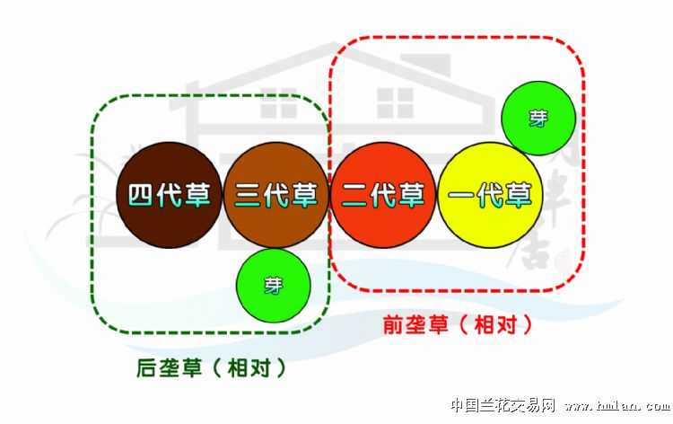

较新的前两苗称为前垄,剩下的称为后垄.发苗通常是前垄发,老苗后垄发苗概率不高.

芽会经历如下阶段的成长最终长成兰苗

+ 芽点阶段,兰花从母体芦头上长出芽点并逐渐长大直到破土而出.
+ 出土阶段,兰芽破土而出逐渐升高但没有长叶子的阶段的阶段
   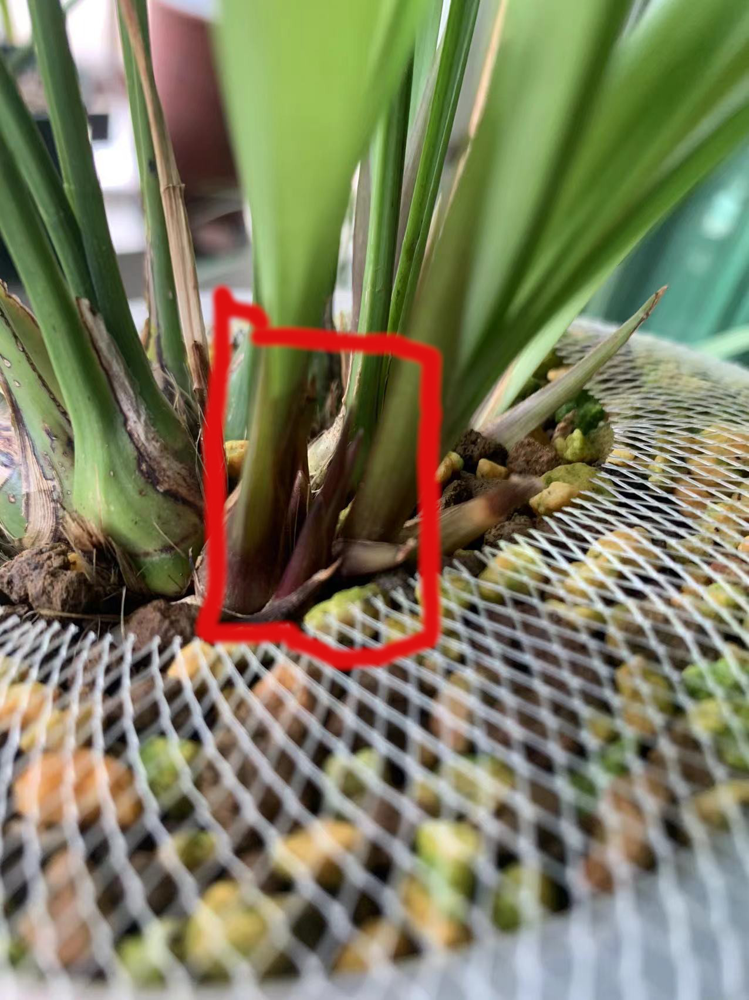
+ 长根阶段,国兰一般在芽出土后会有一段时间不再长芽看上去像僵苗了一样,这实际是芽在长根.
+ 开叶阶段,芽从完全闭合到鞘叶打开露出常态叶
   

主要包括如下评估标准.

+ 芽色,兰花的芽点一般都是嫩白色,芽点经过发育外层会长出苞片,这些苞片的颜色就是芽的颜色,一般有嫩绿色,深绿色,粉红色,嫩红色,深红色,紫色,褐色黑色,有些在尖端还有颜色变化
+ 发芽条件,描述成熟健壮植株的发芽条件,分为:
    + 季节型,只要到固定季节就发芽
    + 条件型,只要满足固定条件就会发芽
    + 条件季节型,既要到固定季节又要满足固定条件

+ 单苗成熟周期,单苗从冒芽到长成成苗的生长时间

+ 不同位置出芽的丰芽程度,以一年为周期描述单次周期不同位置出芽的习性
    苗根据出芽母体位置分为如下

    + 新苗,即新苗期的苗
    + 成苗,即展叶结芦完成的苗
    + 老苗,即老苗期的苗
    + 老头,即老头期的苗
    + 花芽,即从凋谢的花芽上长出芽

    根据出芽母体的健壮程度分为
    + 弱苗,明显瘦小的苗,体现在苗的宽度小,展出的常态叶数量少,叶片也短且细,芦头也细小
    + 中苗,正常大小的苗
    + 壮苗,明显强壮的苗,体现在苗的宽度大,展出的常态叶数量多,叶片宽且长,芦头也大

    根据丛生情况可以分为:
    + 单苗
    + 两苗
    + 小丛,即3苗至5苗
        + 小丛前垄
        + 小丛后垄
    + 中丛,即6苗至15苗
        + 小丛前垄
        + 小丛后垄
    + 大丛,即15苗以上
        + 大丛前垄
        + 大丛后垄

    丰芽程度分为:
    + 丰芽,即1年稳定2苗以上
    + 出芽,即1年稳定1苗以上
    + 少芽,即1年一苗的概率在50%以上
    + 极少芽,即1年一苗的概率在50%以下
    + 不出芽

    | 母体位置 | 母体健壮程度 | 独苗   | 两苗   | 小丛前垄 | 小丛后垄 | 中丛前垄 | 中丛后垄 | 大丛前垄 | 大丛后垄 |
    | -------- | ------------ | ------ | ------ | -------- | -------- | -------- | -------- | -------- | -------- |
    | 新苗     | 弱苗         | 出芽   | 出芽   | 少芽     | 极少芽   | 少芽     | 不出芽   | 少芽     | 不出芽   |
    | 新苗     | 中苗         | 出芽   | 出芽   | 出芽     | 少芽     | 出芽     | 极少芽   | 出芽     | 极少芽   |
    | 新苗     | 壮苗         | 丰芽   | 丰芽   | 丰芽     | 少芽     | 丰芽     | 极少芽   | 丰芽     | 极少芽   |
    | 成苗     | 弱苗         | 出芽   | 出芽   | 少芽     | 少芽     | 少芽     | 不出芽   | 少芽     | 不出芽   |
    | 成苗     | 中苗         | 出芽   | 出芽   | 出芽     | 少芽     | 出芽     | 极少芽   | 出芽     | 极少芽   |
    | 成苗     | 壮苗         | 丰芽   | 丰芽   | 丰芽     | 少芽     | 丰芽     | 极少芽   | 丰芽     | 极少芽   |
    | 老苗     | 弱苗         | 少芽   | 少芽   | 少芽     | 极少芽   | 少芽     | 极少芽   | 少芽     | 不出芽   |
    | 老苗     | 中苗         | 出芽   | 出芽   | 出芽     | 极少芽   | 出芽     | 极少芽   | 出芽     | 不出芽   |
    | 老苗     | 壮苗         | 出芽   | 出芽   | 出芽     | 极少芽   | 出芽     | 极少芽   | 出芽     | 不出芽   |
    | 老头     | 弱苗         | 极少芽 | 极少芽 | 极少芽   | 不出芽   | 极少芽   | 不出芽   | 极少芽   | 不出芽   |
    | 老头     | 中苗         | 少芽   | 少芽   | 少芽     | 极少芽   | 少芽     | 极少芽   | 少芽     | 不出芽   |
    | 老头     | 壮苗         | 少芽   | 少芽   | 少芽     | 极少芽   | 少芽     | 极少芽   | 少芽     | 不出芽   |
    | 花芽     | ---          | 极少芽 | 极少芽 | 极少芽   | 极少芽   | 极少芽   | 极少芽   | 极少芽   | 极少芽   |

+ 芽艺,这部分可以参考[国兰赏芽]部分

## 长根习性

国兰是肉质地生根,无根毛,颜色乳白或淡黄,粗细如筷子,一般无主根与支根之分.不同种类的国兰根的长短及形态各异,有的分杈有的不分杈,有的直生有的弯曲.

兰根从外到内由根被组织,皮层组织和中心柱三层组成.根被由海绵体状细胞组成,主要功能是吸水,储水,还有保护皮层组织的作用.

+ 最外层是根被组织,它导源于表皮组织.根被组织的细胞为长筒形,多角,由中心向外,辐射状排列.根被细胞成熟时细胞发生加厚的条纹,根被组织的功能是保护皮层,吸收水分,减少和保护皮层内部水分的散失

+ 兰根的中层为皮层组织,俗称根肉,细胞比较发达,约有20层多角形的细胞.厚度约为根被组织的3倍,占根的大部分.最外面紧靠根被组织的一层是外皮层由单层细胞组成,辐射状排列,整齐,体积大于一般的根被细胞;其内为皮层,皮层细胞有的含有针状结晶体,有的含有共生的根菌.

+ 兰根的内层为中心柱,中心柱最外层与皮层相接的为内皮层,内皮细胞上凯氏带很发达.紧贴内皮层的为一层维管束鞘.内皮层与维管束鞘都有两种不同构造的细胞.在韧皮部外周的为厚壁细胞;在木质部外周的则为薄壁细胞.厚壁细胞主要是加强根的强度,薄壁细胞是输导组织,用来运输水分和养分.兰根有多数的维管束,其木质部和韧皮部是分开的呈辐射状排列.在木质部和韧皮部周围有纤维组织,成为管柱;中心则为薄膜细胞的髓部.

兰根干渴后会萎蔫,一旦遇水又会迅速吸水膨涨.

兰菌是真菌.当它们进入兰根的皮层后便在皮层中形成菌丝团并吸收根周围根瘤细菌分解出的腐殖质,把它们变成养分贮存在体内.

生长中的兰根根尖的膨大部分颜色是白嫩半透明的,被称为水晶头.从一定程度上来说水晶头越多代表植株越有活力.

国兰的根在自然环境下并不完全向下生长,而是喜欢贴着土面横着生长.一般来说地面上能有多大冠幅,地下就可以有多大冠幅.

现代兰苑养国兰一般使用深盆控根从而节省空间.因此一般买回来的兰根是向下生长的看起来像面条一样.
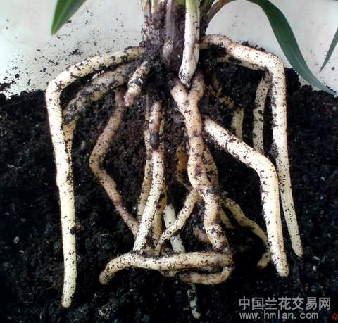

我们评估国兰长根的习性从如下几个角度

+ 发根条件,描述植株发根的条件
    + 季节型,只要到固定季节就发芽
    + 条件型,只要满足固定条件就会发芽
    + 条件季节型,既要到固定季节又要满足固定条件

+ 易根性,是否爱长根新,主观感受,按0至10评分
+ 粗壮度,大致分为粗,中,细三种
+ 地面根易出程度,一些品种长根容易长出土外,这样会比较影响美观,而且也容易出海底芽,不利于兰花生长

## 展叶习性

国兰的的地上部分在非花期就是叶子.赏叶也是国兰重要的的观赏价值.国兰的叶片一般都是由假鳞茎上生出,叶形呈带状或线型,而且都没有明显的叶柄.叶片边缘有些品种有粗细不一的锯齿.叶脉平行,大多颜色为暗绿色,也有油绿色和墨绿色,叶片梢部圆钝或尖锐.

国兰的展叶习性我们从如下几个角度:

+ 叶型,这部分可以参考[国兰叶型]部分
+ 叶艺,这部分可以参考[国兰叶艺]部分

## 芦头特性

国兰芦头一般是圆形或者椭圆形,通常讲墨兰建兰芦头比较大,春蕙则小些,而且更加圆,但也不尽然.

国兰的每个芦头一般最多可以出6个芽点,其他则是长根的

国兰的芦头习性我们从如下几个角度:

+ 大小,即常见直径
+ 形状,即芦头是圆的还是椭圆的

## 开花习性

国兰除了春兰外都是一杆多花,只有春兰一般都是一杆一花,偶尔一杆两花.其花结构如下

上图中还有如下概念没有标注:

+ 外三瓣:主萼瓣和侧萼瓣组成的整体称为外三瓣.
+ 中宫:捧瓣和唇瓣以及蕊柱组成的整体称为中宫
+ 花铃:古人称蕙兰的幼蕾为花铃,因为在花未开时花蕾犹如一个个小铃铛因而得名.现在衍生为除春兰外国兰(即一杆多花的国兰)的幼蕾
+ 排铃:即兰花花序的特称.古人描述蕙兰的花朵着生在花梗上的形状和排次.现在衍生为除春兰外国兰((即一杆多花的国兰))花朵着生在花梗上的形状和排次.

国兰的花都有香味
国兰开花是从分化花芽开始的,一般花芽和叶芽颜色相同,但形状更加圆润.春兰和其他国兰从出花芽到开花过程不\同,会经历如下状态:

+ 春兰
    1. 抽杆(抽箭),花芽成熟后会抽出花杆(也叫花梗,或花茎,或花葶或花箭或花夷)并逐渐长高,花蕾从苞壳中逐渐透出.需要注意春兰的花杆即便开花了也会继续拔高
        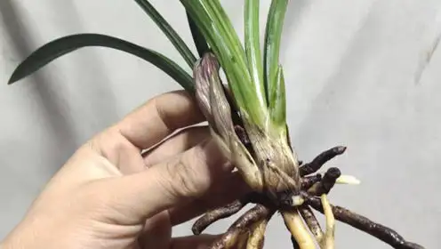
    2. 出苞片(春兰),花包露出花杆上的苞片
        

    3. 转茎,又称转宕,转身等.原指蕙兰大排铃时花梗(茎)上每朵花铃的花柄横出生长,长成花心朝外的过程.此处衍生其含义为春兰花苞横出生长,长成花心朝外的过程
        
    4. 开凤眼:兰花花蕾绽放初期外三瓣的中萼片与两侧萼片的尖端是相互搭盖的状态时,当花蕾发育膨大时,主侧萼被发育了的捧瓣与唇瓣挤压隆起,主侧萼间上露唇瓣与捧瓣的一部分,下露舌根.使这个膨胀的花蕾基部形似鸡眼状,而被称为“凤眼”.开凤眼即为花苞出现凤眼这一过程
        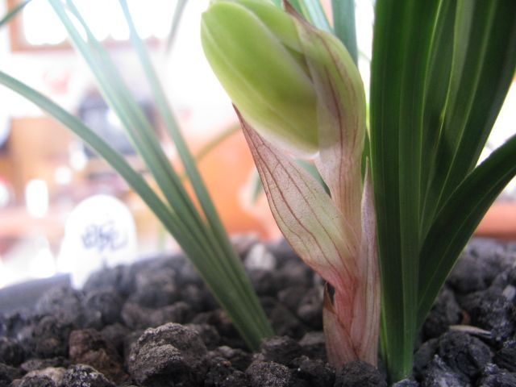

    5. 盛开,花苞到完全打开状态的
        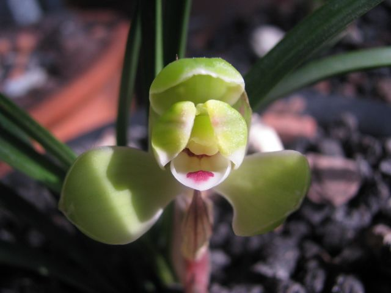
    6. 凋谢,花枯萎到掉落的状态
        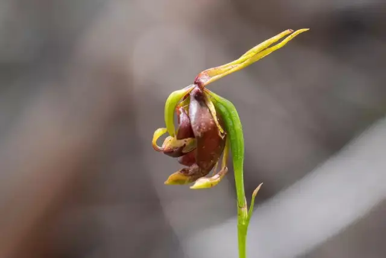

+ 其他国兰

    1. 抽杆(抽箭),花芽成熟后会抽出花杆(也叫花梗,或花茎,或花葶或花箭或花夷)并逐渐长高,花蕾从苞壳中逐渐透出
        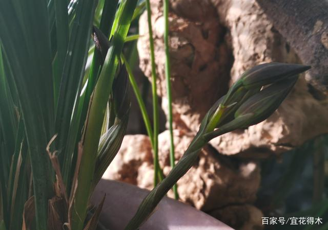
    2. 小排铃(除春兰),原指蕙兰开始抽箭后花苞片逐渐绽开,里面各朵幼小花铃呈竖直状,紧贴花梗的这种形态.小排铃算是抽杆后期的一个阶段
        
    3. 转茎,又称转宕,转身等.对于春兰指的是 原指蕙兰大排铃时花梗(茎)上每朵花铃的花柄横出生长,花心朝外.转茎算是大排铃前期的一个阶段
        
    4. 大排铃(除春兰),蕙兰抽箭结束后花朵次第开放,原来紧贴花梗的幼铃花柄离梗横出,作水平排列称为大排铃,此时即将绽蕊舒瓣渐次盛开.
        
    5. 凤眼:指兰花花蕾绽放初期外三瓣的中萼片与两侧萼片的尖端是相互搭盖的状态时,当花蕾发育膨大时,主侧萼被发育了的捧瓣与唇瓣挤压隆起,主侧萼间上露唇瓣与捧瓣的一部分,下露舌根.使这个膨胀的花蕾基部形似鸡眼状,而被称为“凤眼”.
        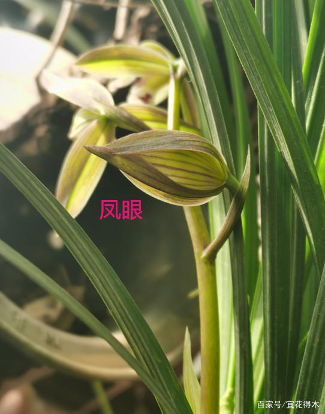
    6. 盛开,花苞到完全打开状态的
        
    7. 凋谢,花枯萎到掉落的状态
        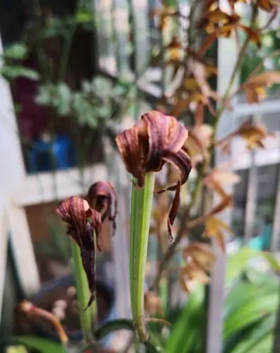

国兰的开花习性我们从如下几个角度:

+ 开花条件,描述成熟健壮植株的开花条件,分为:
    + 季节型,只要到固定季节就开花
    + 条件型,只要满足固定条件就会开花
    + 条件季节型,既要到固定季节又要满足固定条件
+ 下花条件,描述成熟健壮植株在什么情况下会停止开花,分为:
    + 季节型,只要到固定季节就下花
    + 条件型,只要满足固定条件就会下花
    + 条件季节型,既要到固定季节又要满足固定条件
+ 续花性,即在品种花期范围内开花行为的分布状况,分为
    + 续花型,即在花期范围内均匀分布
    + 爆发型,即集中开花
+ 苞叶颜色
+ 花杆颜色
+ 花径,花朵正面以花正中心为圆心,覆盖到所有花瓣的最小圆的直径.一般花杆底部的花会更大,顶花则会小些
+ 单花坐花阶段时长,单花从冒花芽到凋谢经历的状态变化阶段和持续时长
+ 花守,单花从盛开至枯萎期间能保持有欣赏价值不下降的能力,10分满分
+ 稳定性,每次开花每一朵花保持相同且最佳开品的能力,十分满分表示从每次每朵不一样到每次每朵都一样.
+ 叶中花出现频率,不是出花芽就能顺利开花,有时候花芽会从叶夹或者常态叶中长出,以至于无法正常开放,这种现象大多出现在建兰种类.
  出现叶中花出现频率我们分为:
    + 常见
    + 偶尔
    + 未见
+ 消苞条件,像春兰蕙兰会出现花苞自己枯萎的现象,一般由特定条件触发
+ 消苞率,当出现消苞条件后实际消苞的概率
+ 花序舒朗程度: 从1至9评分
+ 出架率,即正常养护下花叶位置关系出现概率,花叶关系状态分为:
    + 地板花,又叫趴地虎,即花开在植株底部贴地开,多见于春兰
    + 平架,即花开在叶间,多见于植株高大的品种
    + 出架,即花杆上花的最上端高于所有叶的最上端但最下端低于或平于所有叶的最上端
    + 大出架,即花杆上花的最下端高于所有叶的最上端

    出现不同花叶关系状态的频率我们分为:

    + 常见
    + 偶尔
    + 未见

    其评估表格如下:

    | 状态   | 频率 |
    | ------ | ---- |
    | 地板花 | 未见 |
    | 平架   | 常见 |
    | 出架   | 常见 |
    | 大出架 | 偶尔 |

+ 不同位置的丰花程度,分为单杆花数量分布和一年中出的花杆数,描述不同品种一杆可以有几朵花.

    苗根据出芽位置分为如下

    + 新苗,即新苗期的苗
    + 成苗,即完成展叶结头的苗
    + 老苗,即老苗期的苗
    + 老头,即老头期的苗

    根据出芽母体的健壮程度分为
    + 弱苗,明显瘦小的苗,体现在苗的宽度小,展出的常态叶数量少,叶片也短且细,芦头也细小
    + 中苗,正常大小的苗
    + 壮苗,明显强壮的苗,体现在苗的宽度大,展出的常态叶数量多,叶片宽且长,芦头也大

    根据丛生情况可以分为:
    + 单苗
    + 两苗
    + 小丛,即3苗至5苗
        + 小丛前垄
        + 小丛后垄
    + 中丛,即6苗至15苗
        + 小丛前垄
        + 小丛后垄
    + 大丛,即15苗以上
        + 大丛前垄
        + 大丛后垄

    丰花程度分为:
    + 丰花,高于70%概率来花
    + 出花,低于70%概率来花
    + 少花,低于50%概率来花
    + 极少花,低于30%概率来花
    + 不出花

    | 母体位置 | 母体健壮程度 | 独苗   | 两苗      | 小丛前垄 | 小丛后垄 | 中丛前垄  | 中丛后垄 | 大丛前垄  | 大丛后垄 |
    | -------- | ------------ | ------ | --------- | -------- | -------- | --------- | -------- | --------- | -------- |
    | 新苗     | 弱苗         | 不出花 | 不出花    | 不出花   | 不出花   | 不出花    | 不出花   | 不出花    | 不出花   |
    | 新苗     | 中苗         | 不出花 | 不出花    | 出花(3)  | 不出花   | 出花(3,4) | 不出花   | 出花(3,4) | 不出花   |
    | 新苗     | 壮苗         | 不出花 | 极少花(2) | 丰花(4)  | 不出花   | 丰花(4)   | 不出花   | 丰花(4)   | 不出花   |
    | 成苗     | 弱苗         | 不出花 | 不出花    | 不出花   | 不出花   | 不出花    | 不出花   | 不出花    | 不出花   |
    | 成苗     | 中苗         | 不出花 | 不出花    | 出花(3)  | 不出花   | 出花(3)   | 不出花   | 出花(3)   | 不出花   |
    | 成苗     | 壮苗         | 不出花 | 极少花(2) | 丰花(4)  | 不出花   | 丰花(4)   | 不出花   | 丰花(4)   | 不出花   |
    | 老苗     | 弱苗         | 不出花 | 不出花    | 不出花   | 不出花   | 不出花    | 不出花   | 不出花    | 不出花   |
    | 老苗     | 中苗         | 不出花 | 不出花    | 不出花   | 不出花   | 不出花    | 不出花   | 不出花    | 不出花   |
    | 老苗     | 壮苗         | 不出花 | 不出花    | 不出花   | 不出花   | 不出花    | 不出花   | 不出花    | 不出花   |
    | 老头     | 弱苗         | 不出花 | 不出花    | 不出花   | 不出花   | 不出花    | 不出花   | 不出花    | 不出花   |
    | 老头     | 中苗         | 不出花 | 不出花    | 不出花   | 不出花   | 不出花    | 不出花   | 不出花    | 不出花   |
    | 老头     | 壮苗         | 不出花 | 不出花    | 不出花   | 不出花   | 不出花    | 不出花   | 不出花    | 不出花   |
