# 国兰赏花标准

国兰的赏花标准基本都来源于瓣型学说.在现代环境下缝缝补补不断迭代,时至今日已经很难形成统一标准.但大致的分类还是可以确定的,本人将国兰的赏花标准分为如下几个方面:

+ 香,花香标准
+ 姿,花叶协调标准
+ 形,主要来自瓣型学说
+ 色,由瓣型学说中的素心概念衍生得到
+ 艺,由赏叶标准衍生得到

注意本文是个人总结,目前国兰赏花标准并没有形成共识,本人也是不是什么权威,本文仅做参考

## 香

国兰最大的卖点是香,香味也是国兰鉴赏的基础.不香或者香味不好闻的国兰无法称为上品.实际上兰科植物有香味的非常多,卡特兰,蝴蝶兰,文心兰,石斛中不乏带香的品种,而风兰更是以小巧浓香闻名.
但我们描述其他兰科植物香味时往往会说有果香,有柠檬香,有桂皮像,有栀子香等.我们通常向没闻过的人介绍国兰香味时会用到下面这些词:

+ 奶香
+ 甜香
+ 幽香
+ 冷香

可以看出这些词都是很抽象形容,很少用其他有香物品的香味来形容国兰,因为国兰是独特的自成一派的香型.国兰的香味确实难以描述,但总体而言特点可以总结为

+ 香味不浓,隐隐约约似有似无
+ 闻着让人感到放松镇静,但多少带点暖意
+ 久闻不会上头

而国兰不同兰种在香味方面也各有千秋,普遍来说不同兰种会有如下特点

+ 春兰,味道中庸,偏暖,扩散性较强,相对比较浓烈.以本文的芳香植物评估标准来看味型可以描述为:
    + 甜-5
    + 暖-7
    + 扩散性-6
    + 浓度-6
    + 质感-清澈,纯正,单薄,湿润
    + 侵略性-1
+ 建兰,相对味道淡些,香味偏冷,扩散性较弱.以本文的芳香植物评估标准来看味型可以描述为:
    + 甜-4
    + 暖-6
    + 冷-1
    + 扩散性-2
    + 浓度-2
    + 质感-清澈,纯正,单薄,湿润
    + 侵略性-1
+ 蕙兰,自己没养过不好评价,据说味道最浓,凑近闻会上头,但间隔1m以上就会觉得相当好闻.

+ 墨兰,自己没养过不好评价,但花店闻过启黑的味道,总体感觉味道偏干偏沉,但扩散性较好,可以在间隔1m左右闻到,与其他国兰相比差别较大.
    + 甜-5
    + 暖-3
    + 冷-3
    + 扩散性-6
    + 浓度-5
    + 质感-浑浊,纯正,厚重,干燥
    + 侵略性-4

也有一些个别国兰品种据说香味不好,甚至被人说是抹布味.这些自然不能算好花.

## 姿

中国是个讲究中庸协调的国家,在国兰鉴赏中也讲中庸协调,这主要体现在赏姿方面.本文是赏花标准,因此主要从赏花的角度看待姿,赏花赏姿主要有如下几个方面(按重要性排名):

+ 花叶协调,中国文化中讲究有主有次,在赏花方面花是主,叶是次,叶必须要可以和花很好的搭配才能称为好花.比如君荷叶型宽大,往往被认为是缺点,但花也大,又是荷瓣花,花叶就相当协调,显得大气庄重,所以不失为好花.
+ 花大突出,一般我们会认为花要尽量大些才好看,比如精彩梅和红一品,他们花型花色以及勤花程度区别不大,通常我们都会认为精彩梅更优秀些,主要就是因为花大.
+ 花多热闹,建兰瓣型花中有不少被人诟病花小,但如果极其勤花,往往同时开几杆,每杆有好几朵,那多少可以补回来些,最典型的就是夏皇梅和红一品.
+ 花高出架,一般我们希望花高于叶,这也符合花为君叶为臣的关系,比如好多春兰光看花型非常完美,但往平架甚至地板花,这就落了下乘.
+ 花序舒朗(针对非春兰),对于非春兰类的国兰,一杆上会有很多花,我们通常都会认为每朵花间都有均匀合适的距离是最好的.

我个人对好花花姿的基本标准是--小草大花,花高出架

## 型

兰花花型可以细花,行花和奇花,细花即符合瓣型学说中定义瓣型的花,行花则是不符合瓣型学说定义的单瓣花.奇花则是一般花卉中的重瓣花.

一般单瓣花不论瓣型我们都会认为

1. 外三瓣
2. 捧瓣,圆捧优于尖捧
3. 舌,平舌优于卷舌

单瓣花在任何瓣型任何花色之外的评判有如下几个基本原则:

+ 飞机肩优于平肩优于等分肩优于落肩,这说的是外三瓣间夹角比例,侧萼瓣又称肩,主萼瓣与侧萼瓣间夹角越小就显得花越精神.
+ 花瓣久开不变形优于越开越外卷
+ 不开天窗优于开天窗,这说的是捧瓣,捧瓣无法包裹住鼻头中间有缝隙称为开天窗.
+ 平圆舌优于卷舌

而重瓣花我们对单独的瓣型一般没有要求,但对其饱满程度会有要求,重瓣的就是要看着大气.

### 细花

细花按对特定花型定义的满足程度可以分为

+ 正格花,完全符合瓣型理论定义特定花型的花,一般称为正格x瓣花
+ 型花,符合瓣型理论定义特定花型中最主要描述的花,一般称为x型花
+ 飘门花,完全符合或大部分符合瓣型理论定义特定花型,且外三瓣呈波浪状,或捧瓣波区的花,一般称为飘门x

细花规定的瓣型只有3种即

1. 梅瓣
2. 荷瓣
3. 水仙瓣

这三种瓣型都要求外三瓣收根(约为萼端宽的三分之一)这是细花和行花最明显的区分方式.

#### 梅瓣

兰花梅瓣花的花形好似刚开的梅花,其标准为如下几点(按重要程度):

1. 外三瓣萼基收根
2. 外三瓣上部圆形
3. 捧瓣短圆起兜且合抱蕊柱.兜指捧瓣尖端部瓣肉组织的形态,兜前端有白色边也叫"白头",并向里扣卷.使捧瓣结块有增厚感,也叫雄性化.按厚薄可分为软兜与硬兜;按内卷形成的空间深度可分深兜和浅兜
4. 唇瓣短硬不后卷
5. 外三瓣紧边(即萼缘紧缩向内扣),呈汤匙形.
6. 外三瓣短圆,萼体短(以长宽比2:1为佳),根据长短情况可分为椭圆形,长萼形,蛋萼形,和扇萼形四种

如果外三瓣花瓣往后翻卷翘起的称为飘梅(褶角梅)

能满足全部6点的就是正格梅瓣,满足前3点,第5点长宽比大于2:1小于3:1或满足第4点第6点则为梅瓣,只满足前3点则为梅型

正格梅典型的如宋梅

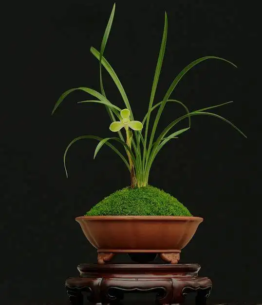

#### 荷瓣

兰花荷瓣花的花形好似刚开的荷花,其标准为如下几点点(按重要程度):

1. 外三瓣收根萼基收根
2. 外三瓣放角(花瓣上部两侧呈明显的钝角)
3. 唇瓣圆正,舒展而不卷或下垂
4. 捧瓣呈向内合抱状,无白头,以能合盖鼻头为佳
5. 捧瓣不起兜,无增厚
6. 捧瓣短阔(长宽比例一般小于2:1)
7. 外三瓣短阔(长宽比例一般小于2:1,超过3:1的只能称为荷形)

能满足全部7点的就是正格荷瓣,满足前4点,剩下的部分满足则为荷瓣,只满足前4点则为荷型

正格荷典型的如环球荷鼎

有说法千梅易得一荷难求,由此可见荷瓣花的稀缺性,但随着育种技术的发展,现在荷瓣已经不再稀少

#### 水仙瓣

兰花水仙瓣相对比较复杂,正格水仙瓣指形似水仙的花瓣;而由于水仙瓣常介于荷梅之间,因此也有偏荷瓣的荷仙(荷型水仙)瓣型和偏梅瓣的梅仙(梅型水仙)瓣型.

无论哪种水仙瓣型,如果外三瓣花瓣往后翻卷翘起的称为飘仙(褶角水仙),

##### 正格水仙

正格水仙必须满足如下要求:

1. 外三瓣收根
2. 捧瓣合抱或微合抱且起兜,捧瓣起兜有白头者称为巧种,也叫巧种水仙;浅兜或没有白头者称官种,也叫官种水仙
3. 唇瓣稍长,下垂或微卷
4. 外三瓣较长(通常长宽比超过3:1)
5. 外三瓣顶部圆头或较尖均可

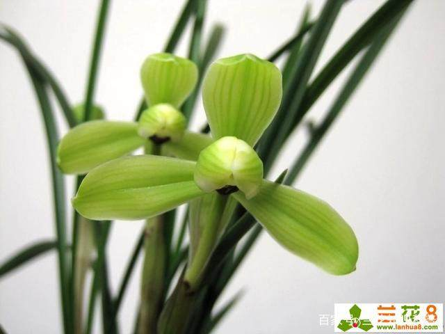

##### 荷仙

荷仙必须满足如下条件

1. 外三瓣收根
2. 外三瓣放角
3. 唇瓣圆阔稍长下垂
4. 捧瓣短阔,呈向内合抱状,无白头
5. 外三瓣较长,长宽比大于2:1小于3:1

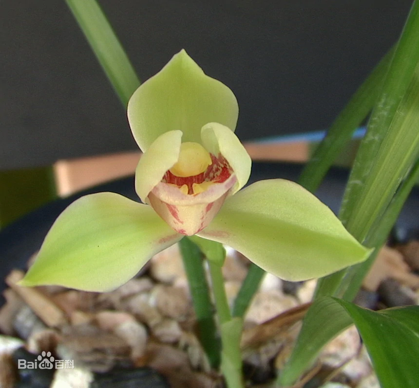

##### 梅仙

1. 外三瓣萼基收根
2. 外三瓣上部圆形
3. 捧瓣短圆起硬兜,兜前端有白头
4. 唇瓣稍长微卷
5. 外三瓣长宽比大于2:1小于3:1

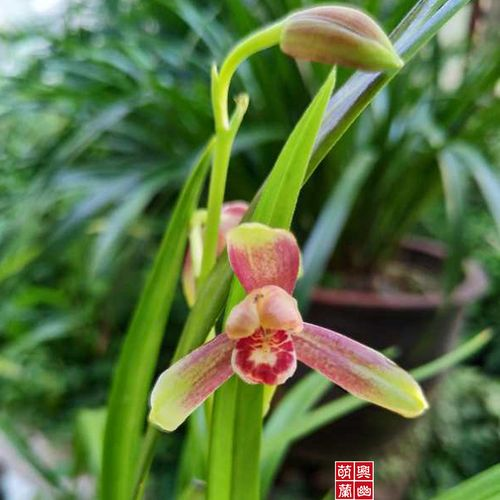

### 行(hang)花

行花在传统瓣型理论中不受待见,但现代人品味多样,也有不少人喜欢这样瓣型的,个人的话除了竹叶瓣其他的行花我是欣赏不来.

行花瓣型主要分为

1. 竹叶瓣,即外三瓣细长型似竹叶,原生春兰建兰多是这个瓣型
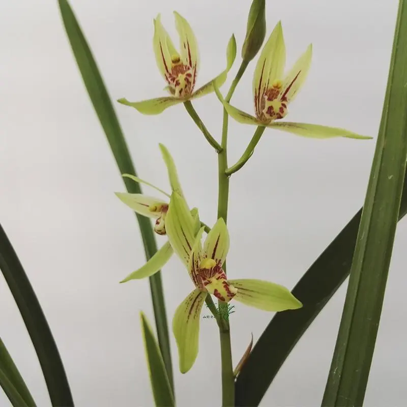
2. 鸡爪瓣,比竹叶瓣更加细长,叶尖叶更加锐,寒兰,墨兰这个瓣型比较多
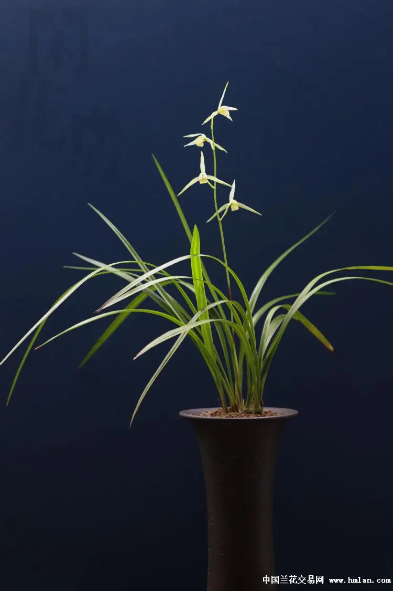
3. 百合瓣,一种飘门瓣型,外三瓣略微外翻而不起波浪,捧瓣似猫耳,上有明显或不明显的雄性化斑块,舌瓣短圆而不翻卷(往往舌斑是大小不等的一点红)的类型,比较典型有春兰玉蟾,巧百合
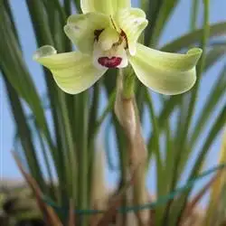
4. 白菜瓣,一种飘门瓣型,外三瓣,捧瓣以及舌的外延都卷曲成波浪状,且花苞无法完全张开,比较典型有建兰彩云追月和春兰严州彩云
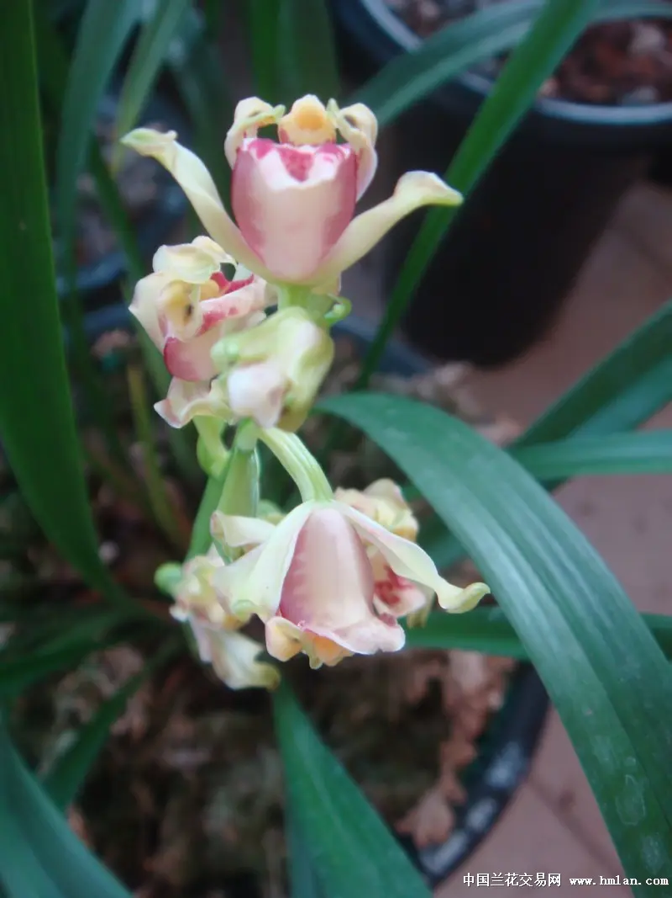

### 奇花

在古代奇花可能不多见,但现代随着基因技术的发展奇花已经相当多见了.本人定义的奇花即为重瓣花.个人认为多数奇花看着比较畸形并不好看.

奇花按变异的方向大致可以分为如下两类

1. 花上花
2. 重瓣花

#### 花上花

花上花指定时在花蕊中又长出花茎而开花的品种.这类花的一大优势是花期相对更长,花香一般也会更浓.

这个类型中又可以细分为

1. 树型花,这类花的特点是从花上开出来的花会带花杆,看起来就像树分叉一样,比如翠玉牡丹
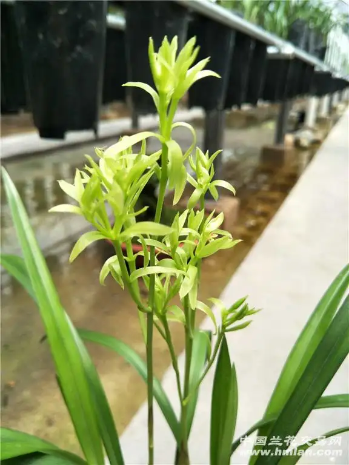
2. 牡丹型花,这类花是在花上直接开花,看起来层层叠叠,比如富山奇蝶
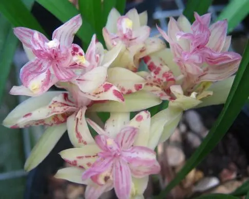

#### 重瓣花

重瓣花指开起来就是重瓣的花,可以分为

1. 多舌花,即有多片花舌,特殊情况是如果有3个舌且没有捧瓣个人不认为它是多舌花,而是三星蝶
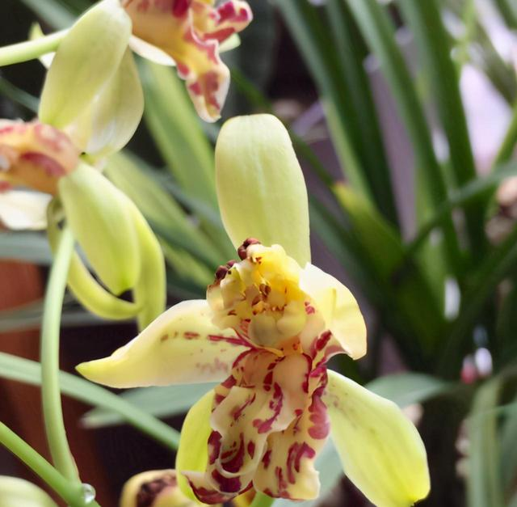
2. 多瓣花,即有多片萼片,还要视萼片的形状是否符合细花标准来判断是不是多瓣正格,典型的多瓣正格比如绿云(多瓣正格荷).
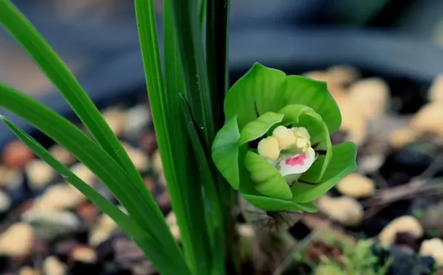
3. 多瓣多舌,即既有多个萼片又有多个花舌,有时候绿云也会开出多瓣多舌
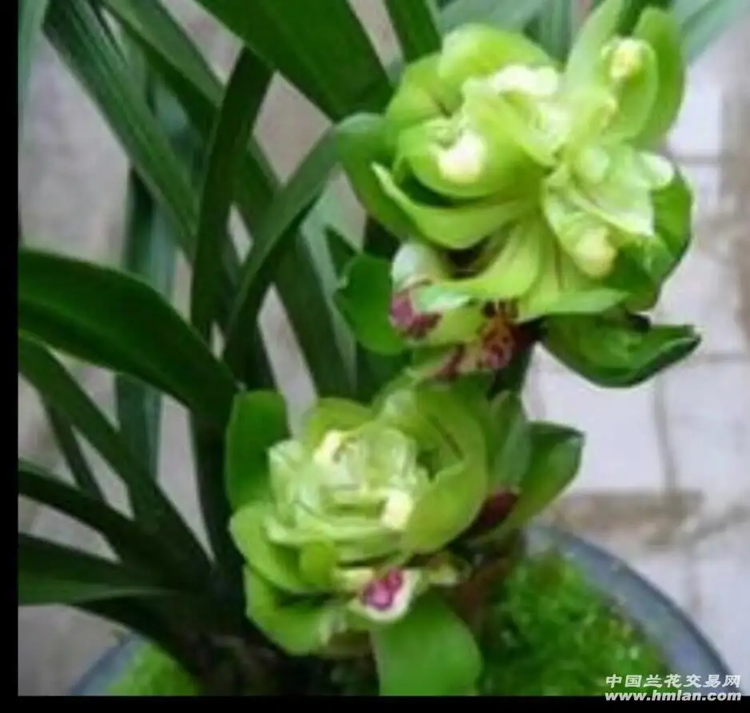

奇花也有按瓣型分的分法,但个人觉得不具备科学性因此不做详细说明

## 色

关于色在传统瓣型理论中只有对素心的描述,即素无下品,素心花全部算细花.古时候信息传递效率低,准确度低,因此颜色难以成为一个容易评估的方面.而现在,人人手机就能照相,清晰度还高甚至几乎人人还都会修图,这让兰花的颜色也成了欣赏的重要以环.

兰花色花很大程度上类似打麻将,就是凑要素,一些只要满足舌色要素就可以称为色花,一些只要满足瓣色要素就可以称为色花,还有一些需要同时满足舌色和瓣色的搭配才可以称为色花.另外芽色杆色以及杆上苞叶的颜色也是加分项.

### 舌色

舌色分为素心和彩心

+ 素心: 即舌色即为底色,一般舌的底色为白色,嫩黄,嫩绿.在传统瓣型理论中只要是素心花就算细花,但本人认为瓣型理论不应该涵盖对花色的评估,因此将其抽出来.
    再细分可以分为
    + 纯素,即舌色完全为底色.
    + 桃腮素,即舌色只在底部靠近花心的位置有轻微粉色红晕其他全为底色
    + 水渍素,即舌上有非常浅像被水洗过一样不仔细看看不出来的红斑痕迹,但一般认为如果一个素花的舌色是水渍素,那它算比较下品的素.

+ 彩心:即舌上有红色或者紫色色斑,进一步可以细分为
    + 彩心: 有色斑,一般兰花都是彩心
    + 红舌: 色斑成片均匀覆盖舌面,舌背面可红可不红(红的被称为穿版红舌),一般来说只要有红舌就算色花,这类色花统称`红舌`
    + 红素:色斑均匀覆盖舌面,舌面全红,舌背面也全红,且舌面舌背颜色一致,一般来说只要有红素就算色花,但这类色花还是统称`红素`

### 瓣色

不同兰种花瓣底色不太相同,江南春蕙建多为绿白黄色,西南春兰多为麻壳,墨兰多为深红.花瓣上多有贯通花瓣径向的红色脉纹和红晕.花瓣颜色往往稳定不变.一般瓣色只有与普通的不同才会被认为出色.

瓣色可以分为:

+ 素瓣,即纯底色无脉纹,素瓣一般要和素心搭配,这类被称为素花,算是色花下的一个大品类.素瓣通常分为
    + 绿素瓣(普通素瓣)
    + 白素瓣
    + 黄素瓣
+ 麻壳,即有脉纹,且有成片色晕规律的覆盖表面和背面
+ 彩壳,即花瓣无脉纹,但有成片色晕规律的覆盖表面和背面
+ 红瓣,一般也分为红花和穿版红花,区别就在于是否花瓣背面也覆盖红色,从颜色区分
    + 紫红瓣,即花瓣底色为紫红色,只要有紫红瓣就算色花,这类色花统称`紫红花`
    + 粉瓣,即花瓣底色为粉色(胭脂色),只要有粉瓣就算色花,这类色花统称`胭脂红花`(`红粉花`),
+ 复色瓣,花瓣上有两种或三种对比分明的不同颜色规律分布.只要有复色瓣就算色花,这类色花统称`复色花`
+ 转色瓣,花瓣上的颜色分布会随着花朵开放的时间阶段以及开放的季节环境有变化的花,只要有转色瓣就算色花,这类色花统称`转色花`,像随开放时间变化的比如建兰俏佳人,很多时候复色花也是转色花,最知名的比如上面的逸红双娇(随开开放季节环境变化)

### 芽色

兰花花芽的芽色一般有纯色的如粉色,白色,嫩绿色,黑色,墨绿色,暗红色,也有杂色的比如翠绿底墨绿麻壳的.一般认为粉色优于白色优于嫩绿色,这三种芽色都是加分项

### 杆色及苞叶色

兰花的花杆一般为粉色,白色,嫩黄色,嫩绿色,翠绿色,墨绿色,一般认为粉色优于白色优于嫩黄色优于嫩绿色.只要苞叶颜色和杆色协调那么杆色也是加分项,但比如杆子是个白杆子,而苞叶是个脏的那就不是加分项而是减分项了.

### 色花的固定搭配

更多的时候舌色或者瓣色是两者搭配满足一定条件的才可以称为色花.一般判断色花先看舌再看瓣:

+ 舌为素心则为`素花`,然后根据瓣色判断是什么素.
+ 舌为红素则无论瓣色是什么样都是`红素`,典型的比如建兰赤诚
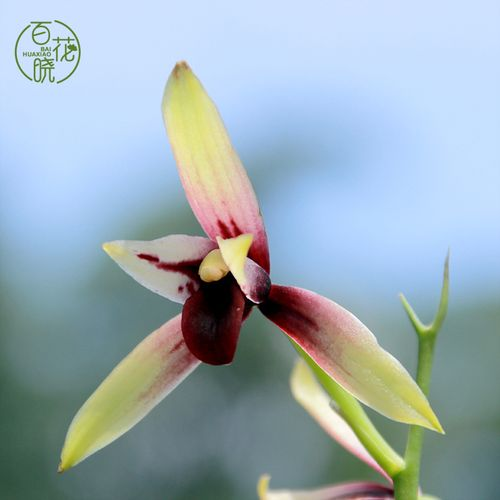
+ 舌为红舌则无论瓣色是什么样都是`红舌`,典型的比如建兰国魂
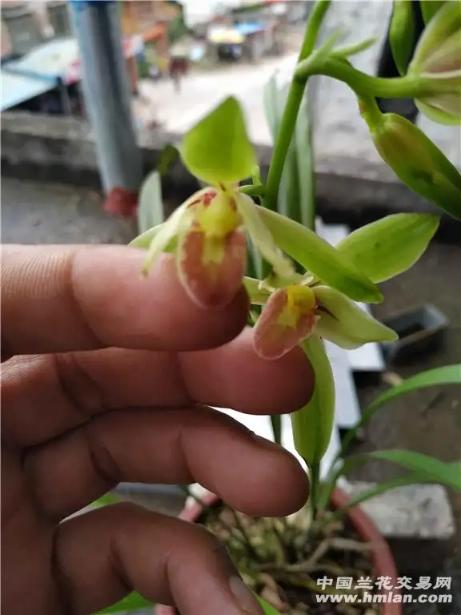
+ 舌为彩心则根据瓣色查看是否满足特定瓣色组合,如果满足就也是色花

主要的搭配有:

+ `白花彩心`(`白彩`),即彩心+白底+基部放射状脉纹或基部浅红晕,典型的比如建兰玉白丹红
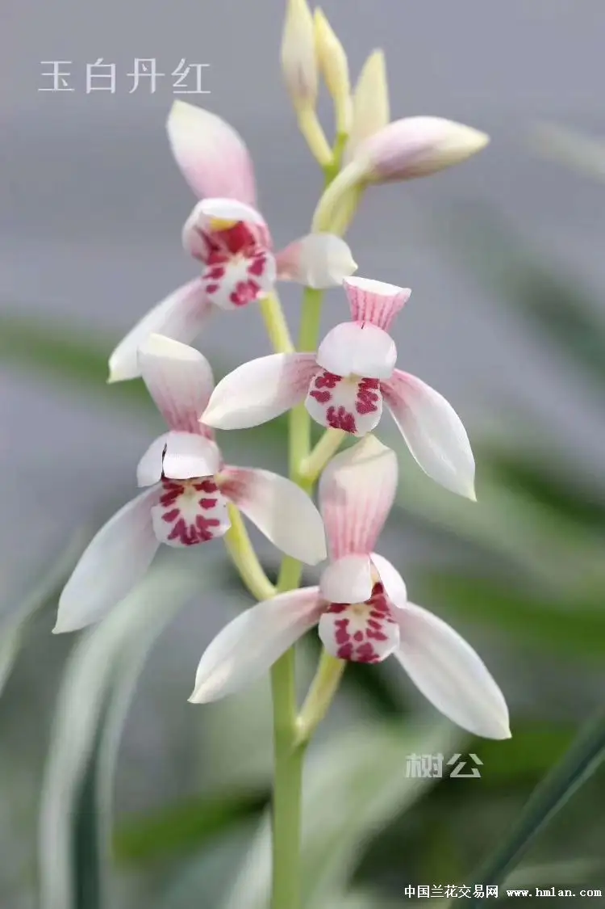
+ `粉花彩心`(`粉彩`),即彩心+白底+基部放射状脉纹或基部浅红晕+花瓣大部成片淡粉色红晕,典型的比如建兰宝玉
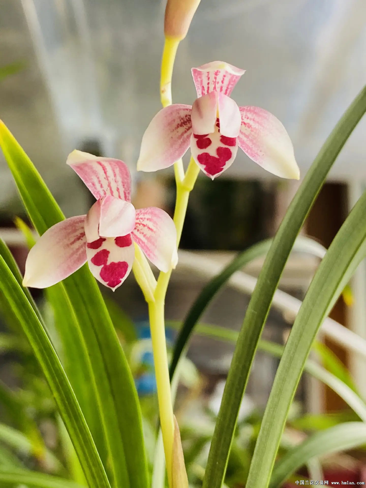
+ `紫红花`,即彩心+紫红瓣,典型的比如建兰墨宝
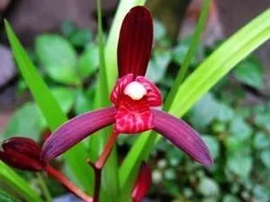
+ `胭脂红花`(`红粉花`),即彩心+粉瓣,典型的比如建兰玫瑰妖姬
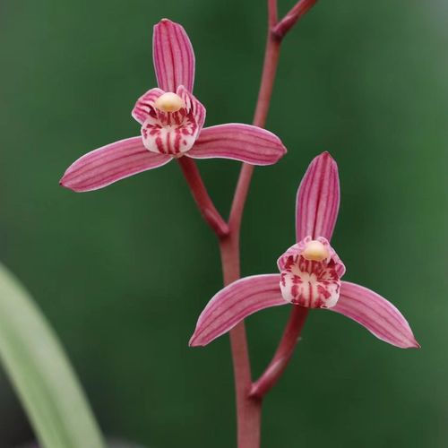
+ `转色花`,即彩心+转色瓣,典型的比如逸红双娇(又名玉虹双娇,小国魂)
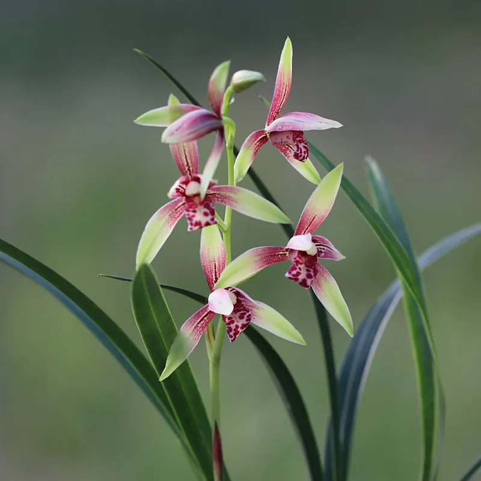
+ `复色花`,即彩心+复色瓣,典型的比如逸红双娇,精彩梅,蒙山彩荷等
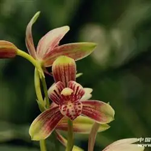

在确定好色花种类后最后再看芽色杆色是否有加分项以确定在色方面的观赏价值.

#### 素花分类

素花即素心+素瓣,定义为色花中的一个特殊子类.个人认为素花的品级应该高于其他色花组合,素花可以细分为:

+ `水渍素`,即水渍素心+任意瓣色
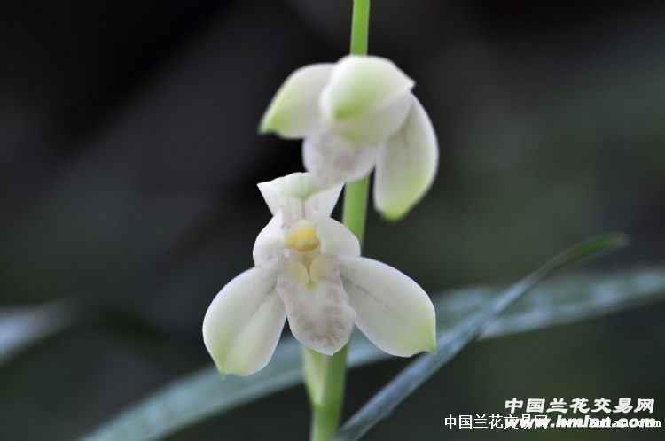
+ `桃腮素`,即桃腮素心+任意瓣色
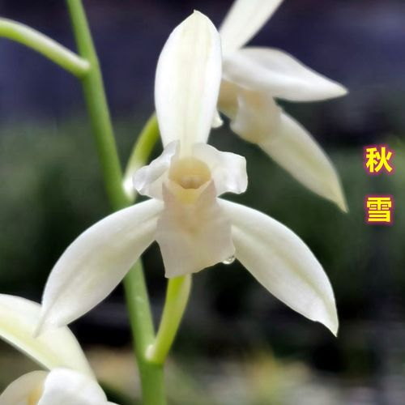
+ `麻壳素`,即纯素素心+麻壳瓣
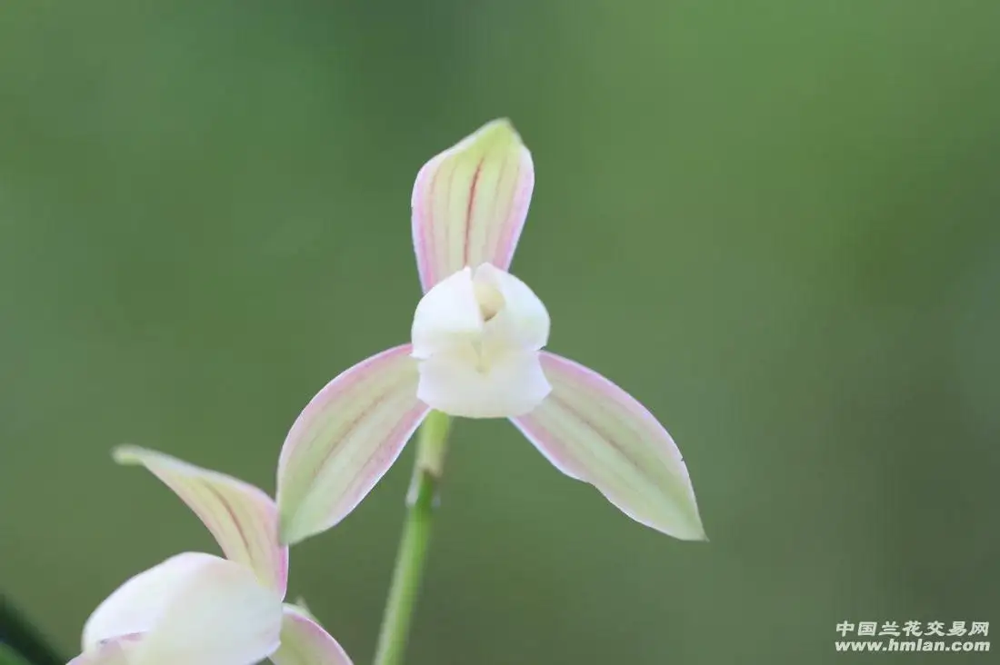
+ `彩壳素`,即纯素素心+彩壳瓣
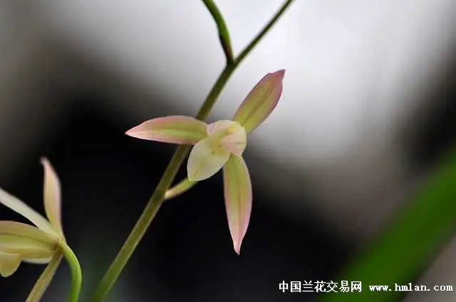
+ `绿素`,即纯素素心+绿素瓣
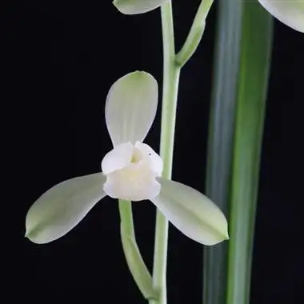
+ `白素`,即纯素素心+白素瓣
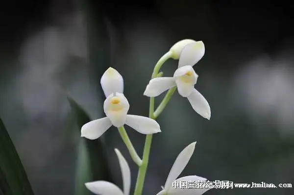
+ `黄素`,即纯素素心+黄素瓣
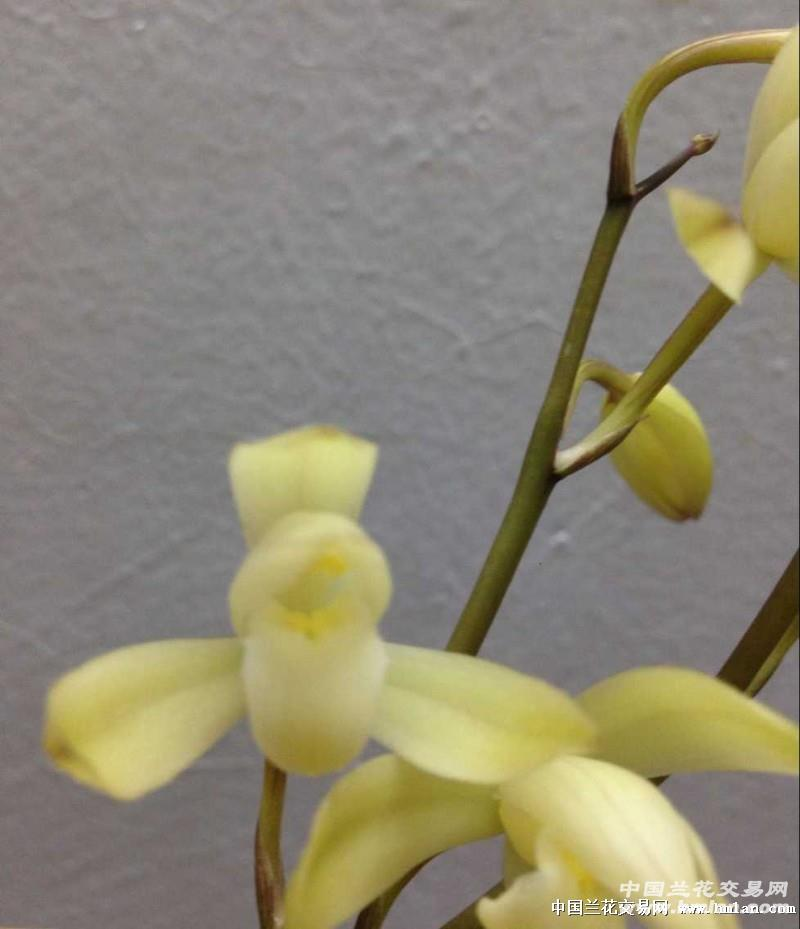

按传统瓣型理论素花无下品,都算细花,品评顺序为先看素心类型,纯素最好,然后桃腮,然后水渍,然后按颜色来分黄素最好,其次白素,再次绿素,再次彩壳素,再次麻壳素.现在的标准只能说各花入各眼了.

#### 色花的层次

传统瓣型理论认为素无下品,而红舌包括红素都不吉利像吊死鬼,其他就没有进一步描述了.而如今红素红舌成了香饽饽.在素花中本来也是黄素为贵白素次之,麻壳素(包括彩壳素)算不得上档次,而现在彩壳素最为受欢迎.个人认为这种审美的变迁很大程度上是和科技的发展以及生活节奏变快有关系的--传统瓣型理论非常强调花守,认为只有无论什么情况下开出来的花始终如一,而且久开不变的才是好花;而现在的审美更加注重所谓最佳开品,不少色花需要非常苛刻的条件才可以开出宣传中的最佳开平,而一般养护则非常容易平平无奇.这是非常需要关注的一个方面.

个人认为的色花排名如下(分先后):

1. 第一档(上品),原因:开品稳定,颜色清新
     + 白素
     + 桃腮白素
     + 绿素
     + 桃腮绿素
     + 黄素
     + 桃腮黄素
2. 第二档(中品),原因:颜色艳丽,但有开品不稳定的缺点,因此不及第一档
     + 彩壳素
     + 桃腮彩壳素
     + 粉彩
     + 白彩
     + 转色花
     + 红粉花
3. 第三档(下品),原因:颜色容易看着脏或者颜色对比度容易过高过于艳丽
    + 麻壳素
    + 桃腮麻壳素
    + 水渍素
    + 红素
    + 紫红花
    + 复色花
    + 红舌

## 艺

艺是评价花的加分项,针对的是花朵上的一些特殊变异,这种变异同样可能出现在叶片上.目前我只知道3种,即蝶化,绿覆轮和水晶.

花朵带艺的都可以称为`艺花`.

### 蝶化

蝶化是指兰花在舌之外的地方出现舌化的现象,由浅到深表现为

1. 长出红色舌斑
2. 起喉(长出舌上会有的凹槽)
3. 底色完全变为和舌一样

根据蝶化的位置和蝶化程度分为

+ `叶蝶`,即叶片上蝶化,只能达到长出红色舌瓣的蝶化程度
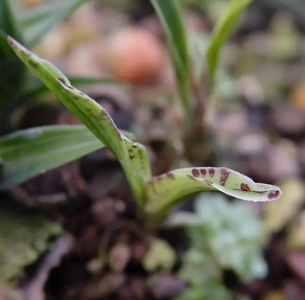
+ `外蝶`,即外三瓣蝶化,一般只会出现在两片副瓣上,且不会整片副瓣完全蝶化.一般是一半副瓣长出红斑且底色变成和舌一样的颜色
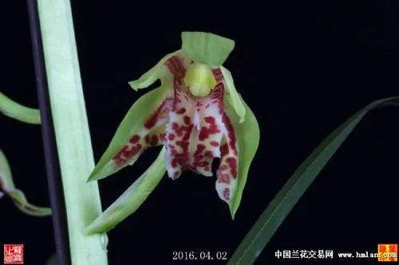
+ `内蝶`,即捧瓣蝶化,根据蝶化的位置和蝶化程度分为
    + `捧蝶(彩捧)`,捧瓣长出(红色舌斑
    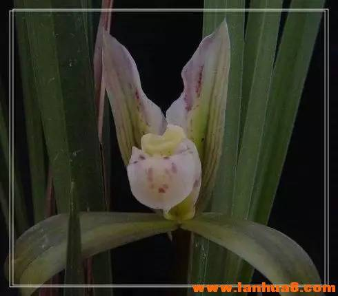
    + `蕊蝶`,捧瓣长出红色舌斑,起喉
    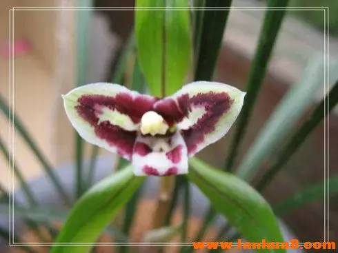
    + `三星蝶`,捧瓣长出红色舌斑,起喉,底色形状完全变为和舌一样
    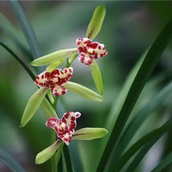

蝶花在兰花中算一个很大的品类,在传统瓣型理论中蝶花算奇花,我个人认为这种分类并不清晰而且和难以处理叶蝶的位置,因此摘出来单独作为一个品类

### 绿覆轮

绿覆轮是指叶绿素在叶片或者花瓣萼片边缘集中的现象.这当然也是一种变异.在传统的叶艺分类中并没有专门的绿覆轮而是覆轮和中透两种.一般描述绿覆轮都是说绿覆轮中透艺.
覆轮指的是叶片边缘颜色和叶片大部不一样,这种描述下绿覆轮算是覆轮的一种,但明显绿覆轮的形成原因和因为锦化而变色的其他颜色的覆轮不同;而中透则是指的叶片除了边缘外叶片中间锦化叶绿素缺失造成变色.

+ 叶片绿覆轮艺
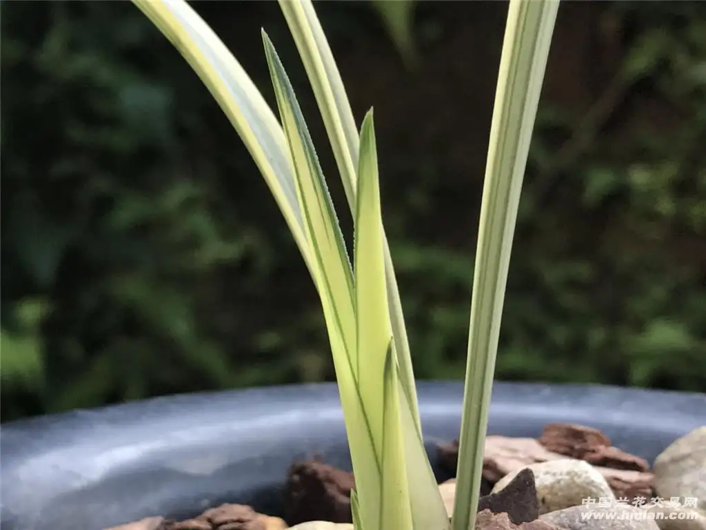

+ 花绿覆轮艺
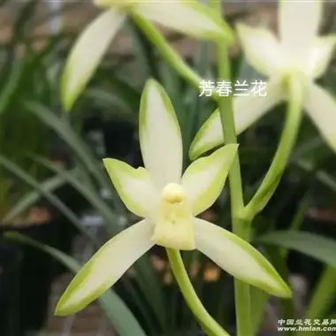

因此这里单独抽出来作为一种单独的艺来算.

许多带绿覆轮艺的都是花叶同艺,比如叶有先明后暗绿覆轮艺,花带绿覆轮的建兰就有青山玉泉,国色天香(铁骨黄芽),高山春色等.

### 水晶

水晶是指在兰花的叶片上出现白色透明状或乳白色半透明状的水晶体,犹如晶莹剔透的玻璃,钻石和水晶,在兰花叶片的叶尖,边缘叶片中间部位,花萼片的尖端都会产生.水晶体是真菌或支原体寄生于兰株的体内产生的,这些真菌或支原体会使叶片上的叶绿素消失而出现水晶.叶片上水晶表现出来的各种形态是真菌或支原体寄生叶片后产生的"瘿瘘".虽然没有科学家对形成水晶的真菌或支原体进行分离识别,但兰花叶片上的水晶是由真菌或支原体寄生所产生的是可以确定的.也就是只要真菌或支原体寄生在了兰株的组织内,寄生的地方就有可能出现水晶,真菌或支原体是具有感染性的,可以将其接种于兰花体内使兰花的芽原基受感染而产生变异形成新的水晶艺.

+ 叶片水晶艺

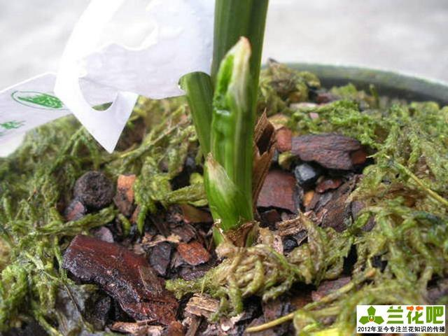

+ 花水晶艺

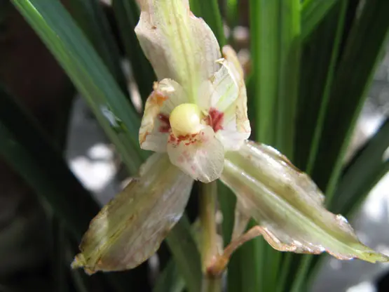

个人认为水晶艺比较病态没什么欣赏价值