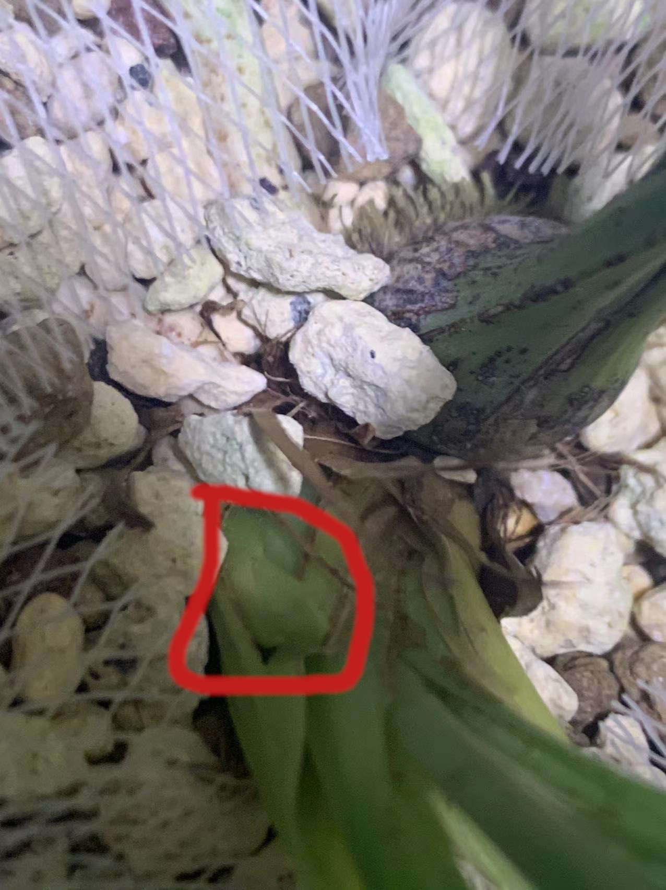

# 丹霞鱼枕素

+ 别名: 丹霞鱼魫素
+ 品种: 建兰
+ 产区: 四川峨眉
+ 来源类型: 自然选育下山
+ 价格区间: 50元/苗
+ 草型: 中等叶材
+ 优点:
    + 花品优秀
    + 叶材飘逸
    + 易出架
+ 缺点:
    + 小贵

<!--  -->

## 来源

丹霞鱼枕素下山自广东韶关市仁化县的丹霞山.丹霞山下山过大量优质兰花品种,本品在其中并不算突出,因此名声一般,传播也比较少.目前只知道中交仁化兰园偶尔会有放出.

鱼魫素是南宋<金漳兰谱>中介绍的一路白素,据说花瓣放入水中形如鱼骨,现在早已不可考.本品只是取其花型花色类似鱼枕附会而得名,实际是5年前下山的新花.

## 总体评价

+ 推荐等级: 4/10
+ 推荐人群: 素花爱好者,喜欢较大叶材且出架的爱好者

丹霞鱼枕素其实不算多优秀,而且也不是白素只是绿素偏淡,主要的卖点是花叶协调,叶材不小依然易出架,以及骨力.

但同类优秀的建兰素心花太多了,而这个品种卖的人少,价钱也相对贵,因此这个品种并不推荐.当然如果刚好碰到

## 分项评价

+ 花性: 8/10,还算比较勤花的品种,而且花比较大,但单杆通常5~8朵,花期较长,作为单瓣花来说花寿也长,通常可以放香10天,开花超过20天
    + 勤花: 7/10
    + 早花: 7/10
    + 花期: 9/10
    + 花寿: 9/10
    + 花芽颜色: 绿色
    

+ 花品: 8/10,稳定性极佳,花守极佳,即便要凋谢了也只是花变软垂下来而已.花品飘逸优雅,颜色嫩绿通透,花序较舒朗.
    + 瓣型: 5/10
    + 花色: 8/10
    + 花守: 10/10
    + 稳定性: 9/10
    + 花杆: 6/10
    + 花序: 7/10

+ 叶材: 7/10,中叶材,通常不会超过40cm,大叶品种,一般在1.4cm左右.叶嫩绿偏黄,叶质较软,半立叶骨力不错.卖点也就是株型飘逸.
    + 硬: 5/10
    + 挺: 6/10
    + 垂: 5/10
    + 扭: 0/10
    + 韧: 7/10
    + 色: 5/10

+ 抗性: 8/10,这个品种生命力非常强非常抗造
    + 抗虫害: 7/10
    + 抗病: 7/10
    + 抗晒: 3/10
    + 抗热: 7/10
    + 抗旱: 8/10
    + 抗涝: 8/10

+ 芽性: 7/10,勤芽
    + 勤芽: 8/10
    + 春芽: 8/10
    + 秋芽: 6/10
    + 壮芽: 7/10
    + 芽色: 绿色

+ 神韵: 8/10,难得神韵不错的品种,叶子这么高也极易出架,叶子粗瓣子细是遗憾,但整体相当潇洒飘逸
    + 风格: 潇洒飘逸
    + 花叶匹配: 9/10
    + 筋骨: 8/10
    + 柔韧: 6/10
    + 生机: 6/10
    + 动感: 8/10
    + 气势: 9/10

## 选盆,配土,铺面搭配与养护要点

### 放养

放养做备份建议如果苗少使用外盆口径16cm内盆口径15cm的套盆种养,植料可以使用老三样加蛇木屑加少量大块泥炭土的组合.

### 上盆

丹霞鱼枕素这个花气质算8分飘逸2分贵气,上盆适合高瘦盆形,材质可以考虑贴花白泥,釉面或彩绘浮雕的紫砂或出汗泥,色彩应该尽量素雅.再根据具体的材质挑选盆形细节.由于使用高盆,建议以颗粒植料为主.使用植金石铺面增添贵气,由于草比较高,可以搭配狼尾蕨,太湖石等点缀盆面,增加趣味性
