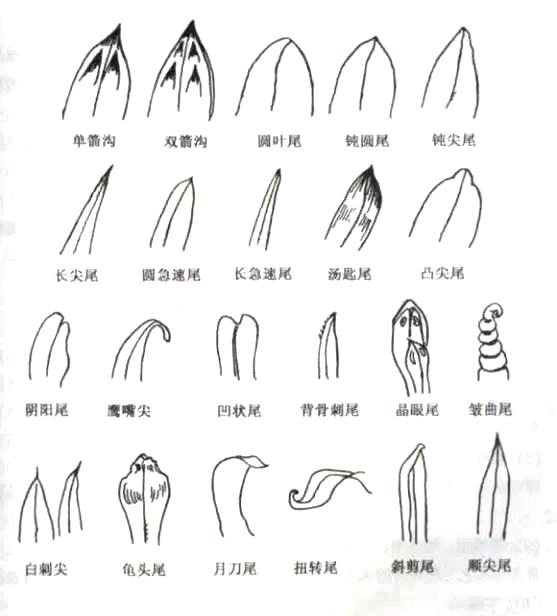
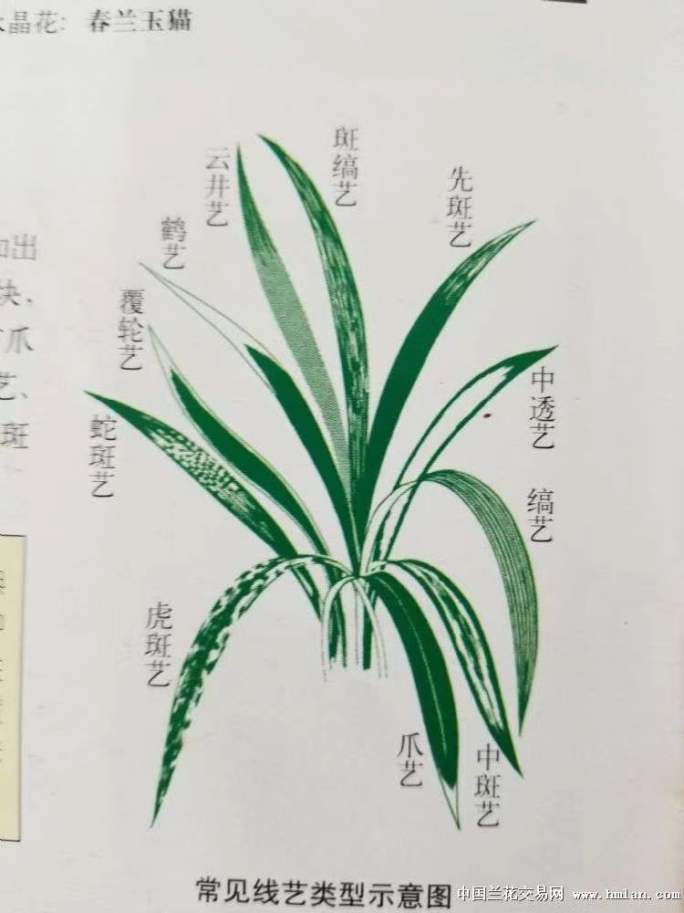
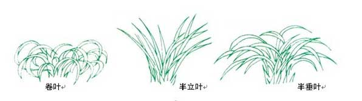
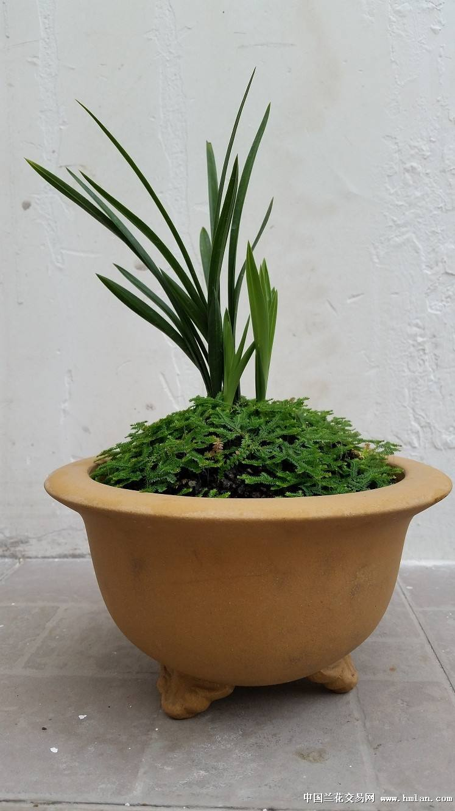
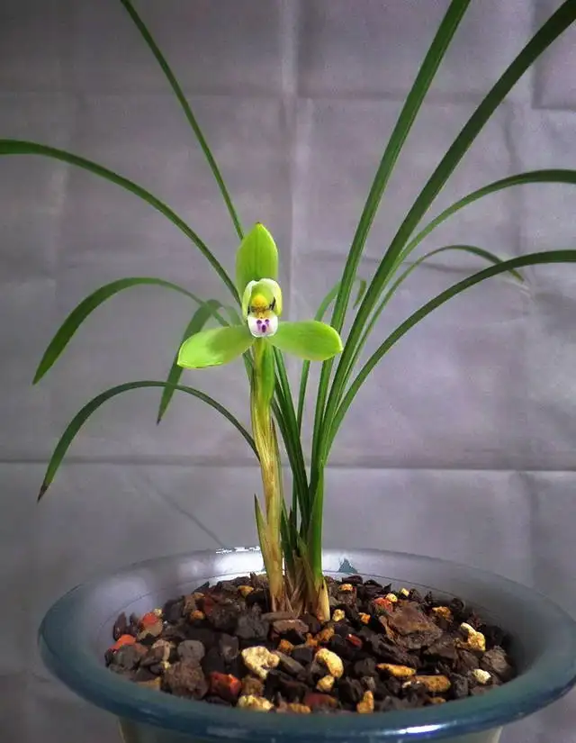
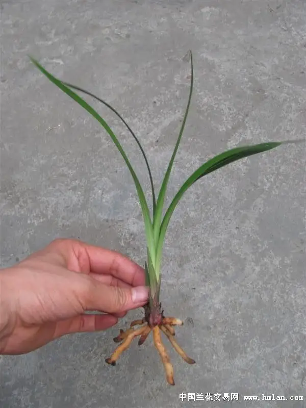
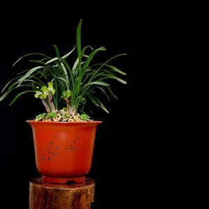
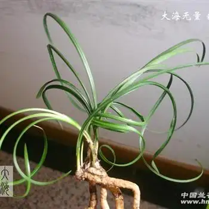

# 国兰赏叶

兰花的叶子也是赏兰的一项重要组成部分.兰叶柔中带刚,是国画的一个重要描绘对象.通常来说春兰蕙兰寒兰主要赏叶姿,建兰墨兰主要赏叶艺.

国兰赏叶往往从如下几个角度综合的欣赏

## 叶形

按正常生长成苗叶子的长度,兰叶又可以分为如下叶材:

+ 矮叶材,即矮种(低于20cm),春兰建兰中原生很少见,几乎都是春兰比如姜氏荷,翠盖荷,其他中完全没有.即便控养矮化这个尺寸也是很难达到的.
+ 小叶材(20cm~25cm),春兰建兰中原生的有比如春兰文荷,环球荷鼎,建兰日月宝,其他兰种中完全没有.这个尺寸春兰建兰通过控养矮化相对比较容易达到,
+ 中小叶材(25cm~35cm),春兰建兰中较常见;墨兰蕙兰中很少见,已经可以称为矮蕙,墨兰矮种了.
+ 中等叶材(35cm~45cm),建兰中较常见;蕙兰墨兰中比较少,见一般在蕙兰墨兰中被认为是中小叶;豆瓣,寒兰,春剑,莲瓣等这个也是属于正常偏小的叶材了
+ 中大叶材(45cm~55cm),春兰基本没有;建兰这个大小的比较少;蕙兰中这个尺寸算偏小的;墨兰中比较常见;豆瓣,大叶寒兰,春剑,莲瓣等也比较常见.
+ 大叶材(55cm~75cm),春兰建兰基本没有;蕙兰墨兰中比较常见;大叶寒兰这个尺寸也比较常见.
+ 高叶材(高于75cm),似乎只有蕙兰,寒兰有这个尺寸的

兰花的叶子一般是底部收拢较细,向中间逐渐变粗,再逐渐变细到末端收尖

按成苗叶子最宽处算,兰叶总体可以分为

+ 细叶(0.7cm以下),通常莲瓣春兰为主
+ 小叶(1.3cm以下),通常莲瓣春兰春剑寒兰多在这个范围,建兰这个尺寸就已经算细了
+ 大叶(1.6cm以下),通常建兰在这个尺寸已经算粗了,墨兰这个尺寸则算细的
+ 宽叶(1.6cm以上).墨兰多数在这个尺寸范围

在这个范围内不同兰种又会按相对大小来区分,比如寒兰会分细叶寒兰和大叶寒兰;莲瓣会分细叶莲瓣,宽叶莲瓣.一般来说叶子细显飘逸,叶子宽更容易展现叶纹叶艺.

叶子收尖最常见的22种叶尖形状可以总结为下图

## 叶质

叶质指叶片的颜色,厚度,弹性,质感,表面纹理形态等,通常认为墨绿油亮有弹性的为佳,如果兼有一些纹理形态就更好了.

国兰成苗的叶色一般有翠绿,油绿,深绿,暗绿,墨绿,通常刚抽叶时颜色会偏嫩些.质感有软有硬,有薄有厚,有的表面粗糙有的表面油滑,有的平整有的成V字形,有的叶脉明显有的不明显甚至看不到.由于生长不均匀和向光性,叶面有时会有一些变化,包括:

+ 蛤蟆皮,即叶面有凹凸状斑块
+ 行龙叶,即中骨(即兰叶中间最粗大的一条主叶脉)两侧有纵向凹陷突出
+ 扭卷叶,即叶面延中骨扭曲

兰草柔中带刚的的一个体现就是叶质,一般如果一个草拨弄叶子可以沙沙作响,那就说明叶质优秀筋骨硬朗.有个术语形容叫`叶有力道`就是说的这个.叶质不光和品种有关,和种养环境也有很大关系,一般偏阴养的叶绿,偏阳养的叶会偏黄.但偏阴养的叶子会相对软,偏阳养的则会更硬,因此兰叶的`力道`也是种养的一个很重要的关注点.

## 叶芽

叶芽又称子芽,是从假鳞茎基部生长出来可以成长为新苗的的幼小芽.叶芽最开始时通常是嫩白的芽点,随后会逐渐成长露出土面.出土的芽子,整生长过程中叶色的变化同样非常有欣赏价值.

刚出土叶芽,上尖下钝,芽色有粉芽,红芽,褐色芽,银灰色芽,绿芽,白芽,有的颜色有渐变,有的有沙晕.古人总结了如下规律:

+ 凡属绿花类和素瓣,芽尖都呈白绿色;
+ 如赤绿壳或水银红壳类的芽尖呈微红色;
+ 如赤壳类,芽尖为红紫色.

随着叶芽成长,叶片会逐步露出来,这个过程称为展叶.一些品种新叶老叶颜色色差很大,比如一些品种嫩叶会呈现一种嫩绿,黄绿的状态直到叶子完全长成;一些特殊品种新叶会含有较高花青素,因此呈现红色,到成苗时花青素褪去逐渐回归原有绿色,这类被称为红草;还有一些带先明后暗艺的品种.这些品种展叶观赏性堪比开花

## 叶艺

国兰叶艺指的是叶子出现异于寻常状态的现象.通常包括锦化,蝶化,水晶.后两种除了在叶上出现花上也会出现,已经在国兰赏花标准中有过描述,这里不再复述.这部分仅介绍锦化叶艺.

锦化本质上是叶面叶绿素缺失,按缺失部分颜色的不同叶绿素缺失程度由小到大分为绿艺,黄艺(金黄艺),白艺(瓷白艺),一些艺还会再叶片中.

根据叶素绿缺失的位置有如下叶艺

而从叶艺的出现时间和存在时间角度,可以将叶艺分为

+ 先明后暗艺,即在叶芽展叶到成苗这个阶段叶带艺,成苗后不带艺
+ 先明艺,即在叶芽展叶开始全程叶带艺
+ 后明艺,即在叶芽展叶到成苗这个阶段叶不带艺,成苗后带艺

锦化让叶绿素缺失自然会造成植株光合作用能力减弱,只是程度不同罢了.一般来说艺色越白,出艺区域占叶面占比越大,通常称为艺越高,影响也就越大.影响具体来讲就是

+ 开花相对会少
+ 芦头相对会小
+ 叶子相对会细短

适当的艺比如云锦艺,粉斑艺,覆轮艺,边艺让兰叶更有观赏价值.但有艺未必是好事,艺高的品种很多时候就成了纯观叶品种,舍本逐末,欣赏价值也就和吊兰差不多了.

个人认为最优的艺是先明后暗的中透艺,即让叶芽出芽也有观赏价值,又在苗生长期限制了叶片生长达到了控旺的作用,而成苗后艺消失也不会影响开花.

由于先明后暗艺是在叶片未成熟时才有的艺,而如果刚好碰到新叶老叶颜色色差很大,就会呈现一种

## 叶姿

叶姿是不考虑叶艺情况下对一株兰花叶片形态的整体观感的描述.大体可以分为如下2种5类

+ 立叶(企剑),通常体现兰花阳刚的一面,立叶品种叶尖往往不太向下
    + 直立叶: 叶直直向上或斜上生长,仅因自身重量略微下坠弯曲.立叶草往往叶面细,典型的如环球荷鼎.
        
    + 半立叶:叶从假鳞茎出土后向斜上方向生长,仅在靠近叶尖处开始弯垂.如龙字.
        
+ 软垂叶(软剑),通常体现兰花阴柔的一面,软剑品种叶尖往往都会向下
    + 半垂叶(弓型叶),叶片从假鳞茎斜着生长,到中间慢慢弯下.比如建兰市长红
        <!--  -->
        一些半立叶直的地方非常直,垂的地方非常垂,会相当有观赏价值,通常也被认为是最优雅的叶姿
    + 垂叶,叶片整体呈弧形,形如镰刀,叶尖下垂至假鳞茎.如大富贵等
        
        一些垂叶品种下垂幅度过大甚至叶尖会到盆面以下,这种被称为抱盆草,一些人喜欢,一些人会觉得垂头丧气,属于有争议的叶姿
    + 卷叶,叶子打卷,比较少见
        

叶姿不光和品种有关,也和种时的角度,分苗时截取的结构,培育时的光线方向有关.赏兰在赏花之外更多的就是赏叶姿.而兰花盆栽更多的时候也是在控制叶姿.