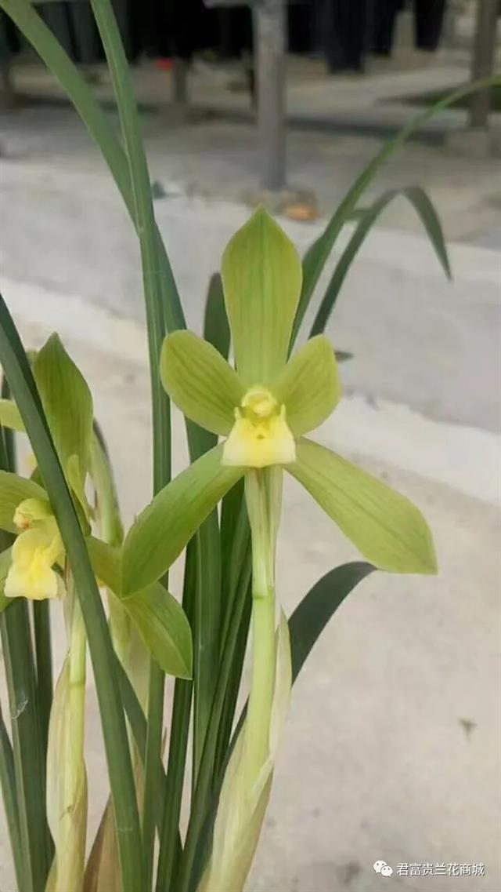
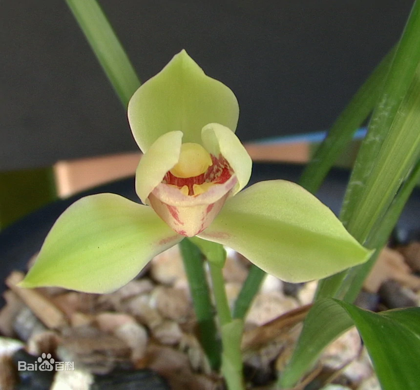
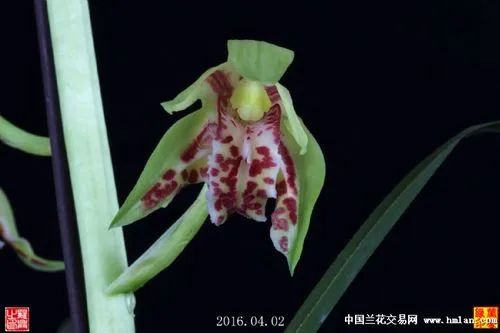
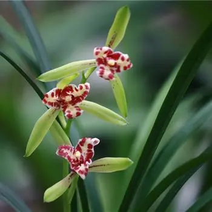
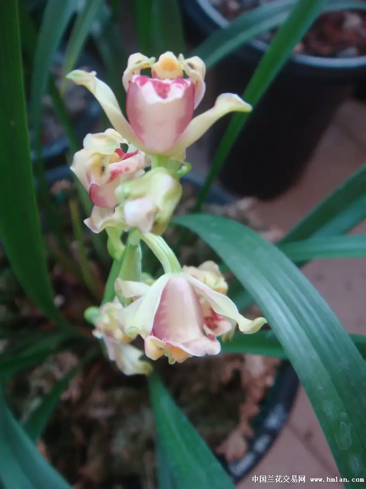
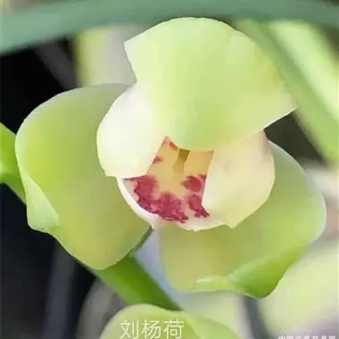
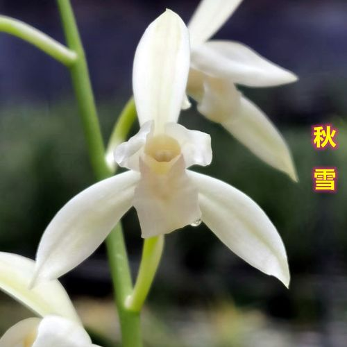
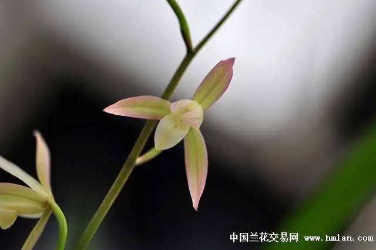

# 国兰赏花

国兰在中国有很长的欣赏培育历史.国兰古代常被文人用于自比.兰花按传统瓣型理论可以分为细花,行花.细花即符合瓣型学说中定义的花,行花则是不符合瓣型学说定义的单瓣花.也就是说可以大致理解为细花就是比较有可取之处的花,行花则是平平无奇的花.往往一颗细花价值连城,而行花则是非常廉价.

国兰赏花基本可以从如下几个角度进行.

+ 香,花香的优劣品评
+ 姿,花与花杆的姿态组合
+ 形,主要来自瓣型学说
+ 色,由瓣型学说中的素心概念衍生得到
+ 艺,由叶艺衍生的花艺
+ 气质,花的精神面貌

## 香

赏兰闻香在中国有着悠久的历史.

东汉时期<琴操>编者蔡邕在其中写道:

> "猗兰操者,孔子所作也.孔子历聘诸候,诸候莫能任,自卫反鲁,过隐谷之中,见香兰独茂,喟然叹曰:夫兰当为王者香,今乃独茂,与众草为伍.譬犹贤者不逢时.与鄙夫为伦也.乃止车援琴鼓之云……"

原文讲述了胸怀满腔抱负的孔子,晚年率弟子周游列国十四载却始终未遇伯乐之君.自卫返鲁途中,在山谷里看见兰花和杂草生在一起,心中感叹:兰花当为王者献上自己的香气,如今却与众草为伍,就好像有德才之人却生不适逢时.于是停车取琴,奏唱<猗兰操>.

可见赏兰,闻香自古以来就是和文人,琴棋书画,联系颇深.
我们都知道在现实中兰花并不是最香的,比兰花香味浓且好闻的也不少,实际上同为兰科植物有香味的也非常多,卡特兰,蝴蝶兰,文心兰,石斛中不乏带香的品种,而风兰更是以小巧浓香闻名.但香是国兰鉴赏的基础.文人以兰自比,兰香便是文人的德才,不香或者香味不好闻的国兰自然无法称为上品.

但文人又要清高有风骨,时刻卖弄才德自然也非君子所为,因此兰香以时有时无,似有似无,有香时淡雅高洁,柔和平顺,满屋清新为最高境界.

决定国兰香味的大致可以分为:

+ 品种因素
+ 产区因素
+ 株型因素
+ 种养因素

### 品种因素

而国兰不同兰种在香味方面也各有千秋,普遍来说不同兰种会有如下特点:

+ 春兰,味道中庸,偏暖,扩散性较强,相对比较浓烈.以本文的芳香植物评估标准来看味型可以描述为:
    + 甜-5
    + 暖-7
    + 扩散性-6
    + 浓度-6
    + 质感-清澈,纯正,单薄,湿润
    + 侵略性-1
+ 建兰,相对味道淡些,香味偏冷,扩散性较弱.以本文的芳香植物评估标准来看味型可以描述为:
    + 甜-4
    + 暖-6
    + 冷-1
    + 扩散性-2
    + 浓度-2
    + 质感-清澈,纯正,单薄,湿润
    + 侵略性-1
+ 蕙兰,自己没养过不好评价,据说味道最浓,凑近闻会上头,但间隔1m以上就会觉得相当好闻.

+ 墨兰,自己没养过不好评价,但花店闻过启黑的味道,总体感觉味道偏干偏沉,但扩散性较好,可以在间隔1m左右闻到,与其他国兰相比差别较大.
    + 甜-5
    + 暖-3
    + 冷-3
    + 扩散性-6
    + 浓度-5
    + 质感-浑浊,纯正,厚重,干燥
    + 侵略性-4

+ 莲瓣兰,自己没养过不好评价,据说比较淡
+ 香豆瓣,据说品种之间差异巨大不好统一描述,有的号称第一香,有的则只是淡淡有点味道.

兰种之外瓣型也会有一定影响,比如相同株型的花,重瓣花,花上花会比单瓣的香,单瓣的又比蝶花香.

另外也有一种说法--香花不艳,艳花不香.也就是色彩越丰富的花越不香.比如蕙兰中一般也是认为绿蕙香味优于赤蕙.其理由是兰花吸引昆虫授粉靠颜色和气味,如果颜色比较鲜艳就不太需要香气吸引昆虫了.当然这种说法仅仅是个说法,目前没看到有人做过相应的量化研究.

### 产区因素

就产区来说,相同兰种不同产区也可能会有不同.比如中部地区,日韩的出产的春兰就不香,也有一些品种在个别产区据说香味不好,甚至被人说是抹布味.

### 株型因素

国兰的香味来自于外三瓣和捧瓣.因此花多瓣多自然就更香,要花多瓣多就要株型够壮,比如建兰株型弱的一杆两朵花,一次就来一杆,这样自然比不上健壮的一杆7,8朵花同时来几杆花的香.

### 种养因素

我们人为可以控制的部分基本就只在种养因素这里了,下面是网上搜到的相关要点

1. 使用腐殖土和有机肥.有说法认为山泥土种养的兰会比较香,现在主要用树皮各种石头种养有机质含量过少会让兰花营养不良从而香味减弱.可以通过出花芽前后及时用有机肥或蒸煮过的黄泥加杂泥的浆水浇灌的方式补救.个人没试过土养兰花没有发言权,这边姑且写下来.
2. 充分光照.兰花要香得有较强光照刺激,尤其是春兰.因此如果希望更香些最好将兰花放在明亮处或者直接放室外.
3. 控水.据说在花苞到小排铃阶段适当控水可以让兰花中组织液根浓从而兰会更香.不过我一般为了拔干高些不会控水
4. 防虫.如果兰花授粉了那不光是会很快失去香味,更会快速枯萎结果.
5. 春化到位.对于要春化的品种比如春兰蕙兰,春化时间不够香味会不足

## 姿

中国是个讲究中庸协调的国家,在国兰鉴赏中也讲中庸协调,这主要体现在赏姿方面.本文是赏花标准,因此主要从赏花的角度看待姿,赏花赏姿主要有如下几个方面(按重要性排名):

+ 花大突出,一般我们会认为花要尽量大些才好看,比如精彩梅和红一品,他们花型花色以及勤花程度区别不大,通常我们都会认为精彩梅更优秀些,主要就是因为花大.
+ 花多热闹,建兰瓣型花中有不少被人诟病花小,但如果极其勤花,往往同时开几杆,每杆有好几朵,那多少可以补回来些,最典型的就是夏皇梅和红一品.
+ 花序舒朗(针对非春兰),对于非春兰类的国兰,一杆上会有很多花,我们通常都会认为每朵花间都有均匀合适的距离是最好的.

不同姿态有不同的韵味,没有绝对.不同姿态可以通过配盆和盆面装饰突出优点掩盖缺点.这部分我们在后面造景部分进行详细探讨.

## 形

按瓣型理论来说花型分为正格花和奇格花(也称奇花,变格花).所谓正格就是花型正统符合瓣型理论中定义的外三瓣,捧瓣,舌形舌色等状态组合的单瓣花,也就是最常说的梅荷水仙和素花;而所谓奇格花指的是花朵本身产生了变异或者有稳定奇特姿态的花,也就是重瓣花,花上花,蝶花,飘门花.这体现了古人正奇相生的辩证思想.

在这些之外的瓣型按照传统瓣型理论自然属于不入流的.现代社会欣赏标准已经多元化,除了瓣型理论中规定的花形外其实也多了很多新的瓣型,这些瓣型有些可以放正格花里,有些可以放奇花里,但更多的可能单独分类会更合适.

这部分只考虑花形,花色相关的后面再综合介绍.

本部分资料整理自中交网上的相关资料,主要参考自`纳兰荣欣`前辈的相关帖子

### 花杆

兰比君子,蕙比士大夫,花杆自然以挺拔飘逸又稳健庄重为美.因此无论春蕙都以花杆高为美.

一般认为花杆要细才是好花,细杆也被称为`灯芯杆`.当然也有例外,赤蕙的花杆就以粗为美.个人认为花杆最主要的还是要和整株形态搭配才是最好的,比如一些蕙兰墨兰以高大有气势为观赏点,那花杆就不宜过细,过细会显得头重脚轻.

对于多花的蕙花,每杆花杆以花序舒朗为佳,也就是说每朵花之间间隔应该适当,起码不会花与花之间肩碰肩甚至打架,且子房长度也应和杆高协调,过长过短都影响美观.最好朵朵如一,朝向也一致或者对称.

有一种情况是一些蕙花品种没有子房,因此这种花没有大排铃了也很难转茎,这种蕙被称为抱杆花.莲瓣兰中有不少矮种铭品是这类花.这类花天生做不到花序舒朗比较遗憾.

### 瓣型花

瓣型花一般指的是符合瓣型理论中定义的外三瓣,捧瓣,舌形组合的单瓣花.广义上讲瓣型花可以分为正格瓣型花,奇格瓣型花,行花瓣型花,但早年间下行花被认为不入流因此瓣型花通常仅指正格瓣型花,奇格瓣型花,而狭义上的瓣型花仅指正格瓣型花.**这边我们以正格瓣型花,奇格瓣型花作为瓣型花的范围,行花瓣型另外讨论**.

由于瓣型花主要就是看瓣型搭配,因此通常对花守要求比较严格,一般来说要求一朵花从完全打开到开败这段时间花形不能有大的变化,如果只有某一个时间点符合特定瓣型那也称不上是瓣型花.因此瓣型花通常花瓣会比较厚,一些花守好的还会紧边(花瓣外边缘内扣).

单瓣细花在任何瓣型任何花色之外的评判有如下几个基本原则:

+ 飞机肩优于平肩优于等分肩优于落肩,这说的是外三瓣间夹角比例,侧萼瓣又称肩,主萼瓣与侧萼瓣间夹角越小就显得花越精神.
+ 花瓣久开不变形优于越开越外卷
+ 不开天窗优于开天窗,这说的是捧瓣,捧瓣无法包裹住鼻头中间有缝隙称为开天窗.
+ 平圆舌优于卷舌

瓣型的定义向外推广可以引用到多瓣花上.比如绿云,它虽是多瓣奇花,但花形工整,有典型的荷型中宫和荷瓣,因此也算瓣型花.

瓣型花的基础在`中宫`(捧瓣,舌,鼻构成的内圈)形态,要求规整,通常必须是短舌,最多允许微垂微卷;捧瓣合抱盖住鼻或与鼻一起构建为一个闭合的状态,鼻也绝不能长过捧瓣.中宫总体像水仙花黄色花蕊那样合抱收拢就可以称为瓣型花.

再根据中宫形态,外三瓣形态进行细分分出不同瓣型确定品级.

瓣型理论规定的基础瓣型只有3种即

1. 梅
2. 荷
3. 水仙

也就是说所有瓣型花都可以被分类为梅瓣,荷瓣,水仙瓣花.

### 外三瓣形态

瓣型理论定义的瓣指的是外三瓣.正格瓣只有梅瓣和荷瓣;其他还有飘瓣,竹叶瓣,鸡爪瓣,超瓣,团瓣.

#### 荷瓣

荷瓣外瓣符合如下标准:

1. 收根(花瓣根部明显快速变细)
2. 放角(花瓣头部两侧呈明显的钝角有尖,这是最关键特征)
3. 最长处和最宽处比例不超过3:1,放宽范围不能超过4:1
4. 短阔成荷花花瓣形状

荷瓣根据收放的位置又有多种形态

+ 收根放角均靠后形似桃子.可也称为桃瓣,典型的如莲瓣维西秀荷
+ 收根放角均靠近中间形似菱形
+ 收根放角均靠前形似铲子的
+ 收根靠后放角靠前形似小船的

#### 梅瓣

梅瓣外瓣符合如下标准:

1. 收根(花瓣根部明显快速变细)
2. 结圆(花瓣头部结为平滑的圆形甚至内凹有缺,没有尖,这是最关键特征)
3. 最长处和最宽处比例在2:1左右,放宽范围不能超过3:1
4. 短圆成梅花花瓣形状

梅瓣根据长短情况可分为

+ 椭圆形
+ 长萼形
+ 蛋萼形
+ 扇萼形

#### 竹叶瓣

竹叶瓣符合如下标准:

1. 收根(花瓣根部明显快速变细)
2. 最长处和最宽处比例往往超过3:1不到5:1
3. 形如竹叶,从根部开始变宽一点,然后逐渐平缓的收窄.

竹叶瓣是春兰建兰最常见的外瓣形状

#### 鸡爪瓣

鸡爪瓣符合如下标准:

1. 最长处和最宽处比例往往超过3:1
2. 形如鸡爪,根部最宽逐渐向顶部收窄

寒兰墨兰常见的外瓣形状

### 中宫形态

瓣型花中宫形态必须封闭内聚,不能开天窗,只要开天窗的就算不得瓣型花.而只要中宫形态封闭内聚则就是水仙型,也就是说只要是个瓣型花就保底是个水仙.

中宫是由捧瓣,舌和鼻共同组成的.鼻就是一根柱子没啥可说的,中宫主要看的就是捧瓣和舌.

#### 捧瓣形态

捧瓣的形态非常多,细花中通常情况下捧瓣盖住鼻优于捧瓣与鼻共同构造为闭合空间.这里列举几个比较典型的捧瓣形态:

+ 蚕蛾捧: 捧瓣似山脊状高耸,其缘紧扣起兜呈"八"字形着生.上侧端角,高凸如蚕茧头状;下侧解钝圆,捧背弧形,恰似一对初出蛹的蚕蛾形态.梅瓣花常开此种捧,梅仙,水仙中也可偶见.蚕蛾捧可分为软,硬两种.传统认为以质嫩软者为佳,硬者相形见绌而为次.不过硬蚕蛾捧的出现率也低很多.

    

+ 观音捧: 俗称观音兜,形似神话中观音菩萨帽沿前端兜形,捧上侧略搭盖,捧面内凹外隆,捧端大兜状里扣,兜缘呈波浪状的连弧.荷仙,水仙中比较常见

    

+ 蚌壳捧: 每片捧瓣,近根部隆起,捧面平伸微微下凹形似两片空蚌壳.荷瓣,荷仙中比较常见

    

+ 豆壳捧: 该捧心端如厚实的豆壳状,双捧呈合抱蕊柱态势,偶有开天窗现象发生.多见于蕙花水仙瓣开品

    

+ 猫耳捧: 飘门瓣型捧瓣标配. 捧瓣前端部分向上翻状似猫耳般.

    

+ 短圆捧: 捧心瓣体短形圆,捧背弧形大,捧缘呈内扣状,双捧合抱蕊柱,紧守中宫,多见荷瓣和团瓣花开品.

    

+ 蒲扇捧: 该捧特征是捧瓣短圆但瓣背弧形较小,呈短阔状如同蒲扇一样,合抱蕊柱紧守中宫.多见于梅形水仙瓣
  
    

+ 蟹钳捧: 捧瓣瓣背中部隆起,尖端兜扁,略分杈,形似蟹钳状的捧型兰花.由于雄性化有过足现象,多见连肩搭背现象开品.该捧多见于蕙花中梅,仙类某些开品.

    

+ 磬口捧: 磬是一种玉制的用于悬挂打击的乐器,其形如曲尺.磬口捧的两捧瓣无兜,分居于合蕊柱后的左右侧,端口成圆弧形,形状如两片"磬"相对的样子.

    

+ 剪刀捧: 捧瓣貌似剪刀一样地开叉而细长,有张开有合抱.是多个兰种中行花的标准配置之一.细花种素心多见.

    

#### 舌形态

舌通常以平整为佳,这里列举几个比较典型的舌形:

+ 刘海舌: 舌形为小半圆,圆正微下宕

    

+ 圆舌: 舌前端呈圆形,微微下挂.
    

+ 如意舌: 舌端稍呈三角形,平挂不卷,形似工艺品如意头.常见于梅,仙

    

+ 大铺舌: 舌形宽大而稍长,呈下挂状,久开会卷,称大铺舌,常见于水仙,荷瓣中春兰大富贵(也是该舌形)

    

+ 龙吞舌: 舌硬而不舒,舌尖部内四微卷起兜,如龙吞食的形状故名龙吞舌.常见于梅,仙,荷瓣极少比如莲瓣兰维西秀荷

    

+ 方缺舌: 舌舒而不卷,舌尖部中央呈内凹或微缺状称方缺舌.方缺舌一般在梅瓣或者各种蜂巧上比较多见

    

+ 执圭舌: 舌稍长呈长方形,舒而不卷,舌端钝尖,似古代大臣上朝时手中的执圭故名执圭舌.常见于梅,仙.

    

+ 秤钩舌: 舌尖向一侧歪且卷,形似秤钩,故名秤钩舌.

    

+ 卷舌: 舌下挂,长而后卷,称卷舌.这基本是行花标配
    

#### 中宫类型

瓣型花细花中宫保底就是水仙型,根据具体的形态和组合又可以分为梅型中宫,荷型中宫.

+ 梅型中宫

    1. 捧瓣短圆起兜且合抱蕊柱,以能合盖鼻头为佳.兜指捧瓣尖端部瓣肉组织的形态,兜前端有白色边也叫"白头",并向里扣卷.使捧瓣结块有增厚感.按厚薄可分为软兜与硬兜;按内卷形成的空间深度可分深兜和浅兜
    2. 唇瓣短硬不后卷下垂(主要特征)

+ 荷型中宫

    1. 唇瓣圆正,舒展而不卷或下垂(主要特征)
    2. 捧瓣呈向内合抱状,无白头,以能合盖鼻头为佳
    3. 捧瓣不起兜,无增厚
    4. 捧瓣短阔(长宽比例一般小于2:1)

#### 花型与花守

上面我们只是静态的拆解瓣型,但任何植物开花那有一模一样的,除非是塑料花.我们需要动态的

花守指的是花朵盛开到凋谢,瓣型变化的程度,又叫骨力.中国传统文化崇尚守节,兰花又常被文人用于自比,因此花守非常被重视.一些花守不太好的花开久之后会有落肩,开天窗外三瓣后倾等现象,即所谓"武相",个人猜测可能这个说法来源于臣子不守节要发兵造反.

传统审美上来说花守好的花即便瓣型没那么规整品格也更高,而一些花就第一天能看的后面就变形的没法看,这种花一般也无法作为细花.

一般一个花确定其瓣型会

瓣型花通常并不一定要求开品稳定,但一般都要求无论怎么开都还是瓣型花.比如春兰宋梅无论怎么开还是要么是梅瓣要么是水仙;比如春兰大富贵(郑同荷)大铺舌开久反卷就从正格荷开成了荷仙.这并不影响他们称为经典瓣型花.

而一个瓣型花确定其开品瓣型也应该取其最佳开品.有说法叫千梅万水仙,千梅易得一荷难求,这说明就稀有程度来说荷>梅>仙.

### 正格花

正格花必然是单瓣花.所有正格花都归属于瓣型花,但并不是瓣型花就都是正格花.所谓`正格`是相对`奇格`而言的,`正格`意味着端正,正统,指的是符合特定瓣型条件且没有外飘的花

可以总结为:

1. `正格荷瓣花`也称为`荷瓣`
2. `正格梅瓣花`也称为`梅瓣`
3. `正格荷仙花`也称为`荷仙`
4. `正格梅仙花`也称为`梅仙`
5. `正格水仙花`也称为`水仙`

#### 正格荷瓣

满足外三瓣为荷瓣,中宫为荷型且没有外飘的就可以称为正格荷瓣花.

正格荷瓣花典型的如环球荷鼎

##### 荷瓣品种的常见特征

荷瓣兰花的叶片比较宽厚,并且叶子的尾部并不尖锐较为圆钝.它的叶脚紧抱具有光泽.整片叶子相对油亮并且叶脉也相对清晰.另外荷瓣兰花的叶片常具有一定的弯曲度,向下弯曲,呈汤匙状.在清晨的时候,略微凹陷的叶片能够承接住露水.

#### 正格梅瓣

满足外三瓣为梅瓣,中宫为梅型且无外飘的就可以称为正格梅瓣花.

正格梅典型的如宋梅

##### 梅瓣品种的常见特征

梅瓣的新芽萌发出土时芽色均较鲜艳,芽尖多数有一点白色玉峰或芽体挂彩,质地晶莹滋润,芽色混浊或油涩者决不出梅.
叶裤劲挺而散,没有一片叶裤扭向前,叶裤企紧峰尖似针.
叶姿多半垂,叶片排列整齐似折扇,底叶多数呈鱼状,叶柄紧企而细长,中幅呈螗肚形,叶面多数有"行龙",叶尾呈船形,叶面通常呈沟漕形而不平坦,叶脉细含无狭丝,叶质滋润,叶色碧绿富光泽.
花苞头形端正而文气,雀咀空头而底部紧收,圆浑而不鼓涨.若花苞圆鼓似拳,花未开而光见捧心白头者,捧心定硬结,外瓣不翘必飘.梅瓣花苞壳色有多种,然壳尖必挂绿彩或玉白峰,衣壳由外向内层层增彩添色麻纹渐稀,上品梅瓣常有2至3片彩壳,边缘有玉白色边衣壳无麻纹酷似花瓣,子房衣壳全彩壳而做起皱者花形必圆整而大.彩壳有翠绿壳,紫红彩壳,赤绿彩壳,白玉壳,玻璃彩壳等.
花蕾透出衣壳时形似莲子或似花生长,头形朝天定不俯首.花蕾顶端有白峰,边缘镶白边,昂首挺胸渐渐放瓣.细细观察梅瓣绽放的过程真有梅花迎春冰雪消融的意境.
梅瓣花艺品种较多,然外瓣圆捧心愈易紧硬粘结,唇瓣也就易尖小,而捧心愈紧硬粘结,外瓣虽圆却易飘翘,外瓣上亦易出现硬白筋,俗称"背背"虽时不有人称其为"水晶梅瓣"然以传统标准论则为劣品.

##### 梅瓣品种的鉴赏

梅瓣花艺品种的优劣中宫是关键所在.

梅瓣的捧兜常见的有以下几种:

+ 软蚕蛾捧: 形似蚕蛾的头形,捧瓣前端远而向内卷呈玉白色或乳黄色.捧瓣质地较软糯滋润具肉质感,两片捧瓣分窠却合抱端正,圆润而光洁.捧心顶部不露鼻背,捧心侧面不见舌腮.如意圆舌,刘海舌更佳.配以圆整的外瓣,如春兰“宋梅”是为梅门中的极顶上品.
+ 半硬蚕蛾捧: 又称半硬捧,捧兜较厚硬,捧瓣尚能分窠或分头合背,唇瓣较短小,中宫略感紧小.已可以开梅门为上品.
+ 硬捧: 捧心厚硬,捧瓣连肩搭背,舌瓣尖小,中宫紧缩,外瓣虽圆仅入中宫.
+ 琵琶头捧,油灰块捧,拳头捧,捧瓣与蕊柱粘结僵化为一体,舌瓣尖小似米粒或无舌瓣,少数亦有下启的舌瓣,然均无口而吊舌.此类梅瓣无论外瓣如何结圆均似冰雪冻僵后无法正常开放的梅花,均为劣品而不入选.

古人云:"梅无大舌".确实梅瓣无艺品种若能舌瓣短圆阔大放启适度,捧心软糯光洁圆整,中宫不紧小与外瓣配比合理;外瓣圆而紧边,主正,肩平,展绽有姿而含抱,色俏质糯,杆高,神韵轩昂,花守又好.这种梅瓣真可以说万在一选.
中国兰花中花容端正,花形舒展的瓣型花并非梅瓣,而是梅形水仙与荷形水仙.欣赏那些冻僵的梅花瓣真不如欣赏普通兰花,平平常常却落落大方.

#### 正格荷仙

荷仙首先必须是荷瓣,但中宫并非荷型而是满足如下要求:

1. 唇瓣圆阔稍长下垂
2. 捧瓣短阔,呈向内合抱状,软捧无白头

荷仙和荷主要的区别就是中宫,荷的中宫没有雄性化且舌大而圆而且不垂不卷,而荷仙要么有雄性化要么舌小或者有垂有卷

通常兰花荷仙以接近荷瓣为佳,仅舌头微卷或下垂其他与正格荷完全一致是最好的,比如春剑天玉荷

通常蕙花荷仙类外三瓣以成菱形为佳,这样的花型看起来硬朗精神,蕙花一杆多花,更显飘逸灵动仙风道骨精气十足,比如建兰夏皇梅.

#### 正格梅仙

梅仙首先必须是梅瓣,但中宫并非梅型,而是满足如下要求:

1. 捧瓣短圆起硬兜,兜前端有白头
2. 唇瓣稍长微卷

梅仙和梅瓣主要的区别就在于舌,通常如果舌不卷不垂就是梅瓣,否则就是梅仙

#### 正格水仙

正格水仙是水仙中特殊的一类,它通常指的是:

+ 捧瓣有雄性化,舌短,不下垂或有微卷或有微微下垂
+ 外三瓣有收根,且有结圆或放角
+ 外三瓣长宽比大于4:1

正格水仙通常花大靓丽春兰四大名花中正格水仙就占了汪字,龙字两席.

### 奇格花

奇格花又称奇花,变格花,基本可以分为:

+ 重瓣花.开起来花瓣或花舌比正常情况多的花.
+ 花上花.花蕊中又长出花茎而开花的花
+ 蝶花,外三瓣或者捧瓣变异有舌特征的花.
+ 飘门花,外三瓣或者捧瓣变异向外扭曲翻转的花

需要注意正格花有时候开飘也会有奇花的形态,尤其是蕙花的顶花,这并不影响他们是正格花.只有至少是大概率开出奇花开品的花才是奇花.

#### 重瓣花

重瓣花指开起来就是重瓣的花,在古代重瓣可能不多见,但现代随着基因技术的发展已经相当多见了.这种类型的主要是欣赏一个繁复,一般以瓣多花大为美.

可以分为

1. 多舌花,即有多片花舌,特殊情况是如果有3个舌且没有捧瓣个人不认为它是多舌花,而是三星蝶
    
    多舌花一般以繁复为美.

2. 多瓣花,即有多片萼片.
    
    多瓣花要视萼片的形态是否符合细花标准来判断是不是`多瓣正格`,典型的多瓣正格比如绿云(多瓣正格荷).也可以看花瓣是否有蝶化,有的话一般可以称为`奇蝶`
    一般以瓣多花大为美.

3. 多瓣多舌,即既有多个萼片又有多个花舌,有时候绿云也会开出多瓣多舌,
    
    多瓣多舌是上面多瓣和多舌的结合体,评估标准也是上面的结合--瓣要看是否正格是否有蝶化,舌要则以繁复为美.

4. 多捧瓣多舌,即有多个捧瓣多个舌,一般可以被叫做`麒麟`.
    

5. 多鼻多舌,即有多个蕊柱和舌,一般可以被称为`狮子`.可能是取自多个蕊柱像佛祖发型狮子头.
    

#### 花上花

花上花这类花的一大优势是花期相对更长,花香一般也会更浓.

这个类型中又可以细分为

1. 树型花,这类花的特点是从花上开出来的花会带花杆,看起来就像树分叉一样,比如翠玉牡丹

    

    树形花以瓣多杆高为美,开品好的树形花会如同麦穗一般一杆多节,有个还会分叉,非常热闹.

2. 牡丹型花,这类花是在花上直接开花,看起来层层叠叠,比如富山奇蝶

    

    牡丹型花以花大繁复为美

#### 蝶花

蝶花是指花瓣有蝶化的花,蝶化是指兰花在舌之外的地方出现舌化的现象.由浅到深表现为

1. 长出红色舌斑
2. 起喉(长出舌上会有的凹槽)
3. 底色完全变为和舌一样

蝶花往往很难有稳定开品,一般以颜色艳丽对比度强为美.

根据蝶化的位置和蝶化程度分为

+ `外蝶`,即外三瓣蝶化,一般只会出现在两片副瓣上,且不会整片副瓣完全蝶化.一般是一半副瓣(下半部分)长出红斑且底色变成和舌一样的颜色
    
    由于副瓣下半部分蝶化,外蝶往往呈现一种落肩,下半部分向外翻转褶皱成波浪形的姿态.
+ `内蝶`,即捧瓣蝶化,根据蝶化的位置和蝶化程度分为
    + `捧蝶(彩捧)`,捧瓣长出红色舌斑
        
    + `蕊蝶`,捧瓣长出红色舌斑,起喉
        
    + `三星蝶`,又叫`鼎蝶`捧瓣长出红色舌斑,起喉,底色形状完全变为和舌一样.
        
        通常三星蝶主要就是欣赏舌和舌的分布,因此
        1. 以三个舌成中心对称的分布为佳
        2. 以舌外翻为最佳,
        3. 以舌上斑块分布优美为佳,素心次之
        4. 比如春兰大元宝.

#### 飘门花

飘门花是一个很特殊的存在,虽然被归类为奇花,但也归类为瓣型花,一般归属于水仙或梅瓣的(主要是水仙).

飘门花一样要遵守瓣型花的要求--花守好不变形,有严格的瓣型标准,但确实长的很难说`正`因此这边还是将其归类为奇花中.

飘门花简单来说就是梅瓣或者水仙外三瓣和捧瓣外翻的一类花.我们知道梅瓣和水仙都会有所谓的雄性化--外三瓣捧瓣部分位置增厚内扣.飘门可以理解为雄性化的影响使外三瓣捧瓣不内扣而是外翻.这种瓣型称为飘瓣,典型的比如猫耳捧.注意捧瓣外飘并不是开天窗,中宫依然是闭合的才符合标准.

+ 文飘,即微飘,通常是侧翻为主,即花瓣顶部两侧向外翻转,经典代表种是蕙兰"海归蜂巧".

    

+ 武飘,即重飘,通常是外翻为主,即花瓣顶部整体向外翻转,雄性化过强起蚂蟥筋(花瓣后背会有明显增厚的筋),经典代表种是蕙兰"老朵云".
    

飘门花有大致如下几种情况:

1. 只飘外三瓣,这类比较多,如果捧瓣符合梅的标准(雄性化起兜,短舌不垂不卷)且外三瓣较宽则为飘门梅瓣,否则都是飘门水仙,比较典型的如春兰翠桃(飘门梅瓣),春兰翠一品(飘门水仙),蕙兰郑孝荷(飘门荷仙).
    

2. 只飘捧瓣,即猫耳捧.这种就统一归为飘门水仙.

3. 外三瓣和捧瓣都飘的.这种通常算作飘门水仙,根据飘瓣形态又大致可以分为

    1. 百合,一种飘门瓣型,外三瓣略微外翻而不起波浪,捧瓣似猫耳,上有明显或不明显的雄性化斑块,舌瓣短圆而不翻卷(往往舌斑是大小不等的一点红)的类型,比较典型有春兰玉蟾,巧百合
    
    2. 白菜,一种飘门瓣型,外三瓣,捧瓣以及舌的外延都卷曲成波浪状,且花苞无法完全张开,这种瓣型的往往命名中会带云,比较典型有建兰彩云追月和春兰严州彩云
    
    3. 蜂巧,外三瓣和捧瓣轻微外翻程菱形,长宽比接近,猫耳捧,舌短小.比较典型的有蕙兰海归蜂巧,老蜂巧.
    

### 行花瓣型

行花在传统瓣型理论中不受待见,但现代人品味多样,也有不少人喜欢这样瓣型的.

在行花瓣型中也有一些可以介绍的瓣型

#### 荷形花

有荷瓣但中宫不满足瓣型花要求的行花,这类还是比较常见的,毕竟荷瓣基本就是拉宽了的柳叶瓣.

#### 梅形花

中宫不满足瓣型花要求但外三瓣顶端结圆的行花,不太常见,梅瓣顶部结圆一般是因为雄性化,而往往外瓣有雄性化捧瓣多少也会有,比较容易会形成水仙型.

#### 团瓣花

花瓣圆润且外三瓣无法完全打开,外三瓣整体看起来就像个球.

需要注意很多商家将团瓣当荷瓣卖,这属于混淆概念.

团瓣花虽然中宫也是闭合的,但外瓣也打不开,因此不能算作细花,这算个特例吧.

#### 超瓣花

大小超过正常范围的外三瓣

### 花苞

开花是一个动态的过程,一些花花苞的形状也是比较值得欣赏的.兰花花苞小排铃后的状态叫`小蕊`,单瓣兰花根据其形状基本可以判断最终的瓣型.古人根据兰,蕙的特点有如下总结

### 兰的花苞

兰通常一杆只有一到两花,没有排铃,转茎后直接就开了,因此花芽可以理解成就是花苞.常见的花苞形态如下:

+ 瓜锤形: 花蕾顶部平而下部敛小,箨筋稍硬者,大多开分头合背梅瓣.或开三瓣一鼻头之类.如筋络细糯,且呈绿色,花蕾下部宽大者,舌形必大,花瓣亦宽.
+ 莲子形: 上下部近乎相等,形似莲子.这种形式其三瓣有肉,裹尖而重白头(即瓣尖端有微白晕肉质兜),边紧.大都开大舌梅瓣,花瓣较圆正.假如满蕊俱白,色泽姣嫩,花瓣放足后容易伸长变皱.
+ 花生肉形: 花蕾似花生仁状,但前端小中部大且形长.如箨筋细糯,多开大铺舌,梅形水仙.白头,肉裹尖重者开梅瓣者居多.
+ 机梭形: 花蕾形似织布机梭.舒瓣后有紧边,如箨筋粗硬,大多开硬捧,尖舌水仙瓣或小如意舌梅瓣.
+ 橄榄形: 花蕾二端小中部宽大.如箨筋细糯,花开小舌水仙者居多.
+ 龙眼形: 花蕾浑圆结实感,如无白头彩壳者,开短圆瓣,或三瓣虽短,而无秀气,还不算名贵这种形式大多开荷花瓣之类.
+ 圆灯壳形: 花蕾较长圆.箨筋细糯,条条延伸达顶,这种形态大多开皱角梅瓣或软捧微皱水仙瓣.
+ 净瓶口形: 花蕾稍长,三瓣瓣尖顶收,口放.如箨筋细糯,颜色娇艳者必开武瓣水仙.
+ 石榴口形: 花蕾圆短,三瓣瓣尖微向外翻.箨筋粗而挺直,筋色鲜艳者必开武瓣水仙

### 蕙的花苞

蕙花的花苞的总结有两套理论--清同治四年(公元1865年)许霁楼<兰蕙同心录>附录中所载的萧山沈沛霖分载蕙蕊“头形八法”头型八法和五门八式:

详见：图解蕙兰<五门八式>
（1）巧种门
蜈蚣钳：花蕾二片副瓣合拢成钳形。舒瓣后有紧边、瓣肉厚，合背硬捧，这种开小舌梅者居多；如分窠大舌，水仙瓣者少；如分窠软捧，开大舌梅者居多，为上品中第一，例如潘绿、程梅等。
大平切：平边厚肉。大舌，分窠捧心者居多。如分头合背、硬捧，小舌梅者为少。这种形式在梅瓣、水仙瓣中都有，为上品中第二，例如上海梅、元字仙等。
小平切：三瓣稍长，平边圆头。分窠捧心，大舌者居多；如合背硬捧，小舌者少。水仙瓣大多出于这种形式，为上品中第三。例如小荡、大陈字等。
（2）皱角门
瓜子口：宽边文皱，花开水仙瓣者居多，开梅瓣者少。属上品中第四。
石榴头：宽边武皱，飞捧、方缺舌，此类梅瓣、水仙瓣都有，为上品中第五。例如蜂巧、峨蜂梅、朵云等。
（3）官种门
官种形：捧兜浅而厚。
滑口形：微有浅薄捧兜。
杏仁形：宽边蒲扇捧、舌小。这类多为水仙瓣，属上品中第六。
（4）癃放门：俗称油灰块。含苞待放时，先见捧心，且形似僵粘整体。外三瓣舒瓣时卷边皱角，不能舒展平整。凡属这种形式，捧瓣全合硬者居多，亦有分头合背。如捧瓣与唇瓣粘连成一块，俗称为三瓣一鼻头，是梅瓣、水仙瓣中最劣开品。
（5）行花门
凡花蕾锐尖、狭长，舒瓣后，花瓣都呈尖狭鸡爪状，这种形式俗称为粗花或行花，是不具瓣型的一般兰花。但，如花蕾稍短，上搭深，有时亦能有一般性荷瓣出现。
蕙兰中除上述“五门八式”蕊形外，尚有多种形式，但多数没有上品好花开出。

### 雄性化与瓣型花

`雄性化`这个词我们在前文中多次提及.这是一个术语,又叫`蕊柱化`(参考魏亚声教授的<兜瓣型兰花的成因——蕊柱化变异>一文),和前面提到的`蝶化`很类似,指的是在外三瓣和捧瓣上出现变异有了蕊柱的一些特征.
兰花的蕊柱尖部凸起放着雄性组织(花药及药帽),紧邻其则下出现凹陷(拟药腔).这种结构在花瓣上就表现为局部增厚,起兜和内扣外翻.按不同部位的雄性化状态细分的话有如下几种情况

1. 外三瓣内扣,捧瓣内扣
2. 外三瓣内扣,捧瓣无雄性化
3. 外三瓣无雄性化,捧瓣内扣
4. 外三瓣无雄性化,捧瓣无雄性化

5. 外三瓣外翻,捧瓣无雄性化
6. 外三瓣无雄性化,捧瓣外翻
7. 外三瓣外翻,捧瓣内扣
8. 外三瓣内扣,捧瓣外翻
9. 外三瓣外翻,捧瓣外翻
  
而外三瓣和捧瓣的雄性化程度又未必是一致的,这就带来了无穷无尽的组合.但总体而言外三瓣和捧瓣的雄性化程度多少有点联系,不会出现一个完全没有雄性化一个雄性化非常厉害的情况.

在瓣型花(中宫闭合)的前提下,

+ 前3种情况和第7种情况就是正格瓣型花中的梅瓣或者水仙,其中第7种情况比较特殊,一般算正格瓣型花,但也也是飘门花.
+ 第四种情况一般就是普通行花瓣型或者荷瓣.荷瓣在花外的表现往往在叶子上--鱼肚宽叶+叶尖起兜.当然也有特例,在失传的环球荷鼎(现有的应该都不是真品)描述中有"外瓣紧边"这样的描述,通常荷瓣是不会紧边的,说明失传的环球荷鼎外瓣也有雄性化特征,只是程度较低.
+ 剩下的情况就是奇格中的飘门花.

一般情况下国兰外三瓣的宽度与捧瓣雄性化程度成正比;外三瓣的长度与捧瓣雄性化程度成反比.而外三瓣的长度决定了花径的大小,因此通常雄性化程度较高的花会比较小.而像荷瓣花就可以大致认为是中宫紧闭且外瓣天然较宽的行花.自然相对是更少有的,因此以前就有了千梅易得一荷难求的说法.

对于瓣型花有官种巧种之分.按中宫进行区别所谓官种指的是捧瓣起微兜或微有白头的弱雄性化软捧品种,而巧种则是捧瓣雄性化强烈的硬捧,一般要么有明显白头,要么内卷外翻

根据瓣型理论中雄性化程度与花瓣大小的关系来简单理解,就可以认为花大者为官种;花小者为巧种.

<!-- 从瓣型角度看雄性化程度大致可以认为符合如下规律:

根据不同位置雄性化程度的不同也都可以在小蕊的时候看出一些端倪,这也是古人赌梅,仙类花的方法之一.雄性化程度大致可以认为符合如下规律:
 -->

雄性化与具体某种瓣型并不是一一对应关系,只是他们会有联系.

## 色

关于色在传统瓣型理论中只有对素心的描述,即素无下品,素心花全部算细花.古时候信息传递效率低,准确度低,因此颜色难以成为一个容易评估的方面.而现在,人人手机就能照相,清晰度还高甚至几乎人人还都会修图,这让兰花的颜色也成了欣赏的重要以环.

兰花色花很大程度上类似打麻将,就是凑要素,一些只要满足舌色要素就可以称为色花,一些只要满足瓣色要素就可以称为色花,还有一些需要同时满足舌色和瓣色的搭配才可以称为色花.另外芽色杆色以及杆上苞叶的颜色也是加分项.

### 舌色

舌色分为素心和彩心

+ 素心: 即舌色即为底色,一般舌的底色为白色,嫩黄,嫩绿.在传统瓣型理论中只要是素心花就算细花,但本人认为瓣型理论不应该涵盖对花色的评估,因此将其抽出来.
    再细分可以分为
    + 纯素,即舌色完全为底色.
    + 桃腮素,即舌色只在底部靠近花心的位置有轻微粉色红晕其他全为底色
    + 水渍素,即舌上有非常浅像被水洗过一样不仔细看看不出来的红斑痕迹,但一般认为如果一个素花的舌色是水渍素,那它算比较下品的素.

+ 彩心:即舌上有红色或者紫色色斑,进一步可以细分为
    + 彩心: 有色斑,一般兰花都是彩心,彩心中以色斑有规律的成块为佳:
        + 一块色斑,以在舌尖正中为最佳,舌正中次之,大小以宽度在舌宽1/3左右为佳,形状以方形块,梯形,u字形,心形为佳.
        + 两块色斑.以在舌尖中间对称两条为最佳,在舌中间对称两条次之,两条色斑宽度适中为佳,长宽相近为佳,左短右长次之.
        + 三块色斑.以在舌尖为最佳.以成品字分布为佳
        + 多块色斑.单独成大小相近的块,并均匀竖向分布在舌两侧为佳.
        + 芝麻状色斑随机分布最次
    + 红舌: 色斑成片均匀完全覆盖舌面,舌背面可红可不红(红的被称为穿版红舌),一般来说只要有红舌就算色花,这类色花统称`红舌`,之前也有叫`丹心`的,现在不怎么看得到这个说法了
    + 红素:色斑均匀覆盖舌面,舌面全红,舌背面也全红,且舌面舌背颜色一致,一般来说只要有红素就算色花,但这类色花还是统称`红素`

### 瓣色

兰花花瓣一般是一个固定的底色上有贯通花瓣径向的红色,白色或绿色脉纹,花瓣上也有可能有红点,红晕或者整块的红色.传统上认为瓣色越纯净越好,否则色混不入流.不同兰种花瓣底色不太相同,江南春蕙多绿色;建兰多为浅绿,白色,黄色;西南春兰多色混,黄绿交杂篇琥珀色,脉纹明显;墨兰多为深红或白色.花瓣颜色往往稳定不变.一般瓣色只有与普通的不同才会被认为出色.

瓣色可以分为:

+ 素瓣,即纯底色无脉纹,无杂斑,颜色均匀的花瓣.花瓣底色可以是纯色也可以是由于花瓣厚度变化产生的渐变色,只要过渡均匀即可.素瓣一般要和素心搭配,这类被称为素花,算是色花下的一个大品类.素瓣通常分为
    + 绿素瓣(普通素瓣),通常认为翠绿色的最好,如果可以随着瓣子的厚度有晶莹剔透的感觉则是最好
    + 白素瓣,通常认为越白越好,如果瓣子颜色可以有晶莹剔透的感觉或者糯糯的质感则更好
    + 黄素瓣,很少见,颜色越亮越好.

+ 红瓣,除去脉纹外只有单一红色的花,一般也分为红花和穿版红花,区别就在于是否花瓣背面也覆盖红色,从颜色区分由深到浅可以分为:
    + 紫红瓣,即花瓣底色为紫红色,只要有紫红瓣就算色花,这类色花统称`紫红花`,比如建兰墨宝
    + 橙红瓣,即花瓣底色为橙红色,只要有橙红瓣就算色花,这类色花统称`橙红花`,比如墨兰瑶琳胭脂
    + 水红瓣,即花瓣底色为水红色,只要有水红瓣就算色花,这类色花统称`水红花`,
    + 粉瓣,即花瓣底色为粉色(胭脂色),只要有粉瓣就算色花,这类色花统称`胭脂红花`(`粉花`,`粉红花`)

    由于红瓣颜色受气温湿度光照等影响很大,往往非常不稳定,所以往往无法精确的确定瓣色是哪种红,一些紫红花在一些情况下也会开成橙红花;水红花和胭脂红花更是很难区分.

+ 复色瓣,除去脉纹外花瓣上有两种或三种对比分明的不同颜色规律分布.只要有复色瓣就算色花,这类色花统称`复色花`
+ 转色瓣,花瓣上的颜色分布会随着花朵开放的时间阶段变化.这类色花统称`转色花`.通常转色都是在花瓣底色上逐渐染上一些红色,比较常见的模式包括:
    + 底色偏黄的花瓣,随着开的天数变多逐渐染上红色从而变为橙色,比如春兰红双喜(淡黄色转橙红色)
    + 底色本就是浅红色,随着开的天数变多逐渐染上红色从而变深红色,比如豆瓣兰红河红(浅红转深红)

    转色瓣一般在豆瓣和寒兰上比较多见,其他品种不太多见.
    注意褪色不算转色,染色也不算转色.很多品种花苞开始是绿色,慢慢内部会变红,然后打开,这个过程并部不是转色,只是正常的花朵成熟过程而已.

### 花芽,花葶和苞叶

开花是一个从萌芽到盛开的连续动态过程,开花的起点是花芽,然后拔干形成花葶,抽出花序,再然后排铃开花.

花苞,花葶,苞叶一体而生,颜色有着紧密的关联.

#### 花葶

兰花的花杆(花葶)一般为要么是纯色,如白色,嫩黄色,嫩绿色,翠绿色,墨绿色,粉红,玫红,暗红,褐色;或者是混色,如白绿,绿红渐变,绿杆带红晕等.单就花葶颜色来看,纯色优于混色,一般认为大致是如下排序

+ 粉色/玫红
+ 白色
+ 白绿渐变
+ 嫩黄色
+ 嫩绿色
+ 其他颜色

通常我们可以笼统的将无麻无晕的纯白色,纯绿色以及白绿渐变的花葶称为`绿杆`,其他因为多少带红色褐色的元素而称为`赤杆(红杆)`

一些花葶在不同阶段颜色还会变化:

+ 花杆和花序在拔干和小排铃的时候是红杆,到大排铃和开花的时候逐渐转为绿杆,这种称为赤转绿杆;
+ 花杆和花序在拔干和小排铃的时候是绿杆,大排铃和开花的时候逐渐转为红杆,这种称为绿转赤杆;

就我的观察,素花多绿杆

#### 苞叶

苞叶,也称`苞壳`,`壳`,其形态在兰蕙上有些不同,兰的苞叶较长,花葶短,苞叶几乎可以覆盖满整个花葶;而蕙花的花葶长,苞叶短,花葶可以明显的分为上下两个部分--上部长着花序,这一部分是没有苞叶的,下部杆子上会有一节一节的苞叶.苞叶颜色应该和杆色协调,比如杆子是个白杆子,而苞叶是个杂色的那就不好看了.

`筋`即苞叶上的细长筋纹.筋有长短有疏密有粗细有平伏有凸出,颜色也各有不同.筋总以细长透顶,软润,疏而不密且微有光泽者为佳,这样的筋也常有瓣型花品出现.如筋粗透顶者花瓣必阔,容易有荷瓣出现.如绿筋绿壳或白壳绿筋,筋纹条条通梢达顶,苞壳周身晶莹透彻,那大多出素心瓣可能性多.梅瓣和水仙瓣的筋纹较细糯,中间还需布满沙晕.

`麻`即苞叶上不通梢达顶的短筋.麻之粗细长短不匀,排列比较紧密,这种俗为麻络.如相互之间空阔稀疏,又布满异彩沙晕,往往多出奇瓣或异种素心瓣.麻由于颜色各异,可分为青麻,红麻,白麻,褐麻等.又根据花苞出土时间迟早分为深与浅之分.

`沙`即各筋纹之间散布着细如尘埃状微点,`晕`即密集如浓烟重雾状的微点,`沙晕`即为两者合称.苞壳上如有沙有晕大多出梅瓣,水仙瓣.如苞壳上的沙如杏毛状密集一起,花苞逐渐抽长时蕊顶部分又呈现浓绿色者,绝大多数出梅形水仙瓣.如沙晕柔和,颜色或白或绿,出素心瓣居多.凡具有瓣形的名花,在其苞壳上除筋纹细糯,通梢达顶,还必须有沙晕.

苞叶有松和紧,厚与薄之分.按我国艺兰先辈们经验总结,无论哪种颜色壳都有好花出现,但必须气色要鲜明,壳薄而硬,色糯方算上品;如壳薄而软则称"烂衣",很少有上品花出现;如壳厚而硬,颜色柔糯,也屡有好花出现.

苞叶有长短之分,俗称为`长梢壳`和`短梢壳`.`短梢壳`中部的色彩浓而厚,锋尖有肉钩,苞尖又呈鹊嘴形,大都出梅瓣水仙瓣.如壳长而苞尖呈钝形,多数出荷形水仙瓣.如绿筋绿壳,白筋白壳,筋细麻纤,晶莹透彻,且通梢达顶,又沙晕与壳,筋,麻同样颜色者往往出现素心瓣.蕙兰苞壳的腹部筋纹间满布沙晕,又有粒粒如圆珠般凸出状的屡有梅瓣水仙瓣出现,但壳色不能有过分明亮光泽.如蕙兰花蕊苞壳紧圆粗壮,下部整足,一般多开荷形大瓣子花.

苞叶有多种颜色,一般分为:

+ `绿壳`: 苞叶绿色无麻,筋不明显
+ `白绿壳`: 苞叶基部白绿色,往上绿色渐深,顶部又稍转淡
+ `赤转绿壳`: 苞叶有麻基部呈淡绿色,往上渐呈红色褐色,顶部又泛出绿中带紫晕
+ `水银红壳`: 苞叶有麻呈淡红色,基部稍白些,鞘上的筋纹为深红色
+ `赤壳`: 苞叶为紫色红色褐色粉色

由于筋纹的颜色深浅和沙晕映辉,更有深绿,淡青,竹叶青,竹根青,粉青,青麻绿壳,白麻壳,红麻壳,荷花色,深紫色,猪肝赤壳等等细分.其中以水银红壳、绿壳、赤转绿壳最易出名花.

简单起见,根据壳上是否有杂色是否有麻也可以将`绿壳`,`白绿壳`统称`绿壳`或`净壳`,`赤转绿壳`,`水银红壳`,`赤壳`统称`赤壳`或`麻壳`.

我国艺兰先辈们通过长期实践总结成许多丰富经验,总结出一个"看壳歌诀",让我们在选择新花中具有瓣型名花时可以借鉴

1. "绿壳周身挂绿筋,理解透顶细分明,真青霞晕如烟护,确是真传定素心."--绿筋忌亮,须要有沙晕,必如烟霞,筋宜透顶小蕊.在仰朵时日光照之如水晶者为素,昏暗者非是
2. "罗衣自绿亦称良,大壳尖长也不妨,淡绿筋纹条透顶,小衣起绿定非常."--白壳绿飞尖绿透顶,沙晕满衣,此种定素.出铃小,蕊若见平,水仙在其中存.
3. "老色银红烟晕遮,峰头淡绿最堪夸,紫筋透顶铃如粉,定是胎全素不差."--出铃时色如茄皮紫者,梅根绿背,黄者素.
4. "银红壳色最称多,莫把红麻瞥眼过,多拣多寻终有益,十梅九出银红窠."--银红窠必须先淡后深,筋纹透顶,飞尖点绿,小衣肉厚,而多光滑.细心选择为要.
5. "绿壳三重起紫灰,此中必定见仙梅,小衣有肉峰如雪,铃顶平疑刀剪裁."--官绿壳上若起紫晕一重,其花必异,筋纹忌亮.
6. "深青麻壳无人晓,莫道青麻少出奇,尖绿顶红条透顶,晕砂满壳异无疑."--深青麻壳,极多光亮,满蕊白砂,必非素异,必须紫筋透顶,飞尖点绿,此花定异也.
7. "筋粗厚壳出荷花,铁骨还须异彩夸,无论紫红兼绿壳,此中常是见奇葩."--筋粗壳硬,屡出荷花,不论赤绿,一样看法,如落盆几日,能起砂晕,就可望异.最难得者,荷花小蕊,尖长深搭,凤眼微露,收根必细,灶门开阔,定是飞肩.

#### 花芽

兰花花芽的颜色一般有纯色的如粉红色,白色,嫩绿色,黄色,墨绿色,暗红色,褐色;一般认为粉色优于白色优于嫩绿色,

分布通常花芽的颜色就是苞叶色和杆色的结合.芽色主体基本可以认为就是苞叶叠加杆的颜色,而芽尖(苞头)又往往是杆色的预兆.

花芽一般有粉色,白色,黄色,嫩绿色,黑色,墨绿色,暗红色,褐色,加上筋,麻,沙晕,颜色搭配也是非常丰富.一般认为颜色越纯净越优秀,而粉色优于白色优于黄色优于嫩绿色.

芽尖一般是红,黄,黑,白,绿五种颜色,通常和花芽整体颜色一致,但有时候芽尖会出现一点颜色变化.比如绿色花芽配红色芽尖,白色花芽配绿色芽尖

### 色花的固定搭配

更多的时候舌色,瓣色,甚至杆色需要搭配满足一定条件的才可以称为色花.一般判断色花先看舌再看瓣:

+ 舌为素心则为`素花`,然后根据瓣色判断是什么素.
+ 舌为红素则无论瓣色是什么样都是`红素`,典型的比如建兰赤诚
    
+ 舌为红舌则无论瓣色是什么样都是`红舌`,典型的比如建兰国魂
    
+ 舌为彩心则根据瓣色查看是否满足特定瓣色组合,如果满足就也是色花

主要的搭配有:

+ `白花彩心`(`白彩`),即彩心+白底+基部放射状脉纹或基部浅红晕,典型的比如建兰玉白丹红
    
+ `粉花彩心`(`粉彩`),即彩心+白底+基部放射状脉纹或基部浅红晕+花瓣大部成片淡粉色红晕+有粉色斑点,典型的比如建兰宝玉
    
+ `紫红花`,即彩心+紫红瓣,典型的比如建兰墨宝
    
+ `胭脂红花`(`红粉花`),即彩心+粉瓣,典型的比如建兰玫瑰妖姬
    
+ `转色花`,即彩心+转色瓣,典型的比如春兰红双喜
    
+ `复色花`,即彩心+复色瓣,典型的比如逸红双娇,精彩梅,蒙山彩荷等
    

在确定好色花种类后最后再看芽色杆色是否有加分项以确定在色方面的观赏价值.

#### 素心花分类

素心花,定义为色花中的一个特殊子类.广义上素心花就是`素花`.个人认为素心花的品级应该高于其他色花组合,素心花可以细分为:

+ `绿素`,即纯素素心+绿素瓣
    
+ `白素`,即纯素素心+白素瓣
    
+ `黄素`,即纯素素心+黄素瓣
    
+ `水渍素`,即水渍素心+任意瓣色,水渍素算作素花本身就比较牵强,水渍越不明显越好
    
+ `桃腮素`,即桃腮素心+任意瓣色,个人认为桃腮白素远比其他桃腮素好看的多,可以和白素比高下.桃腮白素瓣子越白,桃腮越粉则越好.一些桃腮素在特定情况下会出现桃腮扩散到捧瓣外三瓣的情况,开出彩素开品.
    

+ `麻壳素`,也称`红壳素`即苞叶为麻壳的素心花,这类花通常是杂色瓣,即底色通常是黄绿白,但会有红色混合其中,显出混合颜色如琥珀色,又或者红色上色到花瓣之上,有红沙晕,红线,而且往往会有比较明显的脉纹,一些麻壳素会随着开花时的气候条件上色,有些时候可以开出非常艳丽的红瓣粉瓣开品.
    

    当然也有麻壳开出纯色素心的品种,比较少见.

+ `彩素`,即素心+彩瓣,要求花瓣干净艳丽,筋不明显,多同时为麻壳素,一些彩素上色渐变有如彩虹的称为`彩虹素`.个人认为优秀的彩素可以和白素比高下,但上色稳定的彩素很少见
    

+ `赤杆素`,即纯素素心+纯素素瓣+赤杆,通常纯素多绿杆;麻壳素,彩素多赤杆.赤杆素的卖点仅仅是少见,类似的一些麻壳素会以绿杆为卖点,但并没有专门的术语称呼.

`绿素`,`白素`,`黄素`都是纯素素心+纯素素瓣,这三种是`狭义上的素花`也称`纯素`.需要注意

1. 如果纯素花上代艺,比如白瓣代绿覆轮,这种依然认为是纯素,具体的品类以花瓣底色为准,比如青山玉泉,虽然花会带绿覆轮,但其归类依然是白素.
2. 如果由于花瓣厚度变化让花瓣颜色有明显的深浅变化,这种依然算纯素,比如黄山雪,虽然花瓣中线部位最厚的地方有时会是翠绿色,随着花瓣向外逐渐变薄颜色也快速变为白色,但依然算纯素,按花瓣整体颜色算属于白素

而素心+杂色瓣并没有一个专门的称谓,与之相关的是麻壳素和彩素的概念--麻壳素常出杂色瓣素心而彩素是色彩搭配干净艳丽,筋不明显的杂色瓣素心.这样就会出现一个很诡异的情况--一个非麻壳的素心杂瓣花,如果它的瓣色无法做到干净艳丽,筋不明显这个要求,那它虽然是素心花,但无法归属于上面的任意一个品类.杂色瓣素心由于会有上色的情况因此开品会很不稳定,有时开出来惊为天人,但更多的时候开出来绝对称不上美,因此对一个素心+杂色瓣的素花花品的评价需要结合最佳开品和普通开品综合评估,而纯素就没这个问题.

一个素花可既是纯素也是赤杆素,可以既是桃腮素又可以是彩素,但很多组合确实很少见.

按传统瓣型理论素花无下品,都算细花,品评顺序为先看素心类型,纯素素心最好,然后桃腮,然后水渍,然后按外瓣颜色来分,黄素最好,其次白素,再次绿素,再次杂色.现在的标准只能说各花入各眼了.

#### 色花的层次

传统瓣型理论认为素无下品,而红舌包括红素都不吉利像吊死鬼,其他就没有进一步描述了.而如今红素红舌成了香饽饽.在素花中本来也是黄素为贵白素次之,麻壳素(包括彩素)算不得上档次,而现在彩素最为受欢迎.个人认为这种审美的变迁很大程度上是和科技的发展以及生活节奏变快有关系的--传统瓣型理论非常强调花守,认为只有无论什么情况下开出来的花始终如一,而且久开不变的才是好花;而现在的审美更加注重所谓最佳开品,不少色花需要非常苛刻的条件才可以开出宣传中的最佳开品,而一般养护则非常容易平平无奇.这是非常需要关注的一个方面.

个人认为的色花排名如下(分先后):

1. 第一档(上品),原因:开品稳定,颜色清新
     + 白素
     + 绿素
     + 黄素

2. 第二档(中品),原因:颜色艳丽,但有开品不稳定的缺点,因此不及第一档
     + 桃腮白素
     + 白底彩素
     + 桃腮黄素
     + 桃腮绿素
     + 黄底彩素
     + 绿底彩素
     + 粉彩
     + 白彩
     + 转色花
     + 粉红花
     + 水红花
     + 橙红花
3. 第三档(下品),原因:颜色容易看着脏或者颜色对比度容易过高过于艳丽容易造成视觉疲劳
    + 普通麻壳素
    + 水渍素
    + 红素
    + 紫红花
    + 复色花
    + 红舌

## 艺

艺是评价花的加分项,针对的是花朵上的一些特殊变异,这种变异同样可能出现在叶片上.目前我只知道3种,即蝶化,绿覆轮(锦化的一种)和水晶.

花朵带艺的都可以称为`艺花`.

### 绿覆轮

绿覆轮是指叶绿素在叶片或者花瓣萼片边缘集中的现象(怀疑和缀化原因一样源自顶端分生组织增生叶绿素堆积).这当然也是一种变异.在传统的叶艺分类中并没有专门的绿覆轮而是覆轮和中透两种.一般描述绿覆轮都是说绿覆轮中透艺.
覆轮指的是叶片边缘颜色和叶片大部不一样,这种描述下绿覆轮算是覆轮的一种,但明显绿覆轮的形成原因和因为锦化而变色的其他颜色的覆轮不同;而中透则是指的叶片除了边缘外叶片中间锦化叶绿素缺失造成变色.

+ 叶片绿覆轮艺

+ 花绿覆轮艺

因此这里单独抽出来作为一种单独的艺来算.

许多带绿覆轮艺的都是花叶同艺,比如叶有先明后暗绿覆轮艺,花带绿覆轮的建兰就有青山玉泉,国色天香(铁骨黄芽),高山春色等.

### 水晶

水晶是指在兰花的叶片上出现白色透明状或乳白色半透明状的水晶体,犹如晶莹剔透的玻璃,钻石和水晶,在兰花叶片的叶尖,边缘叶片中间部位,花萼片的尖端都会产生.水晶体是真菌或支原体寄生于兰株的体内产生的,这些真菌或支原体会使叶片上的叶绿素消失而出现水晶.叶片上水晶表现出来的各种形态是真菌或支原体寄生叶片后产生的"瘿瘘".虽然没有科学家对形成水晶的真菌或支原体进行分离识别,但兰花叶片上的水晶是由真菌或支原体寄生所产生的是可以确定的.也就是只要真菌或支原体寄生在了兰株的组织内,寄生的地方就有可能出现水晶,真菌或支原体是具有感染性的,可以将其接种于兰花体内使兰花的芽原基受感染而产生变异形成新的水晶艺.

+ 叶片水晶艺

+ 花水晶艺

个人认为水晶艺比较病态没什么欣赏价值.

## 气质

兰花的气质是一种抽象的东西,基本上可以理解为将花拟人后对它的一种品评.古人用兰比君子,所以也就把对君子的各种美好品性的向往往兰上映射,而所谓君子本身就是一个相当理想化的完人形象,因此至少目前应该并没有完美的兰花品种.这种映射大致可以这样归纳:

+ 香味,隐喻才能,君子得是有才之人,因此兰必须有香;君子的才能需要是经世之才,不能是旁门左道,因此香味必须醇正清幽,但既不能烈又不能浊;君子要谦虚谨慎,择时而动,因此香味要时有时无,但不能若有若无,有香时要香的明显;君子之才要能惠及大众,因此兰香要悠远.
+ 形,隐喻五官形象,君子必须得端正,就算是奇花也要奇的端正.外三瓣可以类比站姿着装,要舒展挺立;副瓣不落肩,类比君子要挺直腰板不卑不亢;中宫可以类比五官,要圆润闭合;捧瓣合抱不开天窗,类比君子要长得柔圆润不能过分张扬;舌要短平,不挂不卷,类比君子要守口如瓶谨言慎行;舌苔上的红斑要规律有序,不能细碎,类比君子要微言大义,不能絮絮叨叨.
+ 色,隐喻性格,君子的性格应该温润如玉,因此花瓣质感也要温润如玉,没有杂色,要么没筋要么筋不明显.
+ 开品稳定性/花守,隐喻操守,花大多开品都是随外界环境变化而变化的,而且开时状态最好,慢慢随着时间流逝就越来越破败,兰花也是如此.这就好比一个人,刚成年时往往志向远大,行为端正充满理想主义,但随着年纪越大,慢慢就被环境改变,变得圆滑现实.而君子就要求从始至终都怀有赤子之心,也就是开品香味到花谢也保持不变.当然这是非常难的.

符合上面这些描述的程度有个专门的词叫`骨力`,`骨力`越强符合上述标准,骨力越弱越不符合上述标准,目前说到骨力都是首推春兰八大铭品之一的汪字.

当然现如今兰花的欣赏维度已经相当多样化了,除了来比君子,也有比美人的,只是,没有对应的标准来描述.

## 兰花命名的陷阱

国兰通常比较老派的命名方式是`地名+花品特点`()或`选育人+花品特点`(比如`俞氏素荷`,)或`称赞+花品特点`(比如`环球荷鼎`)或`花品特点+称赞`(比如`翠一品`).这种命名方式好处是可以通过名字大致了解到来历和花品特点.但也有不少人要么有意要么无意的给兰花乱命名,比如上面的团瓣刘杨荷被命名为荷,荷仙瓣型的夏皇梅被命名为梅,客观提高了对瓣型理论认知上的难度.也有故意取名为了夸大花品的比如很多叫彩素,彩虹的其实只是普通麻壳素.这都是需要在挑选品种的时候留意不要被骗了.

## 标签总结

关于兰花赏花相关的标签大致有:

+ 有骨力,指花品稳定,花香幽而不浊,外三瓣主瓣上挺,副瓣紧边拱抱不落肩,中宫捧瓣合抱不开天窗,舌平挂不卷,花守一流,花寿长,能持久放香,从开到败花品几乎不变,花序疏朗,花朵俯仰有度.所谓能持能守即为骨力.有骨力应该是对兰花的最高评价标准之一,所谓兰比君子,骨力就像文人气节,体现的是刚正不屈的净胜面貌,最典型的是春兰老八种之一的汪字.
+ 开品百变,指花品不定但怎么开都端正优雅,花开正格,花守一流.体现的是兰柔的一面,最典型的如春兰四大天王之首的宋梅.
+ 开品一流,指花品,花守,稳定性都出色的品种
+ 花开正格,指瓣型正格
+ 花色明艳,指色花颜色不混不乱
+ 花色纯净,指花瓣无筋无杂色或少杂色
+ 开花机器,指花非常勤花,花量很大