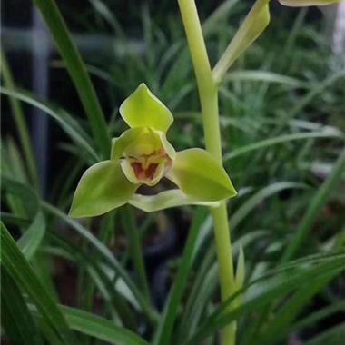

# 国兰赏花标准

国兰在中国有很长的欣赏培育历史.国兰古代常被文人用于自比.兰花按传统瓣型理论可以分为细花,行花.细花即符合瓣型学说中定义的花,行花则是不符合瓣型学说定义的单瓣花.也就是说可以大致理解为细花就是比较有可取之处的花,行花则是平平无奇的花.往往一颗细花价值连城,而行花则是非常廉价.

国兰赏花基本可以从如下几个角度进行.

+ 香,花香标准
+ 姿,花叶协调标准
+ 形,主要来自瓣型学说
+ 色,由瓣型学说中的素心概念衍生得到
+ 艺,由赏叶标准衍生得到

## 香

国兰最大的特点是香,香味也是国兰鉴赏的基础.不香或者香味不好闻的国兰无法称为上品.国兰的香味来自于外三瓣和捧瓣.实际上兰科植物有香味的非常多,卡特兰,蝴蝶兰,文心兰,石斛中不乏带香的品种,而风兰更是以小巧浓香闻名.
但我们描述其他兰科植物香味时往往会说有果香,有柠檬香,有桂皮像,有栀子香等.我们通常向没闻过的人介绍国兰香味时会用到下面这些词:

+ 奶香
+ 甜香
+ 幽香
+ 冷香
+ 清香

可以看出这些词都是很抽象形容,很少用其他有香物品的香味来形容国兰,因为国兰是独特的自成一派的香型.国兰的香味确实难以描述,但总体而言特点可以总结为

+ 香味不浓,隐隐约约似有似无
+ 闻着让人感到放松镇静,但多少带点暖意
+ 久闻不会上头

而国兰不同兰种在香味方面也各有千秋,普遍来说不同兰种会有如下特点:

+ 春兰,味道中庸,偏暖,扩散性较强,相对比较浓烈.以本文的芳香植物评估标准来看味型可以描述为:
    + 甜-5
    + 暖-7
    + 扩散性-6
    + 浓度-6
    + 质感-清澈,纯正,单薄,湿润
    + 侵略性-1
+ 建兰,相对味道淡些,香味偏冷,扩散性较弱.以本文的芳香植物评估标准来看味型可以描述为:
    + 甜-4
    + 暖-6
    + 冷-1
    + 扩散性-2
    + 浓度-2
    + 质感-清澈,纯正,单薄,湿润
    + 侵略性-1
+ 蕙兰,自己没养过不好评价,据说味道最浓,凑近闻会上头,但间隔1m以上就会觉得相当好闻.

+ 墨兰,自己没养过不好评价,但花店闻过启黑的味道,总体感觉味道偏干偏沉,但扩散性较好,可以在间隔1m左右闻到,与其他国兰相比差别较大.
    + 甜-5
    + 暖-3
    + 冷-3
    + 扩散性-6
    + 浓度-5
    + 质感-浑浊,纯正,厚重,干燥
    + 侵略性-4

+ 莲瓣兰,自己没养过不好评价,据说比较淡
+ 香豆瓣,据说品种之间差异巨大不好统一描述,有的号称第一香,有的则只是淡淡有点味道.

也有一些个别国兰品种据说香味不好,甚至被人说是抹布味.这些自然不能算好花.

## 姿

中国是个讲究中庸协调的国家,在国兰鉴赏中也讲中庸协调,这主要体现在赏姿方面.本文是赏花标准,因此主要从赏花的角度看待姿,赏花赏姿主要有如下几个方面(按重要性排名):

+ 花叶协调,中国文化中讲究有主有次,在赏花方面花是主,叶是次,叶必须要可以和花很好的搭配才能称为好花.比如君荷叶型宽大,往往被认为是缺点,但花也大,又是荷瓣花,花叶就相当协调,显得大气庄重,所以不失为好花.
+ 花大突出,一般我们会认为花要尽量大些才好看,比如精彩梅和红一品,他们花型花色以及勤花程度区别不大,通常我们都会认为精彩梅更优秀些,主要就是因为花大.
+ 花多热闹,建兰瓣型花中有不少被人诟病花小,但如果极其勤花,往往同时开几杆,每杆有好几朵,那多少可以补回来些,最典型的就是夏皇梅和红一品.
+ 花高出架,一般我们希望花高于叶,这也符合花为君叶为臣的关系,比如好多春兰光看花型非常完美,但往平架甚至地板花,这就落了下乘.
+ 花序舒朗(针对非春兰),对于非春兰类的国兰,一杆上会有很多花,我们通常都会认为每朵花间都有均匀合适的距离是最好的.

不同姿态有不同的韵味,没有绝对.不同姿态可以通过配盆和盆面装饰突出优点掩盖缺点.这部分我们在后面造景部分进行详细探讨.

## 形

按瓣型理论来说花型分为正格花和奇花.所谓正格就是花型正统符合瓣型理论中定义的外三瓣,捧瓣,舌形舌色等状态组合的单瓣花,也就是最常说的梅荷水仙和素花;而所谓奇花指的是花朵本身产生了变异或者有稳定奇特姿态的花,也就是重瓣花,花上花,蝶花,飘门花.这体现了古人正奇相生的辩证思想.

在这些之外的瓣型按照传统瓣型理论自然属于不入流的.现代社会欣赏标准已经多元化,除了瓣型理论中规定的花形外其实也多了很多新的瓣型,这些瓣型有些可以放正格花里,有些可以放奇花里,但更多的可能单独分类会更合适.

这部分只考虑花形,花色相关的后面再综合介绍.

### 正格花

正格花必然是单瓣花单瓣花在任何瓣型任何花色之外的评判有如下几个基本原则:

+ 飞机肩优于平肩优于等分肩优于落肩,这说的是外三瓣间夹角比例,侧萼瓣又称肩,主萼瓣与侧萼瓣间夹角越小就显得花越精神.
+ 花瓣久开不变形优于越开越外卷
+ 不开天窗优于开天窗,这说的是捧瓣,捧瓣无法包裹住鼻头中间有缝隙称为开天窗.
+ 平圆舌优于卷舌

#### 瓣型花

瓣型花指的是正格花中符合瓣型理论中定义的外三瓣,捧瓣,舌形组合的单瓣花.

由于瓣型花主要就是看瓣型搭配,因此通常对花守要求比较严格,一般来说要求一朵花从完全打开到开败这段时间花形不能有大的变化,如果只有某一个时间点符合特定瓣型那也称不上是瓣型花.因此瓣型花通常花瓣会比较厚,一些花守好的还会紧边(花瓣外边缘内扣).
瓣型花通常并不一定要求开品稳定,但一般都要求无论怎么开都还是瓣型花.比如宋梅无论怎么开还是要么是梅瓣要么是水仙瓣,这并不影响其称为经典.

#### 花型与花守

花守指的是花朵盛开到凋谢,瓣型变化的程度,又叫骨力.中国传统文化崇尚守节,兰花又常被文人用于自比,因此花守非常被重视.一些花守不太好的花开久之后会有落肩,开天窗外三瓣后倾等现象,即所谓"武相",个人猜测可能这个说法来源于臣子不守节要发兵造反.

传统审美上来说花守好的花即便瓣型没那么规整品格也更高,而一些花就第一天能看的后面就变形的没法看这种花一般也无法作为细花.

#### 瓣型花的基础

瓣型花的基础在`中宫`(捧瓣,舌构成的内圈)形态,只要中宫像水仙花黄色花蕊那样合抱收拢(基部封闭)就可以称为瓣型花,再根据中宫形态,外三瓣形态进行细分分出不同瓣型确定品级.

瓣型理论规定的基础瓣型只有3种即

1. 梅
2. 荷
3. 水仙

也就是说所有瓣型花都可以被分类为梅瓣,荷瓣,水仙瓣花.他们之间的基本关系可以总结为:

1. 完全满足正格荷瓣花要求的就是`正格荷瓣花`
2. 部分满足正格荷瓣花要求的可以称作`荷瓣花`
3. 完全满足正格梅瓣花要求的就是`正格梅瓣花`
4. 部分满足正格梅瓣花要求的可以称作`梅瓣花`
5. 在水仙的品类中对比查找是否为某种特定瓣型
6. 归为单纯的水仙瓣(也有称为`正格水仙`的)

所谓`正格`指的是完美符合特定瓣型条件的品种,如果不带`正格`二字则只能说基本符合特定瓣型,一些条件可以被适当放宽.

瓣型理论认为一般情况下国兰外三瓣的宽度与捧瓣雄性化(兰圈术语,有解释为雄性激素占据主导,表现为捧瓣出现白头和硬化)程度成正比;外三瓣的长度与捧瓣雄性化程度成反比.而外三瓣的长度决定了花径的大小.

#### 外三瓣形态

瓣型理论定义的瓣指的是外三瓣.正格瓣只有梅瓣和荷瓣;其他还有飘瓣,竹叶瓣,鸡爪瓣,超瓣,团瓣.

##### 荷瓣

荷瓣外瓣符合如下标准:

1. 收根(花瓣根部明显快速变细)
2. 放角(花瓣头部两侧呈明显的钝角有尖,这是最关键特征)
3. 最长处和最宽处比例不超过3:1,放宽范围不能超过4:1
4. 短阔成荷花花瓣形状

##### 梅瓣

梅瓣外瓣符合如下标准:

1. 收根(花瓣根部明显快速变细)
2. 结圆(花瓣头部结为平滑的圆形没有尖,这是最关键特征)
3. 最长处和最宽处比例在2:1左右,放宽范围不能超过3:1
4. 短圆成梅花花瓣形状,根据长短情况可分为椭圆形,长萼形,蛋萼形,和扇萼形四种

珍珠矮通常都是椭圆形梅瓣

#### 中宫形态

瓣型花中宫形态必须封闭内聚,不能开天窗,只要开天窗的就算不得瓣型花.

中宫按捧瓣形态又可以细分为官种和巧种,所谓官种指的是捧瓣起微兜或微有白头的弱雄性化软捧品种,而巧种则是捧瓣雄性化强烈的硬捧,一般要么有明显白头,要么内卷外翻

根据瓣型理论中雄性化程度与花瓣大小的关系来理解,就可以认为官种花大巧种花小.

瓣型花的中宫根据具体的形态又可以分为梅型,荷型.

##### 梅型

1. 捧瓣短圆起兜且合抱蕊柱,以能合盖鼻头为佳.兜指捧瓣尖端部瓣肉组织的形态,兜前端有白色边也叫"白头",并向里扣卷.使捧瓣结块有增厚感.按厚薄可分为软兜与硬兜;按内卷形成的空间深度可分深兜和浅兜
2. 唇瓣短硬不后卷下垂(主要特征)

##### 荷型

1. 唇瓣圆正,舒展而不卷或下垂(主要特征)
2. 捧瓣呈向内合抱状,无白头,以能合盖鼻头为佳
3. 捧瓣不起兜,无增厚
4. 捧瓣短阔(长宽比例一般小于2:1)

#### 瓣形组合构成的瓣型系统及品级细分

瓣型理论可以认为就是定义了一些元素,我们可以组合特定元素以构成一个瓣型,有点打麻将凑牌的意思.

下面介绍比较常见的瓣型(按品级由高到低)

##### 正格荷瓣

满足外三瓣为荷瓣,中宫为荷形的就可以称为正格荷瓣花.

正格荷瓣花典型的如环球荷鼎

###### 荷瓣品种的常见特征

荷瓣兰花的叶片比较宽厚,并且叶子的尾部并不尖锐较为圆钝.它的叶脚紧抱具有光泽.整片叶子相对油亮并且叶脉也相对清晰.另外荷瓣兰花的叶片常具有一定的弯曲度,向下弯曲,呈汤匙状.在清晨的时候,略微凹陷的叶片能够承接住露水.

##### 正格荷仙

荷仙首先必须是荷瓣,但可以按放宽要求来算,然后中宫要满足如下要求:

1. 唇瓣圆阔稍长下垂
2. 捧瓣短阔,呈向内合抱状,软捧无白头

##### 正格梅瓣

满足外三瓣为梅瓣,中宫为梅形的就可以称为正格梅瓣花.

正格梅典型的如宋梅

###### 梅瓣品种的常见特征

梅瓣的新芽萌发出土时芽色均较鲜艳,芽尖多数有一点白色玉峰或芽体挂彩,质地晶莹滋润,芽色混浊或油涩者决不出梅.
叶裤劲挺而散,没有一片叶裤扭向前,叶裤企紧峰尖似针.
叶姿多半垂,叶片排列整齐似折扇,底叶多数呈鱼状,叶柄紧企而细长,中幅呈螗肚形,叶面多数有"行龙",叶尾呈船形,叶面通常呈沟漕形而不平坦,叶脉细含无狭丝,叶质滋润,叶色碧绿富光泽.
花苞头形端正而文气,雀咀空头而底部紧收,圆浑而不鼓涨.若花苞圆鼓似拳,花未开而光见捧心白头者,捧心定硬结,外瓣不翘必飘.梅瓣花苞壳色有多种,然壳尖必挂绿彩或玉白峰,衣壳由外向内层层增彩添色麻纹渐稀,上品梅瓣常有2至3片彩壳,边缘有玉白色边衣壳无麻纹酷似花瓣,子房衣壳全彩壳而做起皱者花形必圆整而大.彩壳有翠绿壳,紫红彩壳,赤绿彩壳,白玉壳,玻璃彩壳等.
花蕾透出衣壳时形似莲子或似花生长,头形朝天定不俯首.花蕾顶端有白峰,边缘镶白边,昂首挺胸渐渐放瓣.细细观察梅瓣绽放的过程真有梅花迎春冰雪消融的意境.
梅瓣花艺品种较多,然外瓣圆捧心愈易紧硬粘结,唇瓣也就易尖小,而捧心愈紧硬粘结,外瓣虽圆却易飘翘,外瓣上亦易出现硬白筋,俗称"背背"虽时不有人称其为"水晶梅瓣"然以传统标准论则为劣品.

###### 梅瓣品种的鉴赏

梅瓣花艺品种的优劣中宫是关键所在.

梅瓣的捧兜常见的有以下几种:

+ 软蚕蛾捧: 形似蚕蛾的头形,捧瓣前端远而向内卷呈玉白色或乳黄色.捧瓣质地较软糯滋润具肉质感,两片捧瓣分窠却合抱端正,圆润而光洁.捧心顶部不露鼻背,捧心侧面不见舌腮.如意圆舌,刘海舌更佳.配以圆整的外瓣,如春兰“宋梅”是为梅门中的极顶上品.
+ 半硬蚕蛾捧: 又称半硬捧,捧兜较厚硬,捧瓣尚能分窠或分头合背,唇瓣较短小,中宫略感紧小.已可以开梅门为上品.
+ 硬捧: 捧心厚硬,捧瓣连肩搭背,舌瓣尖小,中宫紧缩,外瓣虽圆仅入中宫.
+ 琵琶头捧,油灰块捧,拳头捧,捧瓣与蕊柱粘结僵化为一体,舌瓣尖小似米粒或无舌瓣,少数亦有下启的舌瓣,然均无口而吊舌.此类梅瓣无论外瓣如何结圆均似冰雪冻僵后无法正常开放的梅花,均为劣品而不入选.

古人云:"梅无大舌".确实梅瓣无艺品种若能舌瓣短圆阔大放启适度,捧心软糯光洁圆整,中宫不紧小与外瓣配比合理;外瓣圆而紧边,主正,肩平,展绽有姿而含抱,色俏质糯,杆高,神韵轩昂,花守又好.这种梅瓣真可以说万在一选.
中国兰花中花容端正,花形舒展的瓣型花并非梅瓣,而是梅形水仙与荷形水仙.欣赏那些冻僵的梅花瓣真不如欣赏普通兰花,平平常常却落落大方.

##### 正格梅仙

梅仙首先必须是梅瓣,但可以按放宽要求来算,然后中宫要满足如下要求:

1. 捧瓣短圆起硬兜,兜前端有白头
2. 唇瓣稍长微卷

##### 正格水仙

水仙必须满足如下要求:

1. 外三瓣收根
2. 捧瓣合抱或微合抱且起兜,捧瓣起兜有白头者称为巧种,也叫巧种水仙;浅兜或没有白头者称官种,也叫官种水仙
3. 唇瓣稍长,下垂或微卷
4. 外三瓣较长(通常长宽比超过3:1)
5. 外三瓣顶部圆头或较尖均可

### 奇花

奇花基本可以分为:

+ 重瓣花.开起来花瓣或花舌比正常情况多的花.
+ 花上花.花蕊中又长出花茎而开花的花
+ 蝶花,外三瓣或者捧瓣变异有舌特征的花.
+ 飘门花,外三瓣或者捧瓣变异向外扭曲翻转的花

需要注意正格花有时候开飘也会有奇花的形态,尤其是蕙花的顶花,这并不影响他们是正格花.只有至少是大概率开出奇花开品的花才是奇花.

#### 重瓣花

重瓣花指开起来就是重瓣的花,在古代重瓣可能不多见,但现代随着基因技术的发展已经相当多见了.这种类型的主要是欣赏一个繁复,一般以瓣多花大为美.

可以分为

1. 多舌花,即有多片花舌,特殊情况是如果有3个舌且没有捧瓣个人不认为它是多舌花,而是三星蝶
    
    多舌花一般以繁复为美.

2. 多瓣花,即有多片萼片.
    
    多瓣花要视萼片的形态是否符合细花标准来判断是不是`多瓣正格`,典型的多瓣正格比如绿云(多瓣正格荷).也可以看花瓣是否有蝶化,有的话一般可以称为`奇蝶`
    一般以瓣多花大为美.

3. 多瓣多舌,即既有多个萼片又有多个花舌,有时候绿云也会开出多瓣多舌,
    
    多瓣多舌是上面多瓣和多舌的结合体,评估标准也是上面的结合--瓣要看是否正格是否有蝶化,舌要则以繁复为美.

4. 多捧瓣多舌,即有多个捧瓣多个舌,一般可以被叫做`麒麟`.
    

5. 多鼻多舌,即有多个蕊柱和舌,一般可以被称为`狮子`.可能是取自多个蕊柱像佛祖发型狮子头.
    

#### 花上花

花上花这类花的一大优势是花期相对更长,花香一般也会更浓.

这个类型中又可以细分为

1. 树型花,这类花的特点是从花上开出来的花会带花杆,看起来就像树分叉一样,比如翠玉牡丹

    

    树形花以瓣多杆高为美,开品好的树形花会如同麦穗一般一杆多节,有个还会分叉,非常热闹.

2. 牡丹型花,这类花是在花上直接开花,看起来层层叠叠,比如富山奇蝶

    

    牡丹型花以花大繁复为美

#### 蝶花

蝶花是指兰花在舌之外的地方出现舌化的现象,由浅到深表现为

1. 长出红色舌斑
2. 起喉(长出舌上会有的凹槽)
3. 底色完全变为和舌一样

根据蝶化的位置和蝶化程度分为

+ `外蝶`,即外三瓣蝶化,一般只会出现在两片副瓣上,且不会整片副瓣完全蝶化.一般是一半副瓣长出红斑且底色变成和舌一样的颜色

+ `内蝶`,即捧瓣蝶化,根据蝶化的位置和蝶化程度分为
    + `捧蝶(彩捧)`,捧瓣长出红色舌斑
    
    + `蕊蝶`,捧瓣长出红色舌斑,起喉
    
    + `三星蝶`,捧瓣长出红色舌斑,起喉,底色形状完全变为和舌一样
    

蝶花往往很难有稳定开品,一般以颜色艳丽对比度强为美

#### 飘门花

飘门花是一个很特殊的存在,虽然这边被归类为奇花,但也有人将它归类为正格花中的水仙或梅瓣的.

飘门花一样要遵守正格瓣型花的要求--花守好不变形,有严格的瓣型标准,但确实长的很难说`正`因此这边还是将其归类为奇花中.

飘门花简单来说就是梅瓣或者水仙外三瓣和捧瓣外翻的一类花.我们知道梅瓣和水仙都会有所谓的雄性化--外三瓣捧瓣部分位置增厚内扣.飘门可以理解为雄性化的影响使外三瓣捧瓣不内扣而是外翻.这种瓣型称为飘瓣,典型的比如猫耳捧.注意捧瓣外飘并不是开天窗,中宫依然是闭合的才符合标准.

+ 文飘,即微飘,通常是侧翻为主,即花瓣顶部两侧向外翻转,经典代表种是蕙兰"海龟蜂巧".

    

+ 武飘,即重飘,通常是外翻为主,即花瓣顶部整体向外翻转,雄性化过强起蚂蟥筋(花瓣后背会有明显增厚的筋),经典代表种是蕙兰"老朵云".
    

飘门花可以说是理论成熟比较晚的品类,在比较近的当代才规范了两个稳定的瓣型:

1. 百合瓣,一种飘门瓣型,外三瓣略微外翻而不起波浪,捧瓣似猫耳,上有明显或不明显的雄性化斑块,舌瓣短圆而不翻卷(往往舌斑是大小不等的一点红)的类型,比较典型有春兰玉蟾,巧百合
    
2. 白菜瓣,一种飘门瓣型,外三瓣,捧瓣以及舌的外延都卷曲成波浪状,且花苞无法完全张开,比较典型有建兰彩云追月和春兰严州彩云
    

### 行(hang)花瓣型

行花在传统瓣型理论中不受待见,但现代人品味多样,也有不少人喜欢这样瓣型的.

#### 竹叶瓣

竹叶瓣符合如下标准:

1. 收根(花瓣根部明显快速变细)
2. 最长处和最宽处比例往往超过3:1不到5:1
3. 形如竹叶,从根部开始变宽一点,然后逐渐平缓的收窄.

竹叶瓣是春兰建兰最常见的外瓣形状

#### 鸡爪瓣

鸡爪瓣符合如下标准:

1. 最长处和最宽处比例往往超过3:1
2. 形如鸡爪,根部最宽逐渐向顶部收窄

寒兰墨兰常见的外瓣形状

#### 超瓣

大小超过正常范围的外三瓣

#### 团瓣

花瓣圆润且外三瓣无法完全打开,外三瓣整体看起来就像个球.

需要注意很多商家将团瓣当荷瓣卖,这属于混淆概念.

### 花杆

一般认为花杆要细才是好花,细杆也被称为`灯芯杆`.当然也有例外,赤蕙的花杆就以粗为美.个人认为花杆最主要的还是要和整株形态搭配才是最好的,比如一些蕙兰墨兰以高大有气势为观赏点,那花杆就不宜过细,过细会显得头重脚轻.

## 色

关于色在传统瓣型理论中只有对素心的描述,即素无下品,素心花全部算细花.古时候信息传递效率低,准确度低,因此颜色难以成为一个容易评估的方面.而现在,人人手机就能照相,清晰度还高甚至几乎人人还都会修图,这让兰花的颜色也成了欣赏的重要以环.

兰花色花很大程度上类似打麻将,就是凑要素,一些只要满足舌色要素就可以称为色花,一些只要满足瓣色要素就可以称为色花,还有一些需要同时满足舌色和瓣色的搭配才可以称为色花.另外芽色杆色以及杆上苞叶的颜色也是加分项.

### 舌色

舌色分为素心和彩心

+ 素心: 即舌色即为底色,一般舌的底色为白色,嫩黄,嫩绿.在传统瓣型理论中只要是素心花就算细花,但本人认为瓣型理论不应该涵盖对花色的评估,因此将其抽出来.
    再细分可以分为
    + 纯素,即舌色完全为底色.
    + 桃腮素,即舌色只在底部靠近花心的位置有轻微粉色红晕其他全为底色
    + 水渍素,即舌上有非常浅像被水洗过一样不仔细看看不出来的红斑痕迹,但一般认为如果一个素花的舌色是水渍素,那它算比较下品的素.

+ 彩心:即舌上有红色或者紫色色斑,进一步可以细分为
    + 彩心: 有色斑,一般兰花都是彩心
    + 红舌: 色斑成片均匀覆盖舌面,舌背面可红可不红(红的被称为穿版红舌),一般来说只要有红舌就算色花,这类色花统称`红舌`
    + 红素:色斑均匀覆盖舌面,舌面全红,舌背面也全红,且舌面舌背颜色一致,一般来说只要有红素就算色花,但这类色花还是统称`红素`

### 瓣色

兰花花瓣一般是一个固定的底色上有贯通花瓣径向的红色,白色或绿色脉纹,花瓣上也有可能有红点,红晕或者整块的红色.传统上认为瓣色越纯净越好,否则色混不入流.不同兰种花瓣底色不太相同,江南春蕙多绿色;建兰多为浅绿,白色,黄色;西南春兰多色混,黄绿交杂篇琥珀色,脉纹明显;墨兰多为深红或白色.花瓣颜色往往稳定不变.一般瓣色只有与普通的不同才会被认为出色.

瓣色可以分为:

+ 素瓣,即纯底色无脉纹,无杂斑,颜色均匀的花瓣.花瓣底色可以是纯色也可以是由于花瓣厚度变化产生的渐变色,只要过渡均匀即可.素瓣一般要和素心搭配,这类被称为素花,算是色花下的一个大品类.素瓣通常分为
    + 绿素瓣(普通素瓣),通常认为翠绿色的最好,如果可以随着瓣子的厚度有晶莹剔透的感觉则是最好
    + 白素瓣,通常认为越白越好,如果瓣子颜色可以有晶莹剔透的感觉或者糯糯的质感则更好
    + 黄素瓣,很少见,颜色越亮越好.
<!-- + 彩壳,即花瓣无杂斑且无脉纹或脉纹不明显,花瓣底色均匀,底色外有红色晕染造成一些颜色的变化的瓣色
+ 麻壳,即有脉纹但无杂斑,花瓣底色为琥珀色,草绿色等比较暗沉的颜色,底色外可以有一些红色晕染造成一些颜色的变化 -->
+ 红瓣,除去脉纹外只有单一红色的花,一般也分为红花和穿版红花,区别就在于是否花瓣背面也覆盖红色,从颜色区分由深到浅可以分为:
    + 紫红瓣,即花瓣底色为紫红色,只要有紫红瓣就算色花,这类色花统称`紫红花`,比如建兰墨宝
    + 橙红瓣,即花瓣底色为橙红色,只要有橙红瓣就算色花,这类色花统称`橙红花`,比如墨兰瑶琳胭脂
    + 水红瓣,即花瓣底色为水红色,只要有水红瓣就算色花,这类色花统称`水红花`,
    + 粉瓣,即花瓣底色为粉色(胭脂色),只要有粉瓣就算色花,这类色花统称`胭脂红花`(`粉花`,`粉红花`)

    由于红瓣颜色受气温湿度光照等影响很大,往往非常不稳定,所以往往无法精确的确定瓣色是哪种红,一些紫红花在一些情况下也会开成橙红花;水红花和胭脂红花更是很难区分.

+ 复色瓣,除去脉纹外花瓣上有两种或三种对比分明的不同颜色规律分布.只要有复色瓣就算色花,这类色花统称`复色花`
+ 转色瓣,花瓣上的颜色分布会随着花朵开放的时间阶段变化.这类色花统称`转色花`.通常转色都是在花瓣底色上逐渐染上一些红色,比较常见的模式包括:
    + 底色偏黄的花瓣,随着开的天数变多逐渐染上红色从而变为橙色,比如春兰红双喜(淡黄色转橙红色)
    + 底色本就是浅红色,随着开的天数变多逐渐染上红色从而变深红色,比如豆瓣兰红河红(浅红转深红)

    转色瓣一般在豆瓣和寒兰上比较多见,其他品种不太多见.
    注意褪色不算转色,染色也不算转色.很多品种花苞开始是绿色,慢慢内部会变红,然后打开,这个过程并部不是转色,只是正常的花朵成熟过程而已.

### 花芽色

兰花花芽的芽色一般有纯色的如粉色,白色,嫩绿色,黑色,墨绿色,暗红色,也有杂色的比如翠绿底墨绿麻壳的.一般认为粉色优于白色优于嫩绿色,这三种芽色都是加分项.一些花的芽也会带艺这也是加分项.

### 杆色及苞叶色

兰花的花杆(花葶)一般为粉色,白色,嫩黄色,嫩绿色,翠绿色,墨绿色,暗红,褐色等一般认为粉色优于白色优于嫩黄色优于嫩绿色,其他颜色的都不算卖点.只要苞叶(葶上的鞘)颜色和杆色协调那么杆色也是加分项,但比如杆子是个白杆子,而苞叶是个脏的那就不是加分项而是减分项了.

对于蕙兰来说,花杆和苞叶的颜色是分类的重要依据.历来常依花杆和苞叶上的主色泽和沙晕,筋纹色而划分类别.传统分类5类:

+ `绿壳类`: 花葶和葶上的鞘都呈绿色的称为绿壳类.
+ `白绿壳类`: 花葶和鞘的在底部呈白绿色,往上绿色渐深,顶部又稍转淡的称为白绿壳类.
+ `赤转绿壳类`: 花葶和鞘的基部呈淡绿色,往上渐呈红色,顶部又泛出绿中带紫晕的称为赤转绿壳类.
+ `水银红壳类`: 花葶和鞘呈淡红色,基部稍白些,鞘上的筋纹为深红色的称为水银红壳类.
+ `赤壳类`: 花葶和鞘为紫红色,花蕾外层(即萼片)背呈淡紫红色的称为赤壳类.

近代把上述分类进行简化归并为三类:

+ 把绿壳类和白绿壳类合并为`绿蕙`;
+ 把水银红壳类和赤壳类合并为`赤蕙`;
+ 把赤转绿壳类简称为`赤绿蕙`.

此为较合理而通用的分类还有一种更为简化:

+ 把绿壳类和白绿壳类合并为`绿蕙`;
+ 把赤转绿壳类,水银红壳类和赤壳类合并为`赤蕙`

这一分类标准其实也可以推广到其他蕙花兰花身上.比如符合绿蕙定义的其他兰花可以定义为绿杆兰花

### 色花的固定搭配

更多的时候舌色,瓣色,甚至杆色需要搭配满足一定条件的才可以称为色花.一般判断色花先看舌再看瓣:

+ 舌为素心则为`素花`,然后根据瓣色判断是什么素.
+ 舌为红素则无论瓣色是什么样都是`红素`,典型的比如建兰赤诚
    
+ 舌为红舌则无论瓣色是什么样都是`红舌`,典型的比如建兰国魂
    
+ 舌为彩心则根据瓣色查看是否满足特定瓣色组合,如果满足就也是色花

主要的搭配有:

+ `白花彩心`(`白彩`),即彩心+白底+基部放射状脉纹或基部浅红晕,典型的比如建兰玉白丹红
    
+ `粉花彩心`(`粉彩`),即彩心+白底+基部放射状脉纹或基部浅红晕+花瓣大部成片淡粉色红晕+有粉色斑点,典型的比如建兰宝玉
    
+ `紫红花`,即彩心+紫红瓣,典型的比如建兰墨宝
    
+ `胭脂红花`(`红粉花`),即彩心+粉瓣,典型的比如建兰玫瑰妖姬
    
+ `转色花`,即彩心+转色瓣,典型的比如春兰红双喜
    
+ `复色花`,即彩心+复色瓣,典型的比如逸红双娇,精彩梅,蒙山彩荷等
    

在确定好色花种类后最后再看芽色杆色是否有加分项以确定在色方面的观赏价值.

#### 素花分类

素花即素心+素瓣,定义为色花中的一个特殊子类.个人认为素花的品级应该高于其他色花组合,素花可以细分为:

+ `水渍素`,即水渍素心+任意瓣色,水渍素算作素花本身就比较牵强,水渍越不明显越好
    
+ `桃腮素`,即桃腮素心+任意瓣色,个人认为桃腮白素远比其他桃腮素好看的多,可以和白素比高下.桃腮白素瓣子越白,桃腮越粉则越好.
    
+ `绿素`,即纯素素心+绿素瓣
    
+ `白素`,即纯素素心+白素瓣
    
+ `黄素`,即纯素素心+黄素瓣
    

+ `麻壳素`,即素心+苞衣花杆为水银红壳类的素花,通常水银红壳类就意味着瓣色会杂,麻壳素底色通常是黄绿混合的琥珀色.
    
+ `红壳素`,即素心+苞衣花杆为赤壳类的素花,通常赤壳类的花底色也是黄绿混合的琥珀色,但红壳素往往更容易上色,因此红壳素比较容易有艳丽的色彩
    
+ `彩壳素`,也叫`彩素`,即白绿壳类或赤转绿壳类不素瓣的素心花,通常开品差的时候会开出桃腮素,开品好的时候则会上色,有如彩虹一般,因此也有叫`彩虹素`的,个人认为优秀的彩素可以和白素比高下,但上色稳定的彩素很少见
    

按传统瓣型理论素花无下品,都算细花,品评顺序为先看素心类型,纯素最好,然后彩素,然后桃腮,然后水渍,然后按颜色来分黄素最好,其次白素,再次绿素,再次赤壳素,再次麻壳素.现在的标准只能说各花入各眼了.

#### 色花的层次

传统瓣型理论认为素无下品,而红舌包括红素都不吉利像吊死鬼,其他就没有进一步描述了.而如今红素红舌成了香饽饽.在素花中本来也是黄素为贵白素次之,麻壳素(包括彩壳素)算不得上档次,而现在彩壳素最为受欢迎.个人认为这种审美的变迁很大程度上是和科技的发展以及生活节奏变快有关系的--传统瓣型理论非常强调花守,认为只有无论什么情况下开出来的花始终如一,而且久开不变的才是好花;而现在的审美更加注重所谓最佳开品,不少色花需要非常苛刻的条件才可以开出宣传中的最佳开平,而一般养护则非常容易平平无奇.这是非常需要关注的一个方面.

个人认为的色花排名如下(分先后):

1. 第一档(上品),原因:开品稳定,颜色清新
     + 白素
     + 白底彩素
     + 桃腮白素
     + 绿素
     + 黄素

2. 第二档(中品),原因:颜色艳丽,但有开品不稳定的缺点,因此不及第一档
     + 黄底彩素
     + 绿底彩素
     + 桃腮黄素
     + 桃腮绿素
     + 粉彩
     + 白彩
     + 转色花
     + 粉红花
     + 水红花
     + 红壳素
     + 橙红花
3. 第三档(下品),原因:颜色容易看着脏或者颜色对比度容易过高过于艳丽容易造成视觉疲劳
    + 麻壳素
    + 水渍素
    + 红素
    + 紫红花
    + 复色花
    + 红舌

## 艺

艺是评价花的加分项,针对的是花朵上的一些特殊变异,这种变异同样可能出现在叶片上.目前我只知道3种,即蝶化,绿覆轮和水晶.

花朵带艺的都可以称为`艺花`.

### 绿覆轮

绿覆轮是指叶绿素在叶片或者花瓣萼片边缘集中的现象(怀疑和缀化原因一样源自顶端分生组织增生叶绿素堆积).这当然也是一种变异.在传统的叶艺分类中并没有专门的绿覆轮而是覆轮和中透两种.一般描述绿覆轮都是说绿覆轮中透艺.
覆轮指的是叶片边缘颜色和叶片大部不一样,这种描述下绿覆轮算是覆轮的一种,但明显绿覆轮的形成原因和因为锦化而变色的其他颜色的覆轮不同;而中透则是指的叶片除了边缘外叶片中间锦化叶绿素缺失造成变色.

+ 叶片绿覆轮艺

+ 花绿覆轮艺

因此这里单独抽出来作为一种单独的艺来算.

许多带绿覆轮艺的都是花叶同艺,比如叶有先明后暗绿覆轮艺,花带绿覆轮的建兰就有青山玉泉,国色天香(铁骨黄芽),高山春色等.

### 水晶

水晶是指在兰花的叶片上出现白色透明状或乳白色半透明状的水晶体,犹如晶莹剔透的玻璃,钻石和水晶,在兰花叶片的叶尖,边缘叶片中间部位,花萼片的尖端都会产生.水晶体是真菌或支原体寄生于兰株的体内产生的,这些真菌或支原体会使叶片上的叶绿素消失而出现水晶.叶片上水晶表现出来的各种形态是真菌或支原体寄生叶片后产生的"瘿瘘".虽然没有科学家对形成水晶的真菌或支原体进行分离识别,但兰花叶片上的水晶是由真菌或支原体寄生所产生的是可以确定的.也就是只要真菌或支原体寄生在了兰株的组织内,寄生的地方就有可能出现水晶,真菌或支原体是具有感染性的,可以将其接种于兰花体内使兰花的芽原基受感染而产生变异形成新的水晶艺.

+ 叶片水晶艺

+ 花水晶艺

个人认为水晶艺比较病态没什么欣赏价值